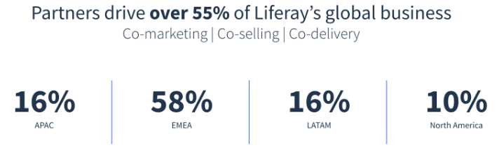
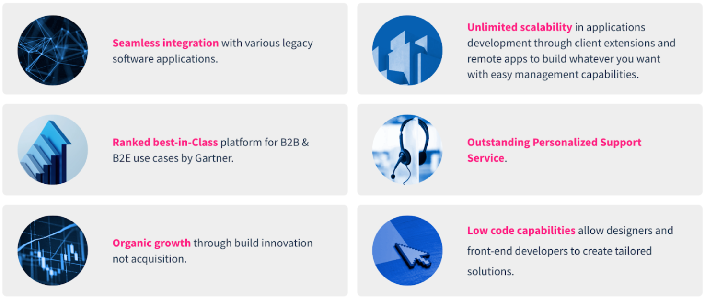
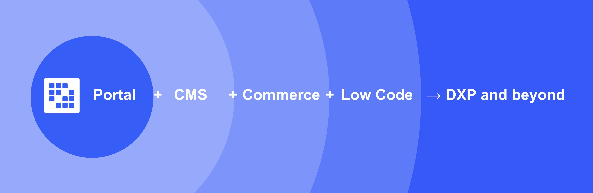

---
toc:
  - ./introduction-to-liferay/what-is-a-digital-experience-platform.md
uuid: cc59c93a-3ba6-43bb-9c57-e319843170ee
visibility: 
- Employee
- Partner
---

# Introduction to Liferay

**At a Glance**

* Founded in 2004
* Liferay’s competitive advantages include
  * Integration capabilities
  * Organically innovation
  * Highly flexible/scalable
  * Outstanding support
* A platform for digital solutions across the entire customer journey

## Background

This module provides an introduction to Liferay:

1. Our origins as an open-source Portal vendor
1. Key facts about the company
1. Why Partners are so important to us
1. What our high-level Competitive Advantages are
1. What a Digital Experience Platform is defined as, and what the basic anatomy of a DXP looks like
1. Key target solutions and example customers

```{note}
* View the [recording](https://learn.liferay.com/web/guest/d/l0-1-introduction-to-liferay) from the live workshop of this module.
* Download the [PDF](https://learn.liferay.com/documents/d/guest/l0-1-introduction-to-liferay-pdf) of the presentation used in the live workshop.
```

## Liferay Origins

Liferay started as a group of young, nerdy entrepreneurs hoping to build a tech company that could be a vehicle for good.

They had a simple goal: to create useful technology that benefited customers, partners, and employees, and to build an organization that helped others reach their full potential. 

From hosting company meetings on church picnic tables, Liferay has grown into a global company, and the technology has transformed from solely open-source to a leading enterprise platform for solving complex digital needs.

This vision continues today with our Mission Statement:

> “By building a vibrant business, making technology useful, and investing in communities, we make it possible for people to reach their full potential to serve others.”

## Liferay Corporate Overview

* Founded in 2004
* Head office in Los Angeles
* Global presence in 20 locations
* Over 5 Million downloads worldwide
* 400+ Partners globally
* 1200+ Enterprise Customers
* 1000+ Employees Globally
* 180,000+ Community Members

Over more than 20 years Liferay has opened offices on all continents, and today we serve more than 1200 enterprise customers. In addition tens of thousands of organizations use Liferay’s open source Community Edition.


Liferay customers are served by over 1000 employees plus our global partner network of integrators, Digital Agencies, Solution Partners and OEM partners.

There are over 180K members in the Liferay community contributing in various ways to the code, translations, and testing of the platform.

Despite being headquartered in the USA, Liferay is not a typical American company:

* 78% of staff are based outside North America.
* Non-US members represent more than 50% of senior leadership of the company

## Importance of Partners

Partners are an integral part of how Liferay builds, markets, sells, and supports solutions built on top of the Liferay platform.

Our ecosystem is built on partners that solve business challenges for customers through a limitless number of business solutions, tailored to meet the unique needs of our customers.

Our partners are experts in digital transformation and customer experience, and act as trusted advisers to their customers.

Our customers are looking for tailored solutions to solve their unique business needs, and our partners have the advisory and implementation capabilities to meet their requirements.



## Company Differentiation

One of Liferay's benefits is our independence. We do not have external investors or stock owners who dictate what we build, where we focus, or what is important.

Our company and product strategy and direction are made with customers, partners, and employees in mind.

Unlike many other software companies, Liferay employees stay with the organization for many years---with many having served for more than 10 years. This improves both product knowledge as well as account continuity.

## Liferay's Differentiators

The differentiators of our product include

* Portal heritage and a leader in headless CMS
* Fully integrated Digital Experience Platform
* Seamless integration with legacy software applications (e.g., CRM and ERP) and easy connection with enterprise data sources
* Composible architecture allows headless access to Liferay core functionality
* Extendable and customizable using loosely-coupled approach
* Low-Code and No-Code capabilities to allow non-developers to create tailored solutions
* Open Source and organically grown platform ensures different parts of the platform are designed to work seamlessly together
* Flexible deployment options over competition with SaaS, PaaS, and Self-Hosted deployment models available
* Enterprise grade platform focused on high-level security, scalability, and availability

Liferay's differentiators ensure that there are practically no limits to the solutions that can be created on the platform to meet the complex enterprise needs faced by our customers.



## Unique Combination of Capabilities

The combination of native Digital Experience Platform, Content Management System, and digital Commerce capabilities within one platform is quite unique in the market.

All of these capabilities are further enhanced with a set of robust low-code tools to enable Liferay to provide customers with a platform that is beyond a Digital Experience Platform.



Next: [What is a Digital Experience Platform?](./introduction-to-liferay/what-is-a-digital-experience-platform.md)
