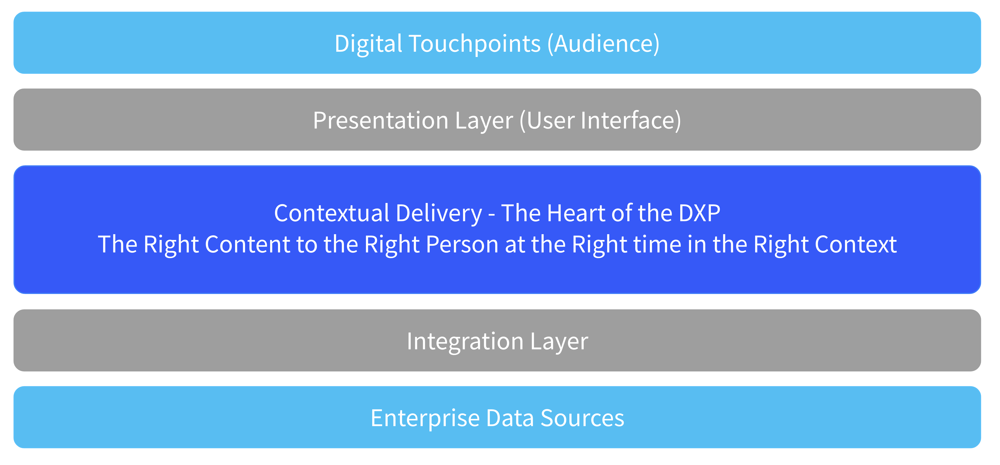
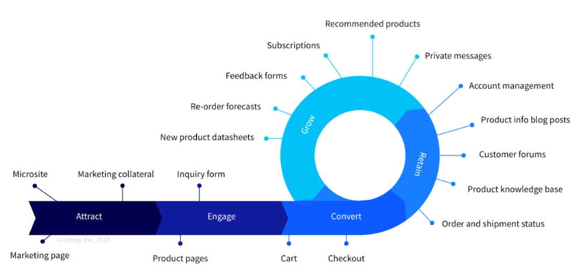

# What is a Digital Experience Platform

Definitions for Digital Experience Platforms vary from one analyst to another, but the broad definition is very similar.  For example most analysts use phrases like

> Digital Experience Platforms “deliver contextualized digital experiences, optimization of customer journey and touchpoints, integrated and cohesive, tailoring experience with context and value with commerce.”

Liferay definition of a DXP is as follows:

> “Enterprise software that provides the foundation for companies to deliver connected, contextualized digital experiences across multiple touchpoints for the entire customer journey.

> Put simply, a DXP is a single platform that has all the elements to deliver external and internal digital experiences.”


```{note}
* View the [recording](https://learn.liferay.com/web/guest/d/l0-1-introduction-to-liferay) from the live workshop of this module.
* Download the [PDF](https://learn.liferay.com/documents/d/guest/l0-1-introduction-to-liferay-pdf) of the presentation used in the live workshop.
```

## Anatomy of a Digital Experience Platform

The basic anatomy of a Digital Experience Platform could be described as follows:

* First are the Digital Touchpoints where our Customers interact with their users---their customers, employees, citizens, businesses, partners, etc. These are the experiences that an end user has as they interact with the company which might be web, mobile, ChatBot, kiosk, IoT etc.
* These touchpoints then provide some sort of presentation layer---which may be supplied by the platform itself, or implemented via headless API capabilities. Liferay’s presentation layer is flexible enough to support all and any of these types of presentation technologies.
* These interfaces serve information and data sourced from various enterprise data sources or content authoring systems. These disparate data sources include CRM, ERP, HRIS, Marketing Automation tools, and many others.
* The DXP therefore must include some sort of integration layer---which might be native to the platform or some 3rd party tool like an Enterprise Service Bus (ESB)
* The integration layer makes it possible to connect to the enterprise data sources, and may use technologies and frameworks like OpenAPI, GraphQL, SOAP, JSON etc.

The heart of a DXP, however, sits between the presentation and integration layers. This is the promise of a DXP's transformative power for a customer's business.

That promise is Contextual Delivery: delivering the right content to the right person at the right time in the right context.

Contextual delivery includes things like content management and authoring, web experience, analytics, personalization and segmentation, digital asset management, forms and workflow, digital commerce, no-code/low-code application building capabilities, easily deployed theming, and more.



## Solutions Across the Entire Customer Journey

Another way to look at what a DXP should provide is to look at the customer life cycle.  Typically this starts well before a customer becomes a customer, continues through engaging with the customer, converting them, and then retaining them by serving them well and growing them.



## Liferay Deployment Approaches

With its composable architecture and the addition of strong Low-Code functionality, Liferay isn't just a complete, integrated Digital Experience Platform, but also goes beyond DXP's capabilities. With Liferay DXP, a solution for any digital challenge can be created and deployed as the customer needs - whether that is SaaS, PaaS, or Self-Hosted.

## Tailored Solutions

Liferay DXP can be used to solve almost any business problem that our customers might face, but some classic example solutions include:

* Customer Portals - attract, serve, and empower customers
* Supplier Portals - simplify purchasing, support vendors, and increase profitability
* Partner Portals - collaborate, support, and grow partner revenue
* Intranets - keep employees productive, self-sufficient, and connected
* Enterprise Websites - give customers a smooth digital journey and reap the benefits of their loyalty
* Digital Commerce - simplify buying and encourage repeat orders

The Liferay platform is also used as an Integration Platform, Agent Portal, Student Portal, and many more.

## Example Customers

Liferay is flexible enough to serve complex needs of global enterprise customers, but is also being used successfully in many medium sized companies and public sector organizations using our platform for delivering digital experiences for their end users and customers.

Some global organizations using Liferay Platform for serving their customers and meeting their their digital experience needs include


## What’s Next

Congratulations! You've now completed the Introduction to Liferay module.

Next: learn about the [Liferay Product Offering](../liferay-product-offering.md).
