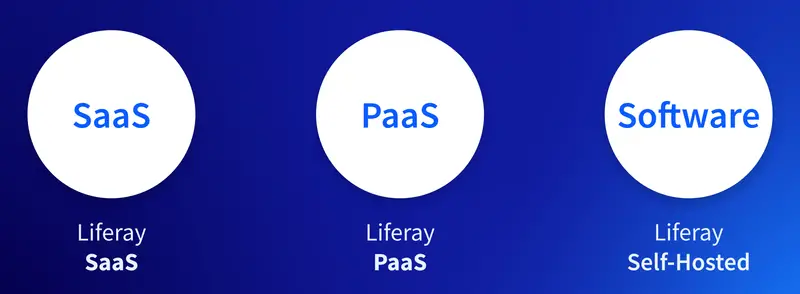

---
toc:
- ./liferay-product-offering/determining-which-deployment-option-is-best-for-your-customer.md
uuid: b982f1e4-2c22-4563-aa19-68d9aa8a801a
visibility: 
- Employee
- Partner
---

# Liferay Product Offering

Here you'll learn the Liferay product offering basics:

* Liferay develops a single Product: Liferay DXP
* There are three Product Deployment Offerings:
  * Liferay SaaS
  * Liferay PaaS
  * Liferay Self-Hosted
* Our Sales approach is SaaS first

## Background

It's important to note four pieces of background information:

1. Liferay's product is Liferay DXP, which is a single offering composed of three previously separate components.

1. Liferay DXP contains three main capability sets: the core Digital Experience Platform, Commerce, and Analytics.

1. **All** features are now available to customers with a current subscription to Liferay DXP. Previously, the three capability sets were separate offerings.

1. While the product is called "Liferay DXP", the features it contains are substantial, allowing it to be used in Content Management (CMS), Commerce, Low-Code (LCAP), Portal, Digital Experience, and many other scenarios.

1. The deployment approach chosen does not impact the features that are provided.


```{note}
* View the [recording](https://learn.liferay.com/documents/d/guest/l0-2a-liferay-offering ) from the live workshop of this module.
* Download the [PDF](https://learn.liferay.com/documents/d/guest/l0-2a-liferay-offering-pdf) of the presentation used in the live workshop.
* Download the [Sales Decision Flow](https://learn.liferay.com/documents/d/guest/new-customer-new-project-sales-decision-flow) referred to in this module.
```

## Supporting Every Deployment Approach

Liferay has always been about preserving customer investment in their chosen software stack and infrastructure. As a result, Liferay has three product deployment offerings so customers can choose the approach that fits their requirements: 

1. **Liferay SaaS** provides a Software-as-a-Service (SaaS) deployment model.

1. **Liferay PaaS** provides a Platform-as-a-Service (PaaS) deployment model.

1. **Liferay Self-Hosted** allows a customer to choose exactly how and where they host their Liferay DXP implementation.

This flexibility of deployment is an important differentiator over many of our competitors, who may not offer anything other than a SaaS deployment option.

```{note}
Although the provisioning, deployment, and maintenance is significantly reduced, Liferay SaaS is not a turn-key application. It is the full Digital Experience Platform, on top of which our customers, partners, and GS build the tailored solutions our customers need to solve their business problems.
```



The day-to-day activities vary with each deployment approach. While each activity is important, delivering the actual business application has the greatest value. In contrast, some of the lower-value activities can be quite time-consuming and difficult. Depending on the deployment approach chosen, these activities can be offloaded to Liferay, freeing the customer to concentrate on the most important tasks.

### Liferay Self-Hosted

Traditionally, this is how Liferay DXP has been sold. Customers download a Liferay DXP bundle or a Liferay DXP Docker image and then are responsible for everything else.

It should not be underestimated how much work is required here. The customer must deploy enough Liferay instances to support their expected peak usage load, must design load-balancing if more than one instance is required, select the infrastructure, how and where that is deployed---on premise, in a private cloud, in a public cloud---and they must select the platform software like the database server.

Then they must maintain that infrastructure and the platform software, plus patch and upgrade DXP.

Finally, they must build their solution on DXP.


**Low Value Activities**

| Responsibility | Liferay | Customer |
| --- | --- | --- |
| Products | &#10004; |  |
| Subscription (Support, Warranty, Indemnity, etc) | &#10004; | |
| Infrastructure (Uptime w/ SLA) |  | &#10004; |
| Application Uptime SLA |  | &#10004; |
| Platform Services (Database, Search, etc) |  | &#10004; |
| Architecture and High Availability |  | &#10004; |
| Upgrades |  | &#10004; |
| Updates |  | &#10004; |
| Patches, Security Hotfixes |  | &#10004; |
| Software Troubleshooting |  | &#10004; |
| Security Scanning / SAST / DAST |  | &#10004; |

**High Value Activities**

| Responsibility | Liferay | Customer |
| --- | --- | --- |
| Application Delivery |  | &#10004; |

### Liferay PaaS

Liferay PaaS (formerly Liferay Experience Cloud Self-Managed) is our Platform-as-a-Service offering. Liferay provides the software itself and also the infrastructure, all of the platform services, and so on.

Additionally, with Liferay PaaS, there are predefined offers that include things like backup and VPN services. Furthermore, these scale via OOTB high availability, auto-scaling capabilities, auto-failover capabilities, and provide load balancing.  These activities are very important, but they can be hard and/or expensive to implement.


Liferay also provides an infrastructure uptime SLA of 99.95%, does regular updates to the platform services, and provides the full DevSecOps CI/CD pipeline with build management.

But there are still some time-consuming and relatively low-value activities that are the Customer’s responsibility, like updates, patches, upgrades and finally the high-value application delivery work.

**Low Value Activities**

| Responsibility | Liferay | Customer |
| --- | --- | --- |
| Products | &#10004; |  |
| Subscription (Support, Warranty, Indemnity, etc) | &#10004; |  |
| Infrastructure (Uptime w/ SLA) | &#10004; |  |
| Application Uptime SLA |  | &#10004; |
| Platform Services (Database, Search, etc) | &#10004; |  |
| Architecture and High Availability | &#10004; |  |
| Upgrades |  | &#10004; |
| Updates |  | &#10004; |
| Patches, Security Hotfixes |  | &#10004; |
| Software Troubleshooting |  | &#10004; |
| Security Scanning / SAST / DAST |  | &#10004; |

**High Value Activities**

| Responsibility | Liferay | Customer |
| --- | --- | --- |
| Application Delivery |  | &#10004; |

### Liferay SaaS

The final product deployment offering is Liferay SaaS. This is a SaaS offering which frees customers to focus on what really matters: creating, launching, and maintaining business applications.

With Liferay SaaS, Liferay provides and manages all of the infrastructure and all of the low-value activities needed to maintain Liferay DXP. Liferay applies product updates on a quarterly basis, testing these against customers' data, and does SAST and DAST security scanning.

What is important to note is that although the deployment model is SaaS, this is not a turnkey application. Customers have a full Liferay DXP instance to use, with all of the out-of-the-box capabilities DXP provides, and they can build their custom applications on top of that base. Furthermore, they can continue to work with Partners and Liferay's Global Services organization to help them build those applications.

**Low Value Activities**

| Responsibility | Liferay | Customer |
| --- | --- | --- |
| Products | &#10004; |  |
| Subscription (Support, Warranty, Indemnity, etc) | &#10004; |  |
| Infrastructure (Uptime w/ SLA) | &#10004; |  |
| Application Uptime SLA | &#10004; |  |
| Platform Services (Database, Search, etc) | &#10004; |  |
| Architecture and High Availability | &#10004; |  |
| Upgrades | &#10004; |  |
| Quarterly Updates | &#10004; |  |
| Patches, Security Hotfixes | &#10004; |  |
| Software Troubleshooting | &#10004; |  |
| Security Scanning / SAST / DAST | &#10004; |  |

**High Value Activities**

| Responsibility | Liferay | Customer |
| --- | --- | --- |
| Application Delivery |  | &#10004; |

With that background out of the way, you can learn how to determine what deployment option is best for your customer.

[Let's Go!](./liferay-product-offering/determining-which-deployment-option-is-best-for-your-customer.md)
