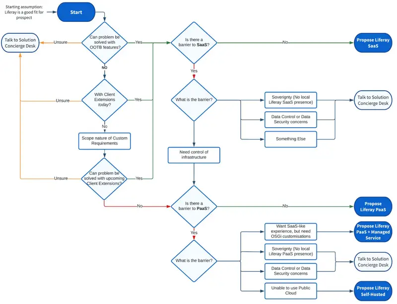

# Determining Which Deployment Option is Best for Your Customer

As already noted, all deployment options are possible, but our Sales approach is SaaS-First. But, what does this really mean, and is this always going to be the right option for your customer?

```{note}
* View the [recording](https://learn.liferay.com/web/guest/d/l0-2a-liferay-offering) from the live workshop of this module.
* Download the [PDF](https://learn.liferay.com/documents/d/guest/l0-2a-liferay-offering-pdf) of the presentation used in the live workshop.
* Download the [Sales Decision Flow](https://learn.liferay.com/documents/d/guest/new-customer-new-project-sales-decision-flow) referred to in this module.
```

## Solving Business Problems

* Customers' business problems are solved with Liferay DXP
* All opportunities start here
* Think business problem first, deployment strategy later

Ultimately the point of a Liferay solution is to solve a customers' business problem. When an opportunity starts it doesn't matter how the product will ultimately deployed - what's critical is - can the problem be solved with Liferay DXP?

If the answer to the question is "yes" - then that's a great place to start. In later modules we will cover the ideal customer profile, our unique value propositions, and challenges we address.

But for now, discovering more about your prospective customer will help you to select the deployment approach which is the best fit.

## Building Tailored Solutions

Solutions implemented with Liferay are not turnkey applications - even when a customer chooses Liferay SaaS as their deployment approach. Liferay DXP provides extensive functionality out-of-the-box. In all cases, this will need to be configured to start to build a solution:

* Pages have to be added
* Content has to be created
* Users and roles have to be defined
* Etc.

But, in most cases, not all of a business' problems will be solved with these features alone. A key strength of Liferay DXP has always been the ability to extend and customize the platform to fit specific needs. The preferred approach to extending the platform is to create [Client Extensions](https://learn.liferay.com/web/guest/w/dxp/building-applications/client-extensions). Client Extensions are not tied to Liferay's code, and can be used with any of the deployment approaches. Client Extensions allow developers to use the technologies that they are familiar with, and make it easy to perform upgrades to the core platform.


In some circumstances where highly complex customization is needed, customers can use an alternative Java-based development approach, deploying OSGi modules to the core platform, however this necessitates a non-SaaS deployment approach.

## Determining if SaaS is Possible

Liferay recognizes that not _all_ customers will be able to solve their unique business problems with a SaaS deployment.

Assuming that a customer is _comfortable_ with SaaS, if the following are true, then a SaaS-first approach should be followed:

* Can the business problem be solved with out-of-the-box Liferay features?
* Can any customization requirements be solved with the preferred approach to extensions?
* Can customization requirements be solved with an upcoming feature that is on the roadmap already, or that is requested?

```{note}
For this last point, please validate with the Solution Concierge Desk - Liferay works aggressively to add new capabilities to support customer requirements, and in many cases new features can be developed for a prospective customer during the sales cycle.
```

## Determining When SaaS Might not be Possible

Liferay SaaS should be the default option, but we do recognize that there will be situations where it might not be the optimal approach for a customer:

* The customer is not open to SaaS
* They have concerns over Data Sovereignty - for example if Liferay doesn't yet have a data center local to the customer
* There are other Data Security or Data Control concerns

In these cases you should consider the other deployment options:

* Liferay PaaS (where it's acceptable)
* Liferay DXP Self-Hosted

Both of these approaches can be provided with a Managed Service option - provided by Liferay or our Partners, which can provide a customer with a SaaS-like experience while addressing their concerns.

All of these concerns should be qualified hard, and validated with the Solution Concierge Desk.

```{note}
All of these cases should progressively reduce as the product evolves, and as resistance to SaaS reduces over time.
```

## New Customer and New Project Sales Decision Flow

Liferay has developed a sales decision flow to use with new customers and for new projects with existing customers. Partners can use this flow to help determine the optimal approach for each customer or project. This provides guidance on which deployment approach is right for an opportunity, covering key decision steps that will guide you towards SaaS, PaaS, PaaS with Managed Services, or Self-Hosted - and to guide you to the Solution Concierge Desk for outliers.



## What's Next

Excellent! You've finished the module on the basics of the Liferay product offering. 

[Start the next module](../liferay-product-overview.md) to get an overview of Liferay DXP's capabilities and how they meet customer needs.
