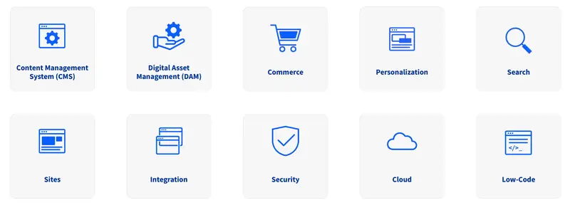

# Liferay DXP Product Capabilities

As a quick refresher, Liferay's product is Liferay DXP, and includes core Digital Experience Platform capabilities along with Commerce and Analytics capabilities.


It's important to note that, while the product is called "Liferay DXP", the features it contains are substantial, allowing it to be used in Content Management (CMS), Commerce, Low-Code (LCAP), Portal, Digital Experience, and many other scenarios.



By the end of this module you will have a high level view of all of the main capabilities areas of Liferay DXP. Don't know where to start? Start by reviewing Liferay DXP's [Content Management System (CMS)](./liferay-product-overview/content-management-system.md) capabilities.

```{note}
* View the [recording](https://learn.liferay.com/documents/d/guest/l0-2b-liferay-overview) from the live workshop of this module.
* Download the [PDF](https://learn.liferay.com/documents/d/guest/l0-2b-liferay-overview-pdf) of the presentation used in the live workshop.
```

::::{grid} 2
:gutter: 3 3 3 3

:::{grid-item-card} Content Management System (CMS)
:link: ./liferay-product-overview/content-management-system.md

:::

:::{grid-item-card} Digital Asset Management (DAM)
:link: ./liferay-product-overview/digital-asset-management.md

:::

:::{grid-item-card} Commerce
:link: ./liferay-product-overview/commerce.md

:::

:::{grid-item-card} Personalization
:link: ./liferay-product-overview/personalization.md

:::

:::{grid-item-card} Search
:link: ./liferay-product-overview/search.md

:::

:::{grid-item-card} Sites
:link: ./liferay-product-overview/sites.md

:::

:::{grid-item-card} Integration
:link: ./liferay-product-overview/integration.md

:::

:::{grid-item-card} Security
:link: ./liferay-product-overview/security.md

:::

:::{grid-item-card} Cloud
:link: ./liferay-product-overview/cloud.md

:::

:::{grid-item-card} Low-Code
:link: ./liferay-product-overview/low-code.md

:::

:::{grid-item-card} Developer Tooling
:link: ./liferay-product-overview/developer-tooling.md

:::
::::
