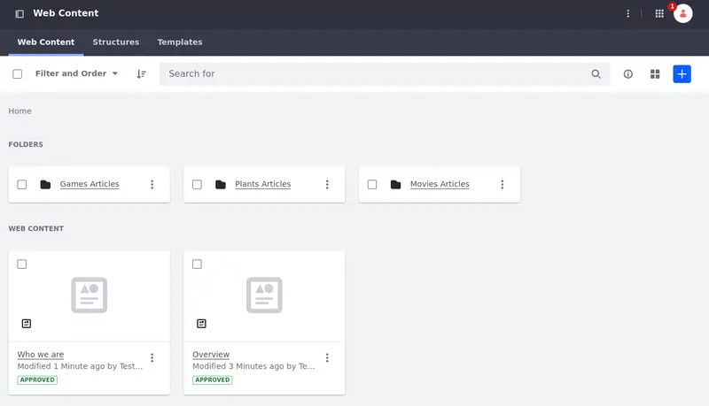

# Content Management System

With Liferay’s Content Management System (CMS), practitioners can create, organize, and manage content for personalized digital experiences more efficiently, which simplifies the authoring and approval process for quicker go-to-market. Liferay includes tools for managing product information, promotion, pricing, and inventory which make it easy for your product managers and e-commerce teams to set up and manage single or multiple online storefronts.

## Content Management System

* [Web Content](https://learn.liferay.com/w/dxp/content-authoring-and-management/web-content)
* [Structures](https://learn.liferay.com/w/dxp/content-authoring-and-management/web-content/web-content-structures)
* [Templates](https://learn.liferay.com/w/dxp/content-authoring-and-management/web-content/web-content-templates)
* [Blogs](https://learn.liferay.com/w/dxp/content-authoring-and-management/blogs)

## AI-Powered Content

* [Automate content creation with AI tools](https://learn.liferay.com/w/dxp/content-authoring-and-management/web-content/web-content-articles/generating-text-content-using-ai)

## Content Grouping

* [Use Collections to group your created content](https://learn.liferay.com/w/dxp/site-building/displaying-content/collections-and-collection-pages/about-collections-and-collection-pages)

## Multichannel

* [Use headless APIs for multichannel scenarios](https://learn.liferay.com/w/dxp/headless-delivery/using-liferay-as-a-headless-platform)

## Content Publishing

* [Workflows for approvals](https://learn.liferay.com/w/dxp/process-automation/workflow)
* [Bulk publishing via Publications](https://learn.liferay.com/w/dxp/site-building/publishing-tools/publications)

## Traffic and Path Analysis

* [Improve desired outcomes through path and traffic analysis](https://learn.liferay.com/web/guest/w/analytics-cloud/touchpoints/pages/paths)

## Content Dashboard

* [Analyze the effectiveness of your content](https://learn.liferay.com/w/dxp/content-authoring-and-management/content-dashboard)

## Structured Content

* [Use Forms for user interaction](https://learn.liferay.com/w/dxp/process-automation/forms/introduction-to-forms)

Next: [Digital Asset Management](./digital-asset-management.md).
