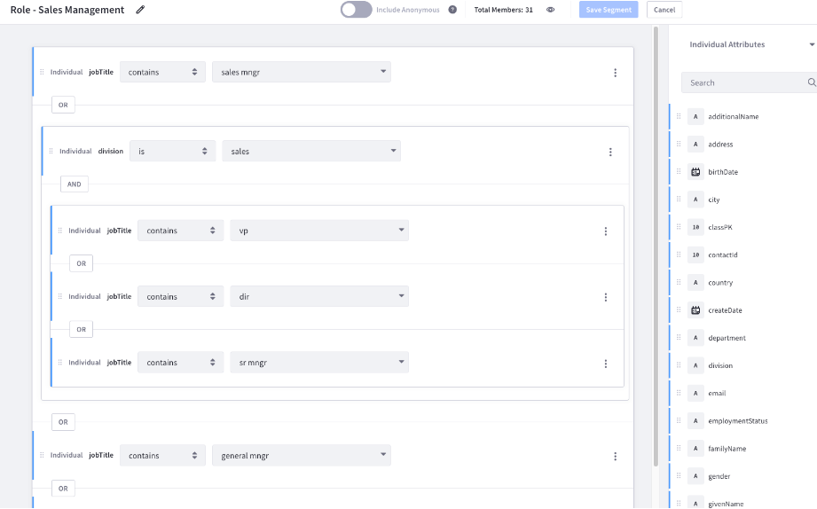

# Personalization

With Liferay DXP, you can personalize and optimize digital experiences at scale to make it easy for your customers, partners, or employees to find relevant information quickly. Liferay DXP helps you target different audience segments with precision, generate tailored recommendations automatically, and test different digital experiences faster so you can optimize user journeys, increase conversions, and maximize results.

## Segmentation

- [Segmentation](https://learn.liferay.com/w/dxp/site-building/personalizing-site-experience/segmentation)

## Personalized Experiences

- [Experience Personalization](https://learn.liferay.com/w/dxp/site-building/personalizing-site-experience/experience-personalization)

## Personalized Collections

- [Predefined collections for specific user segments](https://learn.liferay.com/w/dxp/site-building/personalizing-site-experience/experience-personalization/personalizing-collections)

<!--
-- ## Recommendations
--
--  Add link to article on content recommendation when it's written
-->

Next: [Search](./search.md).