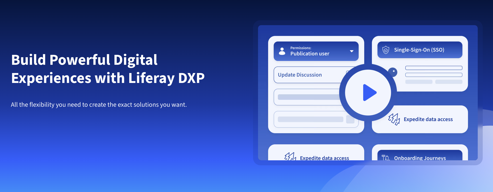

---
toc:
  - ./liferays-unique-selling-points/organic-innovation-and-open-source-leadership.md
  - ./liferays-unique-selling-points/portal-heritage-and-tailoring-liferay.md
uuid: 0ad4710c-53f7-476a-97e8-6ae14c13d2e2
visibility: 
- Employee
- Partner
---

# Liferay's Unique Selling Points

**At a Glance**

* Definitions for
  * Unique Sales Proposition (USP)
  * Value Proposition
* Liferay has evolved organically with home grown technology
* Liferay is an Open Source Leader with a Portal heritage
* Liferay is easy to tailor and customize
* Liferay excels at delivering experiences for many audiences and use cases

## Background

This module explains Liferay’s Unique Selling Points, as well as the value they bring to Liferay's Customers.

While competitors claim to deliver the same value, only Liferay has the unique combination of characteristics and traits that set us apart from those competitors to provide more value to our customers.

```{note}
* View the [recording](https://learn.liferay.com/web/guest/d/l0-4-liferays-unique-selling-points) from the live workshop of this module.
* Download the [PDF](https://learn.liferay.com/documents/d/guest/l0-4-liferays-unique-selling-points-pdf) of the presentation used in the live workshop.
```

## What are Unique Selling Points anyway?

Software vendors often use the terms Unique Selling Points, Unique Selling Propositions, Value Proposition or Key Differentiators, along with acronyms like USP or UVP. To avoid confusion it is helpful to define these terms.

A **Value Proposition** is a statement that clearly conveys the value a vendor promises to deliver to their customers. A value proposition motivates potential customers to choose one vendor over another. It should speak to a customer’s challenge and make the case for your company as the problem-solver.

More simply, it answers the question, “What do you do?”

A **Unique Selling Point** or USP, or sometimes unique selling proposition, is a differentiating statement that separates products and a brand from competitors and allows a vendor to gain a competitive advantage by positioning offerings and the company in a unique way.

USPs help support the value proposition and highlight benefits that target audiences perceive as valuable.

While the wording of each vendor’s value proposition is different, many vendors propose the same value. USPs, however, are the key differentiators that set vendors apart from their competitors and establish them in the market.

## What is Liferay's Value Proposition?  



As stated in the platform overview section of liferay.com, Liferay DXP allows our customers to build powerful digital experiences for their customers. The platform is flexible enough that customers can create exactly the solutions they need.

This statement captures the unique values that Liferay has demonstrated for years. From the beginning Liferay has been more than a portal; it has been a platform that technical users could customize as needed to solve almost any business problem.

At times, this customization ability has been both a benefit and a challenge. It provides complete flexibility, but can create a burden for teams tasked with maintaining and upgrading the platform.

Recently, Liferay has focused on developing the platform with a wide range of out-of-the-box features, low-code capabilitie,s and ways to extend the platform without customizing the core. With these featrues the platform can be tailored to customers’ unique and complex needs, to create any solution or application.

Or in other words, to deliver solutions that customize the digital experience, not the platform. Liferay is well positioned to do that because of our organic innovation, open source portal heritage and our unparalleled ease of customization.

[Let’s Go!](./liferays-unique-selling-points/organic-innovation-and-open-source-leadership.md)
