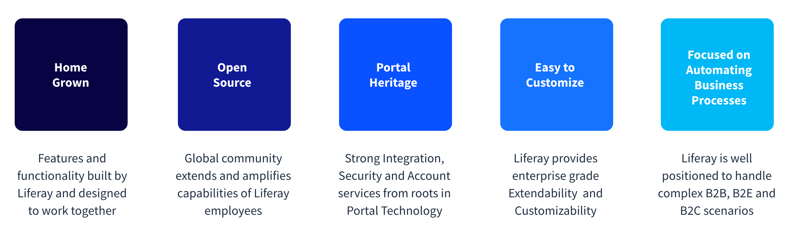

---
toc:
- ./main-competitors-faced-by-liferay/adobe.md
- ./main-competitors-faced-by-liferay/sitecore.md
- ./main-competitors-faced-by-liferay/optimizely.md
- ./main-competitors-faced-by-liferay/acquia.md
uuid: f27cc155-9321-43ee-bbda-9e0698529f66
---

# Main Competitors faced by Liferay

**At a Glance**

* Liferay competes against many competitors, mainly in the DXP space.
* Four of the main competitors faced are:
  * Adobe
  * Sitecore
  * Optimizely
  * Acquia

## Background

In this module, we will take a closer look at some of Liferay’s main competitors.

After completing this module, you will have a basic understanding of what sets Liferay apart from these competitors.

## Liferay Competitors

Click on each of the tiles to read more about four of the most commonly faced DXP vendors that Liferay competes with. In each case we have provided:

* Key challenges for the industry
* Solutions commonly seen in that industry

::::{grid} 2
:gutter: 3 3 3 3

:::{grid-item-card} Adobe
:link: ./main-competitors-faced-by-liferay/liferay-product-offering.md
:::

:::{grid-item-card} Sitecore
:link: ./main-competitors-faced-by-liferay/sitecore.md
:::

:::{grid-item-card} Optimizely
:link: ./main-competitors-faced-by-liferay/optimizely.md
:::

:::{grid-item-card} Acquia
:link: ./main-competitors-faced-by-liferay/acquia.md
:::
::::

## Competitor Commonalities

Having reviewed some of Liferay’s main competitors, there are some clear commonalities:

* All four have acquired multiple companies to build their product suites, resulting in disjointed systems.
* Many have been criticized for their lack of clear strategy or commitment to customer success.
* Most have high costs associated with customizations, upgrades, and hosting.
* Many have a CMS background.  Because of this integration, security and account services have limited capabilities.

## What Makes Liferay Unique

### Built In-House

When Liferay has a gap in its product capabilities, it builds that product or feature in-house. Liferay does not acquire companies to fill that gap. Building in-house results in seamless user and developer experiences across the platform.

### Liferay is Extendable and Customizable

Liferay has an API-first infrastructure. The design of the application starts with API instead of Code first, and grows organically from its community of users.

### Having Roots in Portal Technology is a Strength

This results in:

* Strong Integration Capabilities
* A focus on long-term Customer Relationships
* Bridges Company Silos
* B2B Relationship Management
* Secure Data Handling Capabilities
* Digital Agility

### Liferay makes it easy to Customize

Liferay’s modular architecture contains components you can extend and override dynamically.

### Liferay’s Digital Strategy is to continuously Improve Business Performance

This includes improved:

* Customer Service
* Customer Support
* Integrations
* Ordering
* Account Management

## What’s Next

Congratulations - you’ve now completed the Level 0 Selling Liferay learning path.  Next you can move to Level 1 - with options for both business and technical selling roles.

[Back to Selling Liferay](../../selling-liferay.md)
