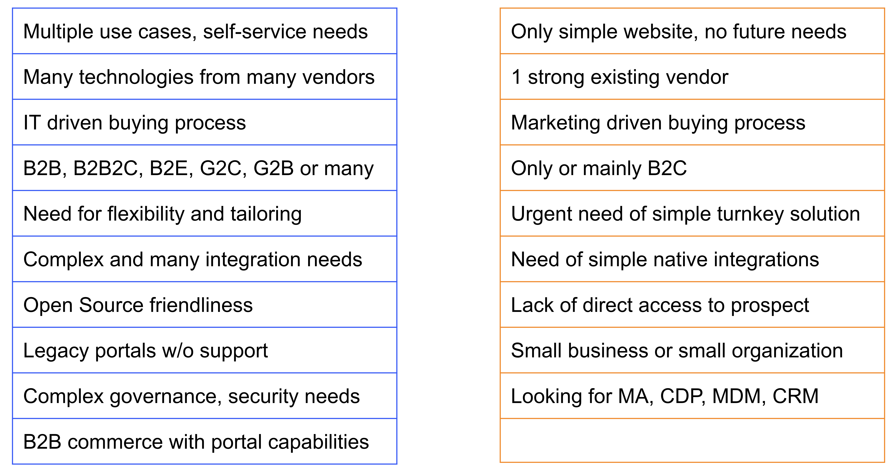

# Strengths and Red Flags

To help to summarize this module, there are many needs, buyers, and situations that are particularly suitable for Liferay offerings and some that raise red flags we should pay attention to:

* Use Cases - Simple or Complex?
* Vendor Mix - tied to one, or flexible?
* IT or Marketing driving the buying process?
* Mainly B2C, or a mix of B2B, B2E, B2B2C etc.?
* Turnkey application or Tailored Solution?
* Integration needs - Simple or Complex?
* Support for Open Source?
* Direct or indirect access to the prospect?
* Existing unsupported portals?
* Small business or organization?
* Complex governance and/or security needs?
* Product fit?
* Portal and Commerce alignment?

```{note}
* View the [recording](https://learn.liferay.com/documents/d/guest/l0-3-ideal-customer-profile) from the live workshop of this module.
* Download the [PDF](https://learn.liferay.com/documents/d/guest/l0-3-ideal-customer-profile-pdf) of the presentation used in the live workshop.
```

## Use Cases

If there are multiple use case needs, self-service needs and/or any type of complexity in the play, that is good for Liferay.

Conversely if the need is for a simple website, there are much cheaper options available. Even then, if the customer has future needs for a customer portal or an intranet, it is worth challenging them to consider the longer term benefits of using a single platform for multiple solutions.

## Vendor Mix

If the prospect already has several technologies from several vendors, it shows they are not totally committed to just one vendor. However, if they are tied tightly to a single technology vendor, it will be hard to get them to choose anything else unless they are unhappy with that provider.

## Who’s Driving the Buying Process?

This is somewhat simplistic, but it is usually positive for Liferay if the buying process is IT-driven.

If the process is entirely driven by Marketing buyers this can be more challenging - for example they might expect certain marketing capabilities which Liferay does not have natively. In these cases, Liferay’s strong integration story means that these capabilities can be brought into the overall solution, which can turn things in our favor. In marketing-driven buying processes it is important to dig deeper to find the technical buying influences. They will be needed in the implementation, and they might help us.

This is even true with SaaS buyers, who are often more business-focused - a tailored solution still needs some degree of technical expertise.

## Consumer or broad scope

B2B, B2B2C, B2E, G2C, G2B (or multiple of these) use cases are often good for Liferay, but when it is **pure** B2C, we are not the strongest player.

## Turnkey application or Tailored Solution

Generally enterprise needs and scalability requirements, with the need for flexibility and tailoring makes our position stronger. But if the need seems to be mainly for a turnkey application or a point solution, it might not be right for us. As with any of these examples, it is worth challenging the buyer on whether they can really fulfill their needs without tailoring.

## Integration

Liferay’s integration and interoperability capabilities are strong, so complex and several integration needs make our case stronger.

If there’s a verified need for native integrations, that however may not be our best scenario - but note that it is rare to have a native integration covering the customer’s needs on a sufficient level.

## Open Source

Obviously if the buyer has a preference for open source but they need enterprise-grade support and services, that is a really strong opportunity for Liferay.

## Prospect Access

Generally if we have direct access to the prospect that is a better sign than if there is a buying organization or a consultant between the prospect and us: that could turn out to be a challenge.

It is always easier if direct access to the prospect can be achieved.

## Existing Portals

Another strong opportunity for us is when there’s a legacy portal without support---especially when it is an enterprise. There aren’t that many great options for enterprise portal solutions.

## Size of Organization

When the buyer is a small business or small organization it is rare for them to have sufficient budget and sufficient resources for a platform like Liferay.

The investment expectation discussion should be done quite early in the opportunity.

## Governance & Security

Where there are complex governance needs and or a lot of different user groups, along with a need for granular access rights and management and security, these are indicators of a good fit for Liferay. 

## Product Fit

Customers generally do not go to market to buy a digital experience platform, but they do look for things like marketing automation platforms, customer data platforms, master data management, CRM, and so on. It is important to remember that while Liferay can cover some of those needs, we are not a best-of-breed CRM, or CDP, or MDM.

Remember the cost of sale and investing into opportunities that cannot be won is the same as those that can be!

## Commerce and Portals

One of the reasons that B2B Commerce opportunities are hard for consumer-focused vendors is that they usually need portal capabilities as well. When both of these sets of requirements are present that’s likely to put Liferay in a strong position.

## Summary



It is important to remember that these lists are not exhaustive, and none of these items alone make it a 100% win or 100% lost case. But the more thumbs up and the less thumbs down, the stronger our chances of winning are.

## Liferay SaaS Ideal Opportunity Learnings

Liferay carries out win-loss interviews with our sales teams, and sometimes also with prospects, so that a good understanding of where Liferay can (and can not) be successful can be obtained.

Liferay SaaS is a relatively new offering, with more being learned regularly about types of opportunities that are more successful than others. To date the following common elements have been observed:

* Public Sites
* Commerce capabilities included
* Integration and low-code capabilities
* 50-100K starting point

### Public Sites

Prospects with a goal to renew their critical public facing web site first, but where there are additional needs for future phases, are a good match for the SaaS offering.

### Commerce Capabilities

Almost all of the interviews on won opportunities revealed that Commerce and Commerce capability requirements, such as the product catalog, would be very important to the customer in the future to help them to improve and solve their end customers' digital self service needs. 

Even though the customers started with a public website project, they appreciated the value that Liferay provides by having native commerce capabilities available and included in the subscription price.

### Integration and Low-Code-Capabilities

The ability to support integration, inclusion of low-code capabilities, a built-in workflow engine, and strong security features were mentioned in several won opportunities.

### 50-100K Starting Point

A common starting point for Liferay SaaS opportunities appears to be an annual subscription _starting_ at between 50-100 K USD/EUR.  

This list is _not_ exhaustive and it is also not definitive, but it could provide some pointers when attempting to identify Liferay SaaS deals.

Congratulations! You've completed the module on the ideal customer profile! 

Next: the [horizontal challenges Liferay solves for](../what-challenges-does-liferay-solve-horizontal-solutions.md).

