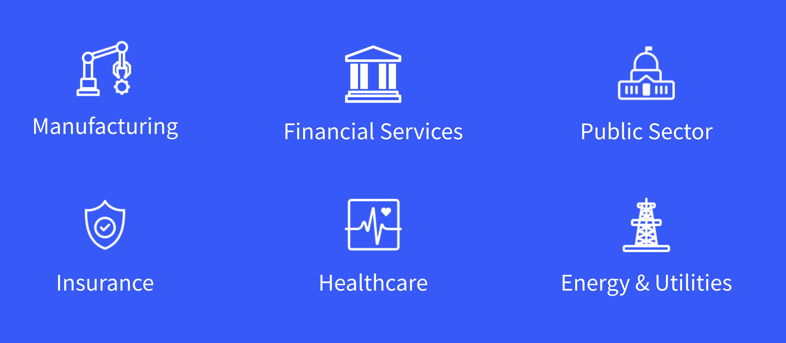
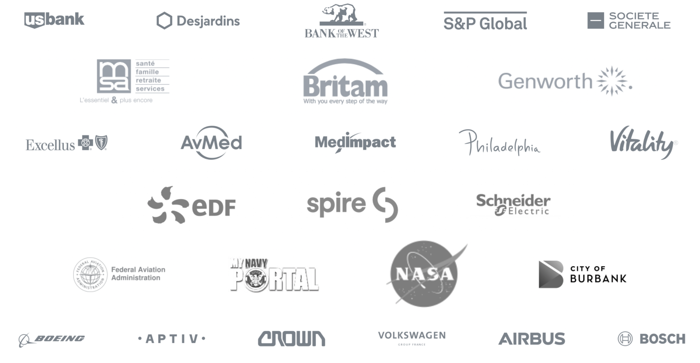

# Target Industries

**At a Glance**

* Liferay is used across all industry verticals

Liferay is used across almost all industry verticals; however we have particular focus and have had great success in

* Financial Services
* Insurance
* Manufacturing
* Healthcare
* Government & Public Sector
* Energy & Utilities

## Financial Services

Liferay is used by many of the largest financial services institutions in the world. This vertical is highly regulated, there’s a great need for multiple and complex integrations between core platforms and digital experiences, and the nature of data and information processed is confidential and sensitive.

The expectation from the end customer of a FSI, whether consumer or business-focused, is to have self-serve, secure, and effortless access to their own accounts, data, investments, loans, etc. any time, any day, and anywhere.

Some of the solution needs in FSI include

* Self-Service Customer Portals
* Wealth Management Platforms
* Intranets
* And much more

The Liferay platform's enterprise-grade flexibility, scalability, interoperability, and security components meet the needs of FSI companies well.

## Insurance

The financial services and insurance industries are similar. Insurance is also highly regulated, there’s a need for complex integrations, and the data is sensitive.

Beyond the needs and requirements of financial services, insurance has industry specific expectations: 

* Self-service is critical for viewing and renewing policies, and for getting quotes and acquiring new ones
* Quoting/purchasing policies adds a digital commerce element
* Providing efficient self-service tools for agents and brokers.

Liferay’s commerce capabilities, forms, and workflow tools help insurance companies to meet these needs.

## Manufacturing

One of the greatest needs in the manufacturing industry is to have robust B2B digital commerce tools, and that commerce should seamlessly work with other self-service capabilities as part of digital customer experience. Liferay’s native digital commerce coupled with robust DXP capabilities enables manufacturers to have tutorials, knowledge bases, product catalogs, community forums, support tickets, workflows, and B2B commerce capabilities in a single platform.

Liferay offers a wealth of features particularly suitable for manufacturers and other B2B commerce scenarios such as the Bill Of Materials or “Shop by Diagram,” buyer approval workflows, contract pricing and discounts, etc.

## Healthcare

In both private and public healthcare, there is a great demand for enabling digital self-service both for patients and health care professionals. Due to the extremely sensitive nature of the data, granular user roles and access management and other account services are a must.

There’s also a great deal of complexity and need for integration with other systems and healthcare is a very regulated industry.

## Government and Public Sector

In the public sector it is almost guaranteed that legacy technologies live alongside requirements for new citizen portals. The possibility of bringing data from legacy systems into a user-friendly platform is a key requirement, meaning that integration and interoperability capabilities are important.

This industry is in some cases even more highly regulated than others---bringing complexity to even simple projects---, for example accessibility capabilities are almost always required.  Liferay DXP is accessible by design which makes it easier to meet these requirements.

Liferay’s open source roots also attracts public sector buyers. Many projects in this sector start out on Community Edition, but once the project has grown in importance, criticality, complexity, or volume, the need for enterprise subscription services to provide benefits such as legal assurance, support, product updates, and further product capabilities becomes significant.

Customers are also attracted by our active open source community which contributes to and improves the code base, and many of our public sector customers are part of this community and contribute themselves, particularly when considering Education as part of this vertical.

## Energy & Utilities

Energy and utilities companies' needs are not that different from other industries---there’s a great need to streamline customer self-service processes and to provide personalized experience through customer portals 24/7.

Lowering costs to serve and increasing end customer satisfaction are the main drivers. This can be achieved by allowing end customers to manage their own accounts, pay online, and solve problems without needing to contact a representative.

## Other Verticals

Other industries where Liferay has lots of customers include Wealth management, Telco, Logistics, Education, and many more.

## Example Customers

Liferay is flexible enough to serve the complex needs of global enterprise customers, but is also used by many medium sized companies and public sector organizations who use our platform to deliver digital experiences for their end users and customers.

Some global organizations using the Liferay platform for serving their customers and meeting their their digital experience needs include

Next: [the solutions that Liferay is particularly suited for](./target-solutions.md).
