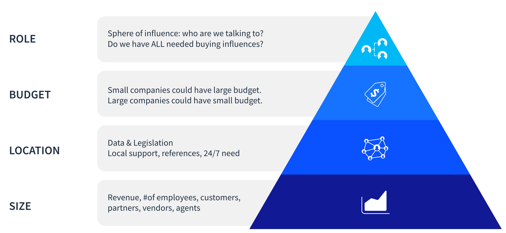

# Target Solutions

**At a Glance**

* Liferay can be used to solve almost any business problem.

The Liferay platform is extremely flexible to cater for all sorts of needs. 

The rich product capabilities, low code capabilities and extensibility are well suited for almost any solution and particularly suitable for certain solutions and use cases: 

* Customer Portals
* Digital Commerce
* Supplier Portals
* Partner Portals
* Enterprise Websites
* Employee Portals

## Customer Portals

With Customer Portals and Self-Service Portals our customers can increase their profitability by empowering their customers to self-serve. Businesses can lower their customer service costs and boost sales, while providing their customers with an exceptional experience. Our horizontal portal background makes Liferay shine beyond the other DXP vendors in the portal use cases.

## Digital Commerce

With native commerce capabilities working seamlessly with digital self-service our customers can grow their revenues by simplifying buying for their customers and encourage repeat orders. They also benefit from the wide variety of OOTB capabilities especially designed for complex B2B scenarios.

Some DXPs have a commerce background, but it is usually a B2C commerce background. The combination of portal heritage with OOTB B2B commerce functionality is unique.

## Supplier Portals

With a Supplier Portal our customers can simplify vendor support and increase their own profitability. By centralizing the location for programs and promotions and where their vendors share product information, availability and pricing, they can save time for their vendors and keep them up to date with offers, etc.

Additionally they can provide visibility on all transactions and monitor their vendors' service levels, which helps their own staff be more productive.

## Partner Portals

With a Partner Portal the customer can support their partners’ sales and technical teams by sharing access to relevant content, promotions, and recommendations. On Liferay DXP, their partners are empowered to maintain their own information and find answers faster themselves, and they have secure online access to sensitive documents like prices, contracts, and invoices. 

By integrating with other platforms, such as CRM, it is possible to automate lead routing, MDF workflows, and more.

## Enterprise Websites

In many ways self-service starts from even before a customer has logged in or posted anything. When there are several digital touch points in play, (e.g on top of web there are Kiosks, Chatbots, mobile, email)  Liferay can orchestrate the systems required for these channels. Most pure CMS vendors (regardless of how fancy they make it look), cannot handle this very well and Liferay beats them hands down once it becomes about associated application management and not just content.

Liferay’s multi-tenancy capabilities are well appreciated by those customers who need a lot of sites.

## Intranets

With a modern employee portal our customers can have their employees share, collaborate, and communicate on one platform and keep everyone in their organization productive, self-sufficient, and connected. Liferay DXP's portal heritage makes it particularly suitable for various Intranet use cases in the same way that it is well suited to customer self-service use cases.

Many common intranet platforms lack personalization features or modularity or easy duplication of pages, all of which are readily available with Liferay DXP.

## Other Solutions

Of course, the solutions covered so far do not represent every solution that can be solved with Liferay. Liferay DXP is also used, for example, as an integration platform, agent portal, student portal, and more. Liferay categorizes the platform as a DXP, but it can be equally categorized as a Low Code Application Platform (LCAP), a Commerce Platform, or a Content Management System (CMS) as well.

## Demographics and Other Factors

There are other factors that make an opportunity well-suited or less well-suited for Liferay:

* Company Size
* Location
* Budget
* Buyer Roles

## Company Size

A company’s size is based on many criteria, including the number of customers it has, the number of employees it has, the number of vendors it works with, students, partners, agents, etc.

If the company is a small business with simple offerings and a handful of customers, there may not be enough value for the investment of annual subscription and work of building a custom solution on Liferay's platform. However, there is no absolute point when a company’s size becomes big enough---or when they are too small---the company's maturity and the market both have an effect.

In some markets, the expectation of great digital self service is strong, so even smaller companies must invest in it to survive. Internally, we use from 150 to 300 million USD / EUR Annual Revenue as a guideline. For an intranet or a student portal, a good guideline is around 1000 employees or students. For the number of customers or partners, it is difficult to determine the threshold: it depends on the solution need and the complexity of processes to be digitized.

As noted earlier, complexity in the requirements is good for Liferay.

## Location

Liferay offers support, services, documentation, contracts, and the product itself in many languages but not every language. Where there is an absolute requirement for a language that we do not cover directly, the best option is to partner with someone who can fill that gap.

Local legislation is a factor and GDPR is the most common example. Liferay’s offerings, including our PaaS and SaaS offerings, are GDPR compliant.

In some cases the physical location where data is stored is a key factor. Liferay’s cloud data centers are located in strategically important locations, but we do not have data centers in every country. In these cases we can offer our self-hosted option to remove the problem, or potentially add new data centers where there is sufficient demand.

An enterprise-grade DXP such as Liferay is a good option particularly when the buyer is a global company needing 24/7 support.

## Budget

Bigger companies have bigger budgets and smaller companies have smaller budgets, but the size of the buyer does not necessarily equal the size of the budget.

It is advisable to ask for a budget range or “what size of an investment are you considering for this project” quite early in the discussion if there’s a doubt related to sufficient funding.

## Buyer Roles

Understanding the roles of the people you are working with is critical.  Business leaders, IT, or marketing people have different levels of influence and buying control. If the C-level are included in the meetings it is more likely you have access to a key decision maker. Conversely, if there are external consultants, advisors, or influencers, we may be in a weaker position.

There’s a wise saying: “You cannot sell to someone who cannot buy”. Even if your main contacts are really nice people and really like Liferay, if they don’t have the funds and if they do not have decision making power or access to all decision makers, your chances of success are reduced.

You must have different types of buying influencers to win a deal, and usually there are several people and several roles impacting the decisions.

Next: a summary of the many types of needs, buyers and situations that are [particularly suitable for Liferay offerings](./strengths-and-red-flags.md).
