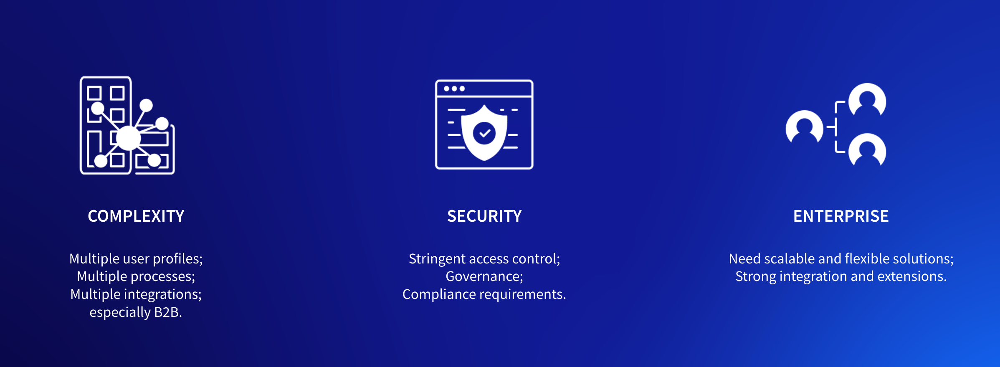

# Where Liferay Shines

**At a Glance**

* Liferay shines when customers' requirements:
  * Are complex
  * Have a focus on security and access control
  * Require an ability to scale

Liferay provides a rich and sophisticated set of capabilities that can be used to address almost any business problem. But certain characteristics of customers and their business problems are particularly suited to Liferay:

* Complexity
* Security
* Enterprise

## Complexity

When a customer has complex needs and requirements---and who understands (or whom we can help to understand) that meeting those needs comes with a price tag---we are in a stronger position.

With _complexity_ we mean things like

* Lots of different types of user profiles
* Multiple usage scenarios
* Multiple processes and complex workflows
* Many integrations
* B2B usage scenarios

Complexity does not mean we should make it more complex. But we should be able to help buyers appreciate the complexity of their needs and understand that "a simple product" (offered by a competitor) doesn’t make their complex needs disappear.

If the buyer needs a platform that can serve as an extranet e.g. for partner-facing scenarios, a supplier, or a reseller portal with self-service elements---that is complex. And that complexity is good for Liferay.

It is particularly important to mention B2B: in many cases these are far more complex than B2C scenarios.

Think about B2B buying and selling vs B2C:

* The sales cycles are longer
* There are bigger buyer teams involved
* There are approval processes 
* Complicated contracts govern pricing, deliveries, and many other terms

Collaboration and knowledge-sharing functionality are prominent considerations for the B2B use case.

B2B is complex even with smaller deals. Compare that to B2C buying where, for example, you're buying a car: you go to a site to browse for a car of your liking, or you might go and do a test drive. If you like the car, you buy it. Providing you have money or sufficient credit rating, the whole process can happen really fast, and you do not need to ask anyone’s opinion, approval or even read the contract (because they would not change it for you anyway).

Sometimes the complexity comes later. The customer or prospect might want to start with a fairly simple project but have a need and plan to evolve later. It is worth inviting them to share their future aspirations to learn if there are in fact more complex needs.

## Security

Liferay is a strong option when the customer has a need for high security and stringent access controls. Security overall is an area where analyst firms like Gartner have repeatedly given Liferay high scores. We have had lots of success across industries where security is the top requirement. For example in Financial Services, Government sites and other public portals, Healthcare, etc. All these have extremely high security expectations, governance expectations and compliance requirements. Liferay’s account services in the form of customer profile management, registration, login, and password management capabilities in an authenticated, logged-in experience meet those needs and expectations.

The security landscape changes rapidly---and security is complicated. Unless the buyer, the prospect, or customer operate in the security industry or have a mature and dedicated security practice, most companies underestimate the threats that are out there. Often they do not have the most recent state-of-the-art tools or knowledge of hacktivists, cyber-criminals, state sponsored hackers, and so on. SaaS and PaaS deployments help provide an answer for this.

With Liferay SaaS, we provide as part of the SaaS subscription Distributed Denial of Services (DDoS) protection, a web application firewall, and much more.

Security, access control and support for governance policies is vital for any DXP. While governance is not a “feature” as such, a DXP plays a role in helping the organization using the DXP to monitor, inform and adapt governance policies---including delegation of roles and responsibilities, compliance with accessibility, privacy regulations, and so on.

Security is related to governance and differentiates Liferay because of the DXP’s role providing access to and interaction with a wide range of internal and external information sources.

## Enterprise

Enterprise customers need scalability because they have lots of

* Markets
* Users
* Customers
* Needs

They also have a huge need for flexibility, and enterprise-grade digital experience needs cannot be met with non-customizable turnkey solutions. 

Enterprise customers also need

* A platform on which to build and tailor their solution to their needs in a flexible manner
* A platform and solutions that adapt to their needs and processes---not the other way around
* Strong integration and extension capabilities
* Well-documented, well-designed, operable, extensible, deep and broad RESTful APIs to enable various types of integrations

Next: [common industry verticals that Liferay powers](./target-industries.md).
