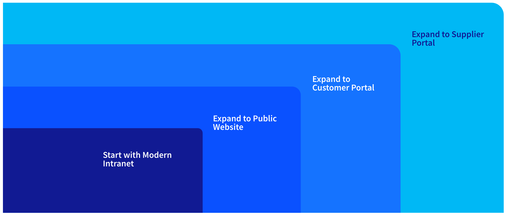

---
toc:
- ./what-challenges-does-liferay-solve-horizontal-solutions/customer-portals.md
- ./what-challenges-does-liferay-solve-horizontal-solutions/digital-commerce-sites.md
- ./what-challenges-does-liferay-solve-horizontal-solutions/external-websites.md
- ./what-challenges-does-liferay-solve-horizontal-solutions/supplier-portals.md
- ./what-challenges-does-liferay-solve-horizontal-solutions/partner-portals.md
- ./what-challenges-does-liferay-solve-horizontal-solutions/modern-intranets.md
uuid: b233e18d-2932-426e-9dfc-209670450195
visibility:
- Employee
- Partner
---

# What Challenges Does Liferay Solve - Horizontal Solutions

**At a Glance**

* Liferay is great for horizontal solutions like
  * Customer Portals
  * Digital Commerce Sites
  * External Websites
  * Supplier Portals
  * Partner Portals
  * Modern Intranets
  * And more
* Customers often start with one project and later add others.
* Each of these solutions draw on many of Liferay’s core capabilities.

## Background

Here you'll learn more about the types of business challenges that Liferay solves well. One of Liferay's key strengths is its flexibility, which means you really can use Liferay to solve just about any problem for any industry.

However, there are some solutions and industries we are a particularly good fit for, and we want to focus on new business opportunities that align with those solutions and industries to have the highest chance of success.

```{note}
* View the [recording](https://learn.liferay.com/web/guest/d/l0-5a-what-challenges-do-we-solve-overview) from the live workshop of this module.
* Download the [PDF](https://learn.liferay.com/documents/d/guest/l0-5a-what-challenges-do-we-solve-overview-pdf) of the presentation used in the live workshop.
```

## Definition of a Solution

A solution is a common business need or a set of challenges that Liferay SaaS is well-suited to address.

## Land and Expand

Most customers come to Liferay looking for a specific solution. Over time they often find additional business challenges that Liferay can help them solve.

For example, in one common pattern, a customer finds Liferay when looking for a modern intranet solution. After the customer implements their intranet, they realize the same features and capabilities (and the same subscription) could also help them solve challenges on their public website or on an authenticated customer portal experience.



## Horizontal Solutions

Click on each of the tiles to read about the six solutions most commonly solved by Liferay. In each case is provided

* A definition for the solution
* The buying audience for the solution
* Key benefits
* Liferay DXP capabilities employed

Don't know where to start? Start with Customer Portals.

[Let's Go!](./what-challenges-does-liferay-solve-horizontal-solutions/customer-portals.md)

::::{grid} 2
:gutter: 3 3 3 3

:::{grid-item-card} Customer Portals
:link: ./what-challenges-does-liferay-solve-horizontal-solutions/customer-portals.md

:::

:::{grid-item-card} Digital Commerce Sites
:link: ./what-challenges-does-liferay-solve-horizontal-solutions/digital-commerce-sites.md

:::

:::{grid-item-card} External Websites
:link: ./what-challenges-does-liferay-solve-horizontal-solutions/external-websites.md

:::

:::{grid-item-card} Supplier Portals
:link: ./what-challenges-does-liferay-solve-horizontal-solutions/supplier-portals.md

:::

:::{grid-item-card} Partner Portals
:link: ./what-challenges-does-liferay-solve-horizontal-solutions/partner-portals.md

:::

:::{grid-item-card} Modern Intranets
:link: ./what-challenges-does-liferay-solve-horizontal-solutions/modern-intranets.md

:::
::::

