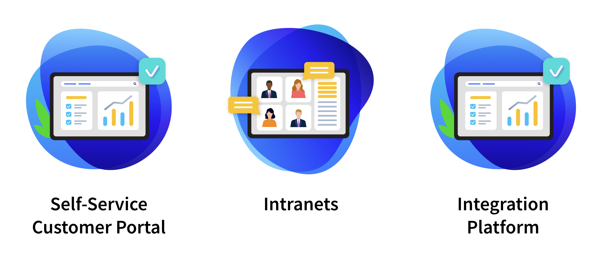

# Energy & Utilities

Companies in the energy and utilities sector have been struggling to overcome the industry’s low customer satisfaction rates and to differentiate their customer experience with intuitive and cost-effective digital solutions.

Liferay has a strong track record of helping companies in this industry deliver winning digital experience solutions. This experience translates into a strong feature set to support the industry’s unique needs.

View Liferay’s Energy and Utilities Case Studies [here](https://www.liferay.com/resources/case-studies?industries=energy-utilities).

## Key Challenges for Energy & Utilities

While many of the key challenges in this sector are common to many industries, energy and utilities also has its own unique challenges:

* How to **empower customers** to serve themselves
* How to **integrate** old and new systems
* How to **leverage analytics**
* How to provide a **consolidated communication hub**

One of the biggest challenges in the energy and utilities industry is finding ways to empower customers to serve themselves while reducing costs. Beyond the value of lowering costs, enabling customers to carry out their transactions at their convenience any time from anywhere increases their satisfaction, customer loyalty, and retention which provides an even bigger benefit.

One of the challenges to providing a seamless self-service experience is the integration of new and old systems. Using Liferay to unite existing core systems and newer technology is one of the best ways to address this challenge.

The size and scale of most utilities means that data could become one of its most valuable assets. Liferay helps make data accessible for all users and unlocks the insights hidden within, helping understand customer behavior, monitor device performance, and pinpoint bottlenecks.

Finally, customers today demand real-time access to critical communications and information. It is important to provide a single location for customers to access transactional information, receive general news and tips, and report incidents or issues---from any device.

## Common Solutions

Liferay provides a variety of solutions to streamline customer experiences for energy and utilities industry clients:

**Self-Service Customer Portal** : Increase customer loyalty and reduce cost-to-serve with a self-service portal that empowers customers to manage their own accounts, pay online, and solve problems without needing to contact a representative.

**Digital Workplace** : Equip teams to better serve and engage customers with a consolidated location to collaborate, access critical information, and simplify day-to-day tasks.

* **Integration Platform** : Connect all your data sources, machines, Internet-of-Things (IoT), and backend systems to provide a unified view of accurate, real-time data on one platform.

## What's Next

Congratulations! You have completed this module on industry solutions. 

Next, find out who are the [Main Competitors](../competitive-landscape-and-liferay-positioning.md) faced by Liferay.
