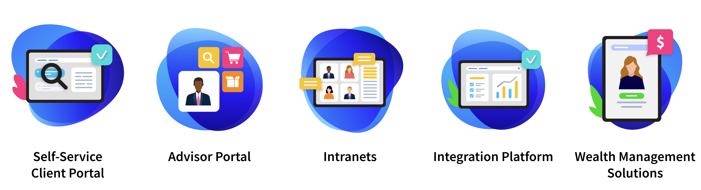

# Financial Services

Much like manufacturing, Liferay has much experience and success in financial services, to a large degree because of DXP’s robust and secure Java based platform.

Financial services customers typically prefer traditional technology choices. Though the IT department may be traditional, their business users expect a modern, personalized, and omni-channel experience.

View Liferay’s Financial Services Case Studies [here](https://www.liferay.com/resources/case-studies?industries=financial-services).

## Key Challenges for Financial Services

Liferay has worked with a wide range of customers in the financial services industry, solving many different challenges for them. While each is unique, some common challenges are seen repeatedly:

* How to offer a **superior customer experience**
* How to support **security** and **compliance** requirements
* How to **keep up** with **competitors**
* How to **empower sellers** to **enable customer delight**

Offering a superior customer service experience for customers has been becoming increasingly important as they interact online. Those customers still want support and guidance, but now expect the same level of service and personalization whether they are visiting in person or banking online.

Financial services customers also struggle with getting the most out of integration with their legacy systems. These challenges might be due to technology incompatibility, data inconsistency, complexity, or even the cost and time that it takes.

For many customers it may not be practical, or take too long, to migrate from these legacy systems. They must therefore find a way to integrate them and deliver value to their employees and customers. This is a challenge that Liferay solves well because of our heritage as a horizontal portal and integration platform.

No discussion of financial services challenges is complete without addressing the increasing threats of cyber-attacks or regulatory requirements. Many financial services companies place a high value on working with proven technologies and vendors, and Liferay’s track record of delivering to banking customers and the maturity of the underlying technologies can really shine here.

Finally, many financial services customers seek ways to provide personalized advice and guidance so _their_ customers can make informed financial decisions. They must find ways to scale this personalized experience while also helping their customer agents and relationship managers be more productive. Liferay’s advanced personalization capabilities and self-service capabilities can help customers do that.

## Common Solutions

The common Financial Services solutions are

**Self-Service Client Portal** : Build personalized, connected, omni-channel digital experiences that make it easy for clients to manage accounts, monitor portfolios, and purchase new services.

**Advisor Portal** : Enable advisors to build and maintain long-term relationships through superior service with a unified solution that provides a 360-degree view of their clients.

**Intranets** : Create a unified intranet that enables employees to collaborate, share information, and work more efficiently.

**Integration Platform** : Maximize operational margins by unifying legacy systems and digitizing manual and paper processes so relationship managers can focus on higher value tasks.

**Wealth Management Solutions** : Outpace change with solutions for advisors and clients while digitizing critical processes in order to efficiently drive assets under management (AUM).

Next: [Government and the Public Sector](./government-and-public-sector.md)
