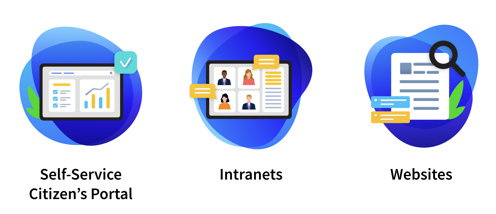

# Government & Public Sector

Liferay has for many years helped customers in the public sector meet the rising expectations of citizens while supporting government digital transformation strategies.

Liferay does this by helping agencies improve mission execution when providing digital experiences that meet the expectations of their constituents. The Liferay platform provides agencies everything they need to build solutions that offer the right information to the right person at the right time.

View Liferay’s Government Services Case Studies [here](https://www.liferay.com/resources/case-studies?industries=government).

## Key Challenges for Government & Public Sector

Typical challenges observed with government and public sector customers are

* How to meet the **rising expectations** of citizens
* How to support **security and compliance** requirements
* How to address **aging legacy systems**
* How to **break down** organizational **silos**

The biggest challenge for customers in the public sector is how to meet ever-rising expectations of their citizens. As with almost every sector, the need for interacting online is growing year by year, and expectations continue to grow when it comes to interactions with local, state, and national governments and agencies.

Another concern for the public sector is to support complex security and compliance requirements. Liferay adheres to a secure development process, adopts OWASP and CWE/SANS security standards, and conducts robust security testing and verification. Additionally, Liferay’s solutions meet EU General Data Protection Regulation (GDPR), ISO 27001, and SOC 2 standards.

The final two challenges---addressing aging legacy systems and breaking down organizational silos---are related, because they are both integration challenges that Liferay addresses well.  When using Liferay as a presentation and personalization layer on the frontend and an integration platform on the backend, data and functionality can be unlocked from diverse legacy systems and presented to citizens in a modern and intuitive platform.

## Common Solutions

Common digital Public Sector solutions that improve citizen satisfaction include

**Self Service Portals** : Build specialized, authenticated portals, so users can securely access appropriate, useful information and collaborate with others. Personalized portals, whether for citizens or government employees, can make it easier for users to find what they need, increasing trust and improving mission outcomes.

**Modern Intranets** : Create protected, customized intranets that enable employees to find the information they need when they need it. Secure, modern intranets help employees better manage their benefits and career planning, allowing for higher satisfaction and better employee retention.

**Websites** : Design sites that appeal to citizens, improve user experience, and boost engagement. Create both appealing and efficient web experiences that solve users’ problems in a single location.

Next: [Insurance](./insurance.md)
