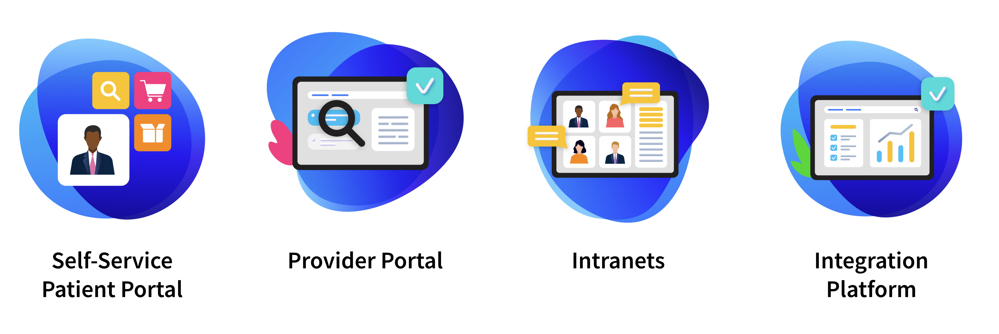

# Healthcare

Healthcare companies are looking for business partners that can meet the demands of digital transformation with customizable, scalable, solutions for providers and users.

Liferay case studies for the Healthcare sector can be viewed [here](https://www.liferay.com/resources/case-studies?industries=healthcare).

## Key Challenges for Healthcare

The Healthcare industry is perhaps changing and being forced to adapt more rapidly than almost any other.  Key challenges seen in this sector are:

* How to put **patients first**
* How to leverage **SMAC-friendly** integrations
* How to **empower employees** and **reduce readmissions**
* How to **rapidly develop** and deploy to **extend the reach** of services

One of the enduring challenges for companies in the healthcare industry is how to put customers first, something that is becoming an even bigger challenge as customer expectations are rapidly rising.  Liferay can quickly create streamlined and connected experiences today’s patients expect.

The convergence of Social, Mobile, Analytics and Cloud (SMAC) is driving business innovation and is the basis for an ecosystem that enables a business to transition from e-business to digital business. Liferay can securely unite existing core healthcare systems and technology with emerging clinical technology. Liferay’s interoperability and flexibility can be used to create seamless and connected digital experiences.

Healthcare providers are also struggling to give employees the tools needed to be more efficient and more effective.  They are looking for ways to provide post-visit care to patients so they can continue to stay healthy long after leaving their facility. With a patient portal built on Liferay DXP, providers can reduce the likelihood of costly readmissions.

Lastly, the healthcare industry is not immune from the vast cultural shifts that the pandemic has brought about and many companies are actively looking for opportunities to reach patients beyond the walls of the office or hospital to provide truly holistic care. Self-service portals give patients on-demand access to their medical records, healthcare provider, and account details securely from any device.

## Common Solutions

Liferay helps healthcare companies to leverage digital efficiencies to improve patient and provider satisfaction:

* **Self-Service Patient Portal** - Build personalized, connected, omnichannel digital experiences that make it easy for patients to manage their accounts, access medical records, and schedule services
* **Provider Portal** - Improve and maintain patient satisfaction through superior care with a solution that provides communication beyond the walls of an office or hospital
* **Intranet** - Create meaningful employee experiences that will engage and motivate your team with customizable user persona dashboards, career paths, and recognition boards
* **Integration Platform** - Unify disjointed legacy systems and integrate new applications on a single platform that enables communication across all patient and provider touchpoints.
