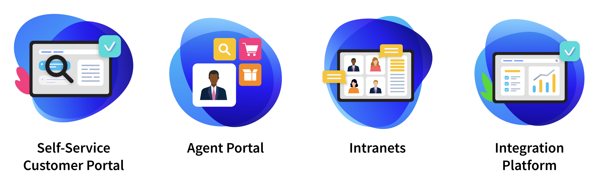

# Insurance

Liferay has a lot of experience building a value chain of customer-centered innovation for the modern insurer, which is one of the reasons why it’s a focus industry. Liferay has a proven record of putting customers, agents, and employees at the center of the digital experience.

View Liferay’s Insurance Case Studies [here](https://www.liferay.com/resources/case-studies?industries=insurance).

## Key Challenges for Insurance

Much like the financial services industry, each insurer is unique, though they share many common challenges:

* How to serve **digital savvy customers** across **omni-channel experiences**
* How to **empower employees**
* How to **integrate legacy systems** to equip **agents** for success
* How to **remain competitive**

Insurers today must serve digital-savvy customers who demand a consistent customer experience across any device, at any time of the night or day. Liferay helps to quickly create streamlined and connected experiences modern policyholders demand. Liferay also allows them to expedite the creation and customization of an insured portal solution by utilizing pre-built capabilities and years of expertise delivering solutions to insurers.

Insurers also struggle to give their employees the tools needed to serve customers effectively. Digital workplaces built on Liferay DXP enable teams to collaborate and perform their jobs effectively, increasing employee engagement, and satisfaction.

Like many other industries, insurers also struggle to integrate legacy systems. Lack of integration leads to disjointed applications and claims processes that are hard to automate. Liferay overcomes integration difficulties with a platform unparalleled for its interoperability and flexibility. Liferay can unite existing core insurance systems and technology to work alongside emerging Insurtech and future innovation.

Finally, insurers must remain competitive. They must stay ahead of changing risks and an evolving market with a flexible platform built to adapt for change. Features like OpenAPI compliance and a wide range of development tools help Liferay customers accelerate future innovations and changing business models.

## Common Solutions

Liferay provides digital Insurance solutions necessary for success:

**Self-Service Customer Portal** : Build personalized, connected, omni-channel digital experiences that make it easy for customers to manage and renew policies and review benefits on their own.

**Agent Portal** : Enable agents, brokers, and partners to share and collect data to deliver personalized quotes and increased operational efficiency through a consolidated location.

**Intranets** : Create a unified intranet that enables agents, underwriters, adjusters, and brokers to collaborate, share information easily, and work more efficiently.

**Integration Platform** : Connect legacy systems, new technologies, and data sources together to ensure optimal performance, eliminate paper processes, and prepare for continuous transformation.

Next: [Healthcare](./healthcare.md)
