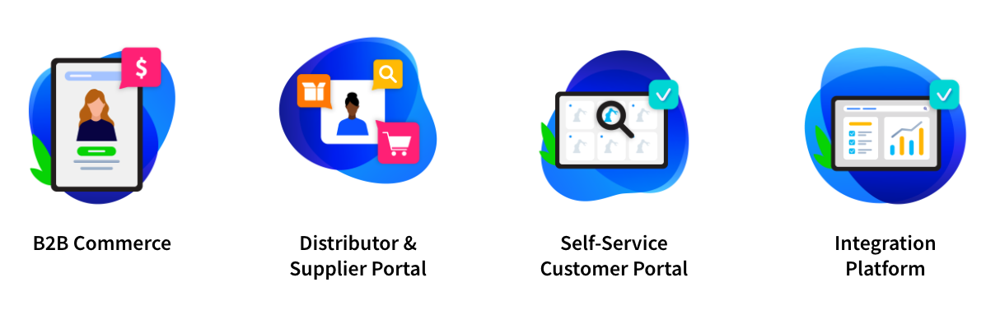

# Manufacturing

Manufacturing is an ideal Industry for Liferay because manufacturers operate in a complex B2B context, with strong international, dynamic and competitive environments.  Many players are involved in the value chain to create a product, from distribution to sale so there are plenty of opportunities for technology to improve efficiencies and enforce processes.

Additionally, Liferay has a lot of experience working with manufacturers with many high profile logos available as references and [case studies](https://www.liferay.com/resources/case-studies?industries=manufacturing).

## Key Challenges for Manufacturers

Liferay has worked with a wide range of manufacturers, solving many different challenges for them. Typical challenges we often encounter with our manufacturing customers are:

* How to **reduce the cost** to serve customers
* Challenges to **establish** **new channels and markets**
* How to **streamline operations**
* How to **differentiate** with **superior user experience**

When working with prospects it is important to validate these challenges with the prospect as they are listed.

## Common Solutions

When working with customers in the Manufacturing industry we most commonly see news for the following solutions:

* **B2B Commerce** - Deliver superior customer experiences, support complex B2B requirements, and drive adoption of online sales channels utilizing digital experience tools with powerful commerce capabilities.
* **Distributor & Supplier Portal** - Equip distributors and suppliers to maximize sales with easy access to critical knowledge and documentation, branding guidance, and product information.
* **Self-Service Customer Portal** - Improve customer loyalty and reduce cost-to-serve with a self-service portal that streamlines processes and empower customers to manage their accounts, access knowledge, and solve problems independently.
* **Integration Platform** - Connect data sources and easily integrate into backend systems like ERP, PIM, CRM, to provide a unified view of accurate, real-time data on one platform.
