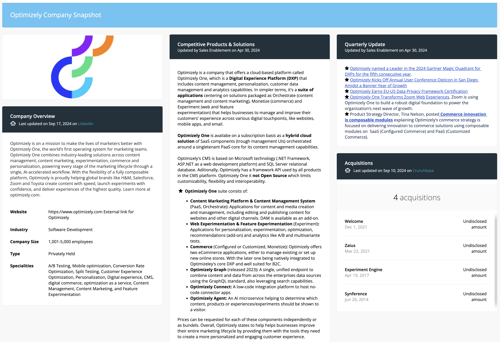
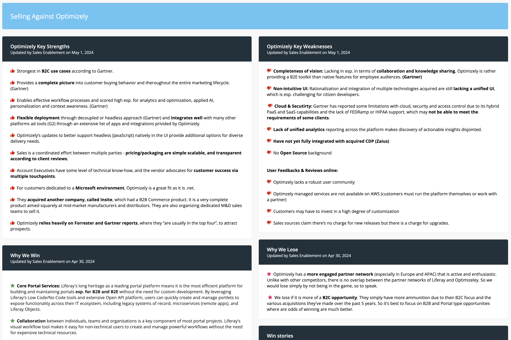
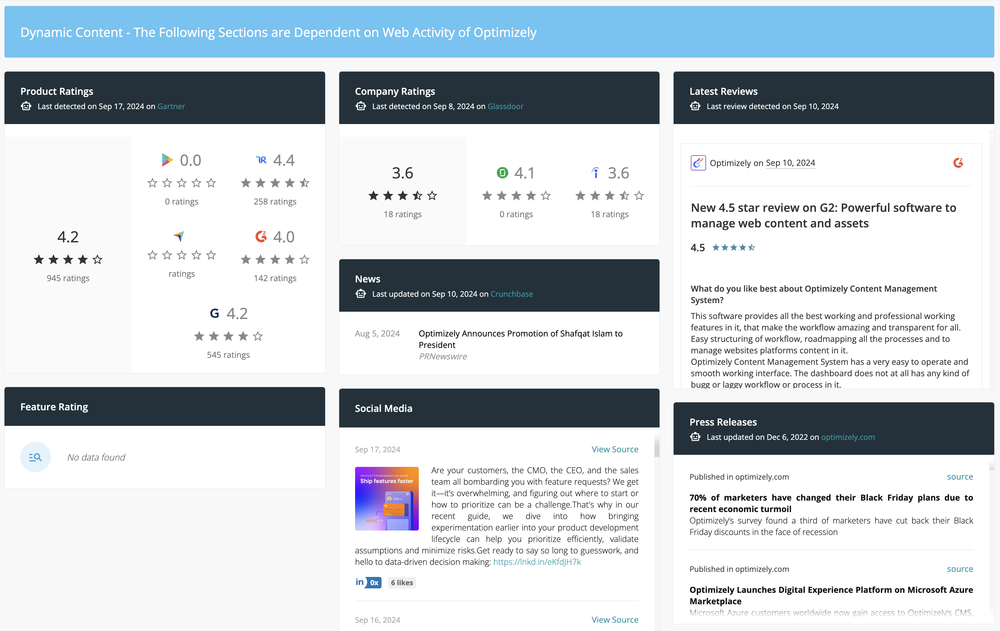

# Competitive Intelligence: Battlecard Format

**At a Glance**

* All Battlecards follow the same structure
* Sections are sourced by scraped data and manually collected information 
* Each Battlecard provides a direct link to the vendor or alliance website

## Battlecard Format

Each Battlecard typically has four sections:

* Company snapshot
* Selling against
* Dynamic content
* Competitor home page

To make this section more meaningful the MACH Alliance battlecard is used.

### MACH Alliance Battlecard Overview

The MACH Alliance promotes that companies should pick and choose the top solutions from top vendors to build the most effective stack, and in doing so not be locked in with a single vendor. The implication is that by selecting the top solutions the customer achieves the best solution they could build.

Conceptually Liferay embraces some of these concepts, but understands that there are always complications when trying to take multiple tools from multiple companies that were not designed to work together, to actually work together well, as is indeed seen with some of the so-called vendor “platforms”.

While not well known in all territories the MACH Alliance is coming up more frequently in some global regions where companies are being influenced to purchase from vendors that are part of the alliance.

Despite potentially low start-up subscription costs, the amounts the buyer needs to pay for building, integrating and most of all maintaining everything could end up being extremely high.

Coupled with this, the end user and developer experiences are fragmented and the customer might become very dependent on different agencies building each application.

### Company Snapshot

The Company Snapshot section provides information on the company and its product offerings to provide a summary of the company and what they sell.

Each battlecard includes:

* Company overview
* Product overview
* Feature summary

In some cases, as with the MACH Alliance, additional information relevant to the company or product is also included.

This section is compiled from scraped and manually added information.

### Selling Against

The Selling Against section provides information geared toward helping understand the way the competitor attempts to position their product and what their strengths and weaknesses are.

Generally the following information is included:

* Competitor’s Positioning
* Competitor’s Strengths and Weaknesses
* Liferay’s Strengths and Weaknesses
* Why They Win/Lose
* Why We Win/Lose
* Objections/Reframes

The information in this section is manually sourced from Liferay’s Product Marketing team, industry analysts, and user reviews as well as feedback from the field where it is available.

### Dynamic Content

The Dynamic Content section contains a snapshot of the most recent updates and communication including:

* Press releases
* News
* Product ratings
* Company ratings
* Latest social media posts

Information in this section is sourced from data scraped from Social Media platforms, event pages, the competitor’s website, and so on.

Note that the example provided for this section is from the OutSystems battlecard, because it is not practical to include information for the MACH Alliance as it is made up of multiple vendors.

### Competitor Home Page

The final section is simply a recent screenshot of and link to the competitors’ Home Page. Note that sometimes the image does not render accurately in the supplied PDF, which is due to the way the competitive intelligence tool collects and renders this image.  Just click on the section to be directed straight to the competitors’ website.

Next: The final module in this learning path covers [Liferay’s Contracts](../liferay-contracts.md).
