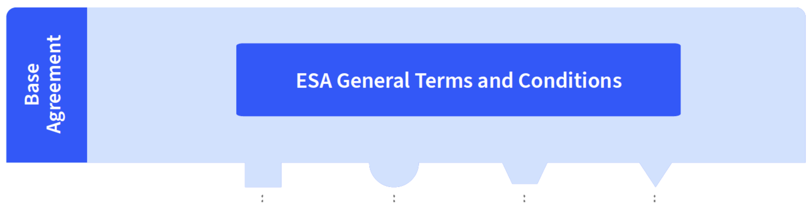
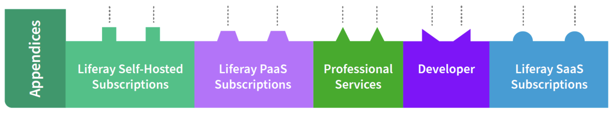
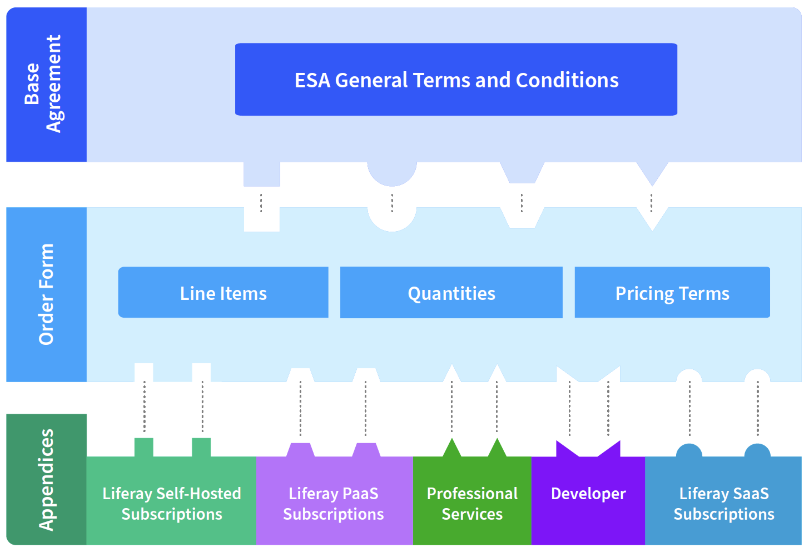
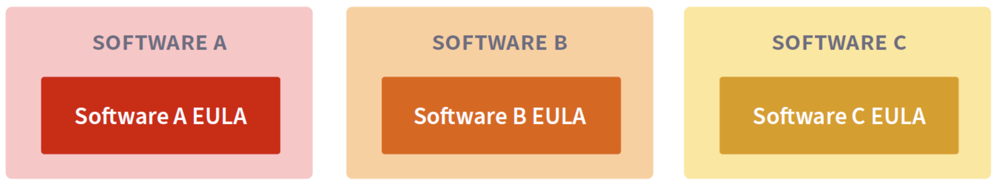

# Liferay Contracts

**At a Glance**

* Liferay is sold using the Liferay Enterprise Services Agreement (ESA) contracting framework.
* The ESA is generic for all customers, with Appendices added to cover the product offerings and services.
* The ESA is used in conjunction with Liferay’s End User License Agreement (EULA).

## Background

This module provides a high-level introduction to the Liferay Enterprise Services Agreement (ESA) contracting framework. It includes brief coverage of the Appendices, applicable Services offerings, and Order Forms.

Finally, at a very high-level, it covers the role of EULAs (End User License Agreement) in the contracting approach.

```{note}
* View the [recording](https://learn.liferay.com/web/guest/d/sa1-7-contracts) from the live workshop of this module.
* Download the [PDF](https://learn.liferay.com/documents/d/guest/sa1-7-contracts-pdf) of the presentation used in the live workshop.
```

## Liferay Enterprise Services Agreement

The Liferay Enterprise Services Agreement (ESA) is Liferay’s customer contract.

The ESA consists of three parts: 

1. The Base Agreement
2. Services Appendices for each of the Liferay Services offering types
3. An Order Form

Together, these parts form the entire contract for the commercial relationship between the customer and Liferay as the vendor.

### Base Agreement



First, the Base Agreement consists of the general terms and conditions and serves as the foundation.

This Base Agreement is designed to be generic and therefore applicable to all of Liferay’s services-based commercial offerings and reusable both for multiple orders and by each party’s affiliates. 

The Base Agreement includes, for example:

* A provision for payment terms (Section 4)
* Confidentiality obligations (Section 9)
* Governing law (Section 12)
* Other terms that establish the commercial relationship

It is important to note that the Base Agreement does not include delivery-specific terms of service for the various Liferay Services, pricing terms, or license terms for Liferay Software.

These terms are found in the other component parts of the agreement structure.

### Appendices



Second, a set of Appendices cover each of Liferay’s Services offering types, respectively.

For example, Appendix 1, the Enterprise Subscription Services Appendix, describes the service obligations, tools and benefits provided by Liferay’s Subscription Services offerings, such as Liferay DXP Subscriptions, and any related add-on Subscriptions. 

Similarly, Appendices 2 to 5 describe the terms and conditions applicable to Liferay Professional Services, Liferay Training Services, Liferay Cloud and related add-on services, and Liferay Developer Subscriptions, respectively. 

Where needed, contract addendums for specific compliance requirements, such as a data processing agreement (DPA), are attached either to an applicable Appendix or the Base Agreement. 

### Order Form



Lastly, the Order Form ties all the component parts together to complete the contract framework.

Each Order Form identifies the Liferay Services ordered, along with any commercial terms, including pricing and quantities, applicable to the specific order. Additionally, each Order Form will reference only those Appendices applicable to each of the Services ordered through the Order Form. 

Where referenced, the Appendix or Appendices augment the Base Agreement to form the complete ESA. 

Because of this, there is no need to review or include Appendices for Services that are not being ordered. 

Each of these elements identified and the structure is explained within the contract itself at Section 2.1 of the Base Agreement.

### End User License Agreement



One important thing to note about the ESA is that it does not include software license terms. The ESA covers the commercial relationship and the provision of Liferay Services, but not any software licensing relationship. 

Liferay does not have any commercial offerings based on charging a software license fee.

Certain Services, such as the Enterprise Subscription Services, do provide for access to Liferay Software free of charge. Where such Liferay Software is made available, the applicable end user license agreement (EULA) is identified in the applicable Appendix for reference purposes. Note however the EULAs are entirely separate agreements that cover the licensing relationship.

Congratulations - you’ve now completed the Level 1 Selling Liferay learning path for Business Sales Roles!

If it’s relevant, you might be interested in [Level 1 for Technical Sales Roles](../level-1-technical.md).  If not, just relax!

[Back to Selling Liferay](../../selling-liferay.md)
