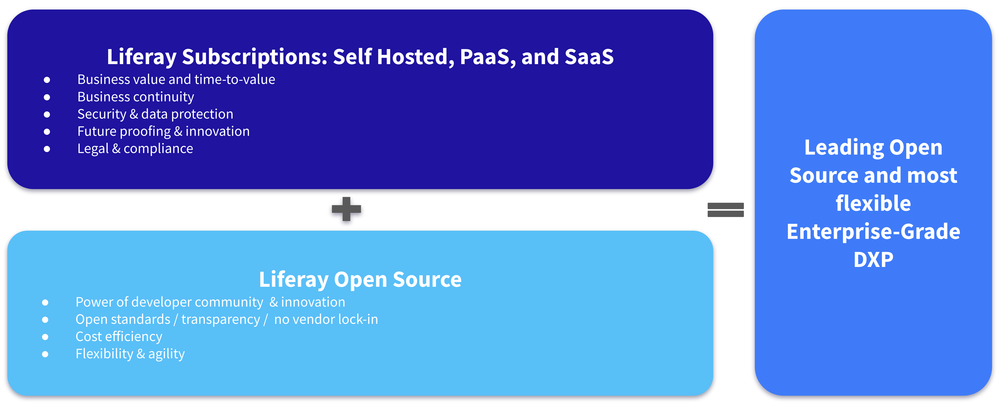

---
toc:
  - ./liferay-pricing/liferay-pricing-saas.md
  - ./liferay-pricing/liferay-pricing-saas-malus-apvs.md
  - ./liferay-pricing/liferay-pricing-saas-addons-upcoming.md
  - ./liferay-pricing/liferay-pricing-paas.md
  - ./liferay-pricing/liferay-pricing-self-hosted.md
uuid: 37d59a74-1900-489a-9e52-2ee681c7d886
visibility: 
- Employee
- Partner
---

# Liferay Pricing

**At a Glance**

* Liferay provides three deployment approaches, all including Liferay DXP:
  * Liferay SaaS
  * Liferay PaaS
  * Liferay Self-Hosted
* Each deployment approach has its own pricing model
* Partner Co-Selling is a key component of Liferay’s sales strategy
* Understanding the pricing models will help you to create Ballpark Pricing for opportunities

## Background

This module covers pricing for Liferay’s three main offerings and product. Once completed, the learner should be able to provide ballpark pricing, tackle most common pricing questions, and build a quote.

Additionally the module covers what type of questions to ask and conversations to have in order to justify the value and understand the needs the customer has in relation to capacity, users, etc. to help select the appropriate offering and sizing.

Although detailed, this is still an *overview* of pricing. Partners should work with the appropriate members of the Liferay team to help with further pricing details. Liferay employees should work with the relevant sales manager.

## Partner First

Liferay is committed to a Partner First strategy which means co-marketing, co-selling, and co-delivering. Co-selling means that Liferay works together with Partners on partner opportunities. The structure of the team will vary based on whether the opportunity is for a new or existing customer:

**New logo opportunities:**

* Channel Account Manager (CAM) and/or Liferay Account Executive (AE) support the sale.
* A Sales Engineer and sometimes a Solution Architect from the Enablement team may also be supporting.

**Existing Customer opportunities:**

* The Liferay account team is there to support the customer and the partner.

Because of this team structure there should not be any situation where Partners need to determine pricing by themselves.

### Selling the Value

Most Buyers are usually eager to learn the pricing at the beginning of the buying process.

Critically, for complex solution selling, it is almost impossible to give an accurate price early in the process because at this stage the needs of the customer will not be fully understood, and without this understanding it is impossible to price correctly.

If the buyer doesn’t understand the *value* of the product and offering the price is interpreted as **cost**, not as an **investment** they need to make.

It is not expected that all customer questions can be answered immediately, and it is not required to provide pricing immediately either. What is more important is to understand the customer’s needs and why they might be asking certain questions so that the value of the offering can be built in before the price is provided.

Particularly in early phases of deals, it is advisable to strategize the needs and solution and content of the offer several times both internally (including for Partners with the Liferay team) and with the different buying influences before sharing details with the buyer.

However, when a serious customer demands a price estimate it must be possible to provide one.

Providing a price estimate to a prospective customer with low investing capability is also a good early disqualification tactic.

### Basic Discovery Questions

Some basic discovery questions for drafting pricing include:

* Solution Use-case
* Success metrics
* Tailoring/Customization requirement
* End-user type & quantity: Registered / Anonymous
* Storage volumes; transaction numbers; types of activities
* Support requirements
* Mission criticality
* etc.

**Solution Use-case**

It’s really important to understand the need that the prospect has, and the type of solution they are looking for will help to inform some of the key pricing metrics. Whether the solution requires authenticated access or not, whether there is a need for commerce (transaction) capabilities needed, or if there’s a lot of traffic (anonymous page views) will all have an impact on the price.

For example, the prospect could be looking to build a Public Web Site. That site could have little to no authenticated access (e.g. a content news site) but a lot of page views.

Alternatively in the case of a Commerce Portal the solution could have a lot of authenticated access and need for purchasing in which case transactions are also needed.

**Volume and Type of End-users**

Understanding the volume of registered users that could log in each month is an important starting point for calculating the pricing. Pricing for registered users uses the concept of Monthly Active Logged-in Users (MALUs), which is covered in detail later in the module. Monthly registered users will not correlate directly, because not all registered users will log in every month, but it can help to be an indicator of how many active users they will have on a monthly basis which then accumulates to their annual band.

This can be refined further if the prospect can estimate what proportion of this user base is active (i.e. logs in) in any given month.

For anonymous traffic, the number of users is less relevant than the number of page views, so if this information is available it will also help with pricing.

**Support and Mission Criticality**

How mission or business critical an application needs to be usually correlates directly to the required support level. For mission or business critical applications customers usually need 24/7 support for issues.

**Other Considerations**

Other considerations include, how much storage the solution will need, what type of tailoring needs there are, and how many customizations might be needed.

## Liferay Deployment Models

Liferay supports three deployment models:

* Liferay SaaS
* Liferay PaaS
* Liferay Self-Hosted

### SaaS First

Liferay’s approach is SaaS first. To make it easier to identify whether this is possible there are some straightforward questions that can be discussed within the Sales team:

* Can the customer’s business problem be solved with Liferay’s out-of-the-box features?
* Or, can the preferred approach to customizations - Client Extensions - be used to meet those requirements?
* Or, could the problem be solved with an upcoming feature - either one that’s already on the roadmap, or one that the customer requests and can be built for them during the sales cycle?

If any of these are true, and the customer is comfortable with SaaS in the first place, then Liferay SaaS should be proposed.

There are some possible scenarios where it might not be possible to be SaaS:

* The customer might say that SaaS is not an option for them.
* There might be concerns over data:
  * Where it’s stored
  * How it is secured
  * Who has control over it

In these cases then it might be that Liferay PaaS could be an option, or if Liferay’s Cloud in general is not an option then Liferay Self-Hosted is available.

And remember, the [Sales Decision Flow](https://learn.liferay.com/documents/d/guest/new-customer-new-project-sales-decision-flow) can also be used to help with this step.

Next: review each of the pricing models, starting with [Liferay SaaS](./liferay-pricing/liferay-pricing-saas.md).

::::{grid} 2
:gutter: 3 3 3 3

:::{grid-item-card} Liferay Pricing - SaaS
:link: ./liferay-pricing/liferay-pricing-saas.md

:::
:::{grid-item-card} Liferay Pricing - PaaS
:link: ./liferay-pricing/liferay-pricing-paas.md

:::
:::{grid-item-card} Liferay Pricing - Self-Hosted
:link: ./liferay-pricing/liferay-pricing-self-hosted.md

:::
::::
