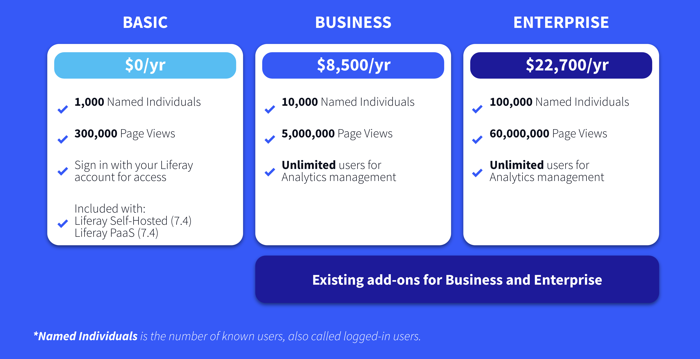

# Liferay Analytics Cloud Pricing

All customers, on all deployment approaches, get access to all of the platform features - and that includes the Analytics Cloud features.

It is important to understand that Analytics Cloud is *usage* based, and that there are some differences between the different Product Deployment Offerings.

### Liferay SaaS

For Liferay SaaS customers, the usage of Analytics is tied to the Liferay SaaS MALU and APV bands - so a SaaS customer will be able to track all of their logged in users, and all of their page views in Analytics Cloud without needing any additional usage.

### Liferay PaaS and Liferay Self-Hosted

Liferay PaaS and Liferay Self-Hosted customers on 7.3 or before have the option to activate a Trial account of Analytics Cloud for 90 days.

If they want to continue beyond that they will need to purchase either the Business or Enterprise plan. This Trial offers the “Basic” usage shown below.

For Liferay PaaS and Liferay Self-Hosted customers on 7.4 or the Quarterly Releases, their subscriptions include the Basic usage. They will need to upgrade to either Business or Enterprise when and if their usage goes above the limits of the Basic plan.

## Liferay Analytics Plans 

### Basic Plan

The Basic plan provides:

* 1000 Named Individuals - the number of users who have logged in - and are hence known
* 300,000 Page Views - all pages served to users - anonymous or authenticated. 

These numbers reset every year.

As noted above, this plan cannot be purchased - it is included for Liferay PaaS and Self-Hosted customers on 7.4 and above, and available as a free 90-day trial for customers on 7.3 or below. 

### Business Plan

The Business plan provides:

* 10,000 Named Individuals
* 5,000,000 Page Views

These numbers reset every year.

The Business plan is currently 8,500 USD/EUR per year.

### Enterprise Plan

The Enterprise plan provides:

100,000 Named Individuals
60,000,000 Page Views

These numbers reset every year.

The Enterprise plan is currently 22,700 USD/EUR per year.

### Add-Ons

When Customers reach their usage limits on either of the Business or Enterprise plans it is possible to purchase additional packs of usage as follows:

* 5,000 Named Individuals
* 5,000,000 million Page Views 

Note that there will be a point where it is financially better to move up to the Enterprise plan than to continue to purchase add-on packs for the Business plan. Please check with your local Liferay team for pricing for add-on packs.

Congratulations - that's the end of the module on Liferay Pricing!

In the next module find out about [Liferay’s Sales Presentations and how to Master them](../liferay-sales-presentations.md).