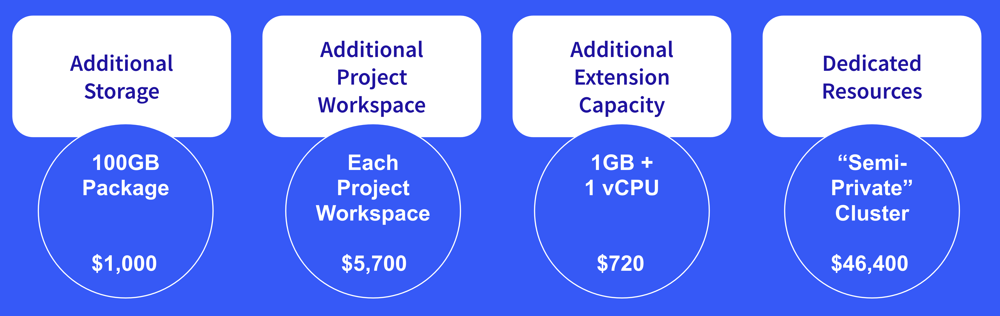

# Liferay Experience Cloud SaaS Pricing - Add-Ons and Upcoming Features

**At a Glance**

* New pricing model for Liferay Experience Cloud SaaS for 2023
* Add-ons are available as customers grow
* New features are coming to improve customer experience and to provide greater visibility to employees and Partners

## Liferay Experience Cloud SaaS Add-ons

In addition to adding more MALUs or more APVs, there are other ways that customers can expand that are not tied to moving to a higher plan:

* Storage
* Project Workspaces
* Extension Capacity
* Dedicated Resources

### Storage

For customer solutions with the need to store lots of documents, images, or other assets in the Document Library, it is possible to purchase additional storage capacity. 

While the different plans offer different starting storage capacity, when customers need to add capacity later that can be purchased as an add-on, in addition to moving to a higher plan.

### Project Workspace

Liferay Experience Cloud SaaS introduces the concept of the **Project Workspace**. A project workspace is a way to encapsulate the different types of environments and different types of user bases the customer might need to have. Most customers will use a single Project Workspace, however some customers might have solutions which require completely segregated user bases.

A possible use case where additional Project Workspaces might be needed could be for a customer with multiple businesses where this fact is preferred to not be known publicly. For example, a manufacturer might produce both premium and economy product lines and sell them under different brands (e.g. luxewidgets.com & basicwidgets.com). In this scenario it is important that a customer who has already registered their email address on the luxewidgets.com website doesn’t see a message warning them that an account already exists with that email address when they also try to sign up for the basicwidgets.com website. 

Because of how Liferay DXP handles email addresses, and how Liferay Experience Cloud is architected, this is only possible if each of these solutions is created in a different Project Workspace.

Each Project Workspace includes Production and UAT environments, which in turn include Liferay DXP and capacity for Extensions. For the Business and Enterprise plans each Project Workspace also includes a Development environment.

Each of the plans provides different numbers of Project Workspaces:

* **Pro**: 1 Project Workspace
* **Business**: 5 Project Workspaces
* **Enterprise**: 10 Project Workspaces

In addition to moving between plans to increase the number of available project workspaces it is possible to buy additional workspaces for each of the plans.

```{note}
The Project Workspace concept is new and specifically for Liferay Experience Cloud SaaS. For other use cases the Liferay DXP [Virtual Instances](https://learn.liferay.com/web/guest/w/dxp/system-administration/configuring-liferay/virtual-instances) feature can be used to achieve a similar outcome.  
```

### Extension Capacity

As with most options, each plan offers a different amount of capacity for Extensions:

* **Pro**: 1 GB RAM / 1 vCPU
* **Business**: 4 GB / 8 vCPU
* **Enterprise**: 6 GB / 12 vCPU

Again, in addition to moving between plans, customers can purchase additional extension capacity. Extension capacity is where customers’ will host Client Extensions. As covered in earlier modules, client extensions are a way that tailored solution development is implemented.  In many cases these client extensions will need some computing power and memory capacity, and based on the number and nature of client extensions customers may need to purchase additional capacity.

### Dedicated Resources

Liferay Experience Cloud SaaS is a multi-tenant environment, where each Liferay customer is sharing a Liferay Instance with other customers.  In technical terms, each customer is getting Liferay “[Virtual Instances](https://learn.liferay.com/web/guest/w/dxp/system-administration/configuring-liferay/virtual-instances/understanding-virtual-instances)” for their Production, UAT, and if they have them, Development environments.

If a customer needs or wants to isolate their installation from themselves they can purchase Dedicated Resources, which gives them their own dedicated Liferay instance and Database.

What’s important to note here is that this is not a private cluster - there are still some shared resources, so it can be considered a semi-private cluster. Liferay Experience Cloud Self-Managed provides an add-on option for a full private cluster if this is required.

### Pricing for Add-ons



The example above shows the pricing for add-ons in US dollars and Euros. For other currencies your Liferay contact persons and your CAMs can provide the exact pricing, but for a guide price, use the normal exchange rates to convert to local prices for each market.

The possibility of customers being able to purchase additional Domains as bundles for the Enterprise plan is being investigated as a potential future add-on.

## Success Drives Growth

The number of sites a customer needs and uses becomes less relevant with the higher plans because Business includes 15 and Enterprise includes an unlimited number. 

What this means is that adding sites doesn’t become expensive to the customers, which was a major limitation of the 2022 price model. 

This flexibility allows customers to build more and more solutions as they grow, which increases the value for them. As their usage and their end users engagement grows there is an increase in the MALU and APV volume which turns into revenue growth also for Liferay and our partners.

For Partners it is now possible to continue to build new solutions for customers after their initial project is complete without needing to immediately buy a set of new instances. Where the customer has multiple solutions the MALUs and APVs for each solution are added together, and the totals are used to determine the required MALU and APV bands for the 12-month subscription period.

This allows both Partners building solutions to grow revenues along with Liferay while the customer gets more value out of their Liferay account.

## What’s Next?

Finally in this module, there are some additional features and items that are coming to enhance the new pricing model:

* Product Notifications
* Product Dashboards
* Enablement Assets
* Free Plan

### Product Notifications

Product Notifications are currently under development, and are particularly important because they will allow customers to understand if they are approaching their MALU and APV limits. The name notifications will be used for Liferay’s Customer Success team and Liferay’s Partners.

With all parties being aware of the remaining usage, it will be possible to start a conversation early on to provide the options for moving to a higher level. Over time we anticipate that Customers may even approach proactively to request to move.

These will ensure that the situation does not arise where a customer exceeds their usage limit without knowing, and is then unexpectedly hit with the overage charge.  

### Product Dashboards

Dashboards are also planned to enable usage metrics to not just be used for charging purposes but to help the customer to understand how the platform is being used, how the solutions are performing, what kind of usage there is and what the trends are.

Having these in place will support more intimate conversations with customers and help to identify opportunities for improving the solutions.

### Enablement Assets

With respect to enablement, we are planning further scenarios, examples, and tests and once the new partner portal is ready will also provide an interactive pricing calculator for you to play with. 

Until the partner portal is ready, if there are questions related to the pricing reach out to your CAM and other Liferay team members who can help with pricing. 

### Free Plan

As mentioned earlier, we have plans to introduce the Free or Hobby plan to promote adoption and provide a bottoms up approach to get more and better feedback, which is important for Liferay as an open source company.

The free plan will also help to identify new potential customers and to understand their needs, and in doing so enable more meaningful conversations with prospects, and identify potential new use cases and product enhancements. 

## Real World Validation

When the new price model was defined, extensive work was done by a large team at Liferay which involved, in part, reviewing numbers and usage metrics of existing customers to understand what implications the new price model would have on them  if they moved from their current model.

The overall feedback from the field since launching this pricing earlier in 2023 has been positive, with some helpful constructive criticims as well.  A number of deals have been closed using the pricing model, which also helps learning with each opportunity. Continued feedback is desired and valued - please keep it coming.

Continue learning about Liferay Pricing, with [pricing for Liferay Experience Cloud Self Managed (PaaS)](./liferay-pricing-paas.md).
