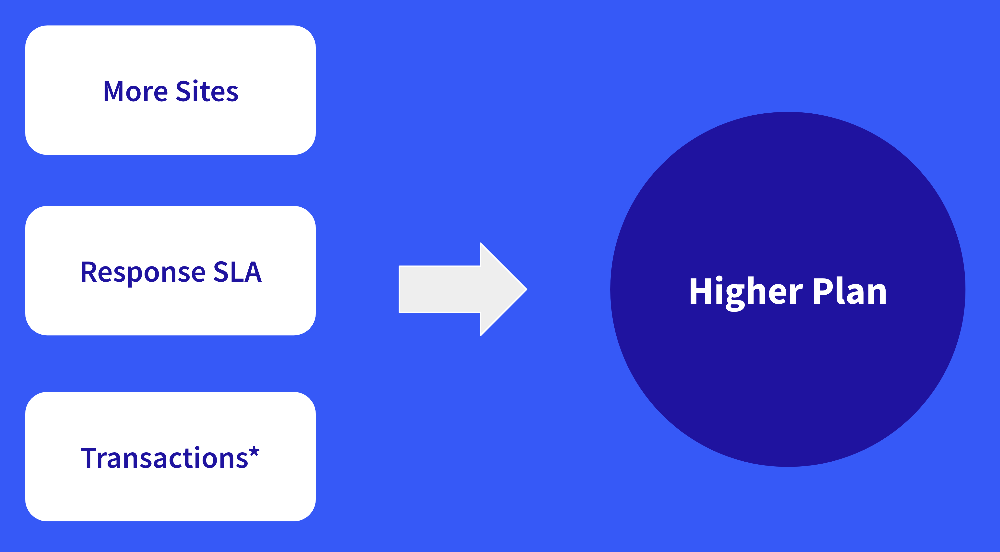

# Liferay SaaS Pricing - MALUs, APVs, Moving Plans

**At a Glance**

* Updated pricing model for Liferay SaaS for 2024
* Primary usage based on:
  * Monthly Active Logged-in Users (MALUs)
  * Anonymous Page Views (APVs)
* Options exist to move between plans when additional capacity is required

## MALU and APV Bands

MALUs and APVs are grouped as Bands where each customer needs to have 1 MALU band and 1 APV band.  The smallest bands are free, but the allowances in the smallest bands provide very small annual usage:

* 100 MALUs
* 100,000 APVs

**MALU Examples**

For MALUs, if a customer had 8 Content Authors or Administrators that logged in every calendar month, the Band of 100 MALUs would be fully used - i.e. 8 users x 12 months = 96 MALUs. 

For the free MALU band this would mean that no additional end-users could log in, so would work only for a public website where no users log in, and only a very small number of Content Editors and Administrators. 

So, in most circumstances, if the customer had more Administrators or Content Authors or if there were some authenticated visits by end-users they would need to purchase a higher MALU band.

As the authenticated usage grows so a higher band is needed:

* The 5,000 band can work for a small organization’s partner portal
* The 15,000 band can work for an intranet for a company that has about 1,000 employees who all log in at least once a month

Once a customer needs more than 200,000 MALUs per year the pricing model becomes custom for each customer. 

**APV Examples**

For APVs there is also a free band to start with. For Intranet solutions, this band, with up to 100,000 anonymous page views might be sufficient. 

But of course, a MALU band would be needed for these for users based on the estimated annual total for Monthly authenticated users, so the main metric for usage for an internal facing site would be MALUs.

If the prospect is implementing a Public Website which allows their customers to login to the Customer Portal then a suitable APV band, perhaps one of the higher ones, must be purchased in addition to the appropriate MALU band.

Similarly, for a customer mainly focused on providing content for any visitor on the public site but having some content which is protected, but that needs to be accessed by a large number of users, these users would be authenticated users, and so a potentially large MALU band might be required.

For APVs custom pricing is also employed, in this case where usage exceeds 300 million anonymous page views.

**MALUs, APVs, or Both?**

Every customer needs to have one MALU band and one APV band. The combination of these depends on the solution they need and the volumes and frequency of their visitors.

If the solution is mainly for authenticated users, such as Intranets, Customer Portals, Supplier Portals, Citizen Self-Service Portal, B2B Commerce Portals and so on, the  primary metric will be MALUs. 

If the solution is mainly meant for anonymous visitors, such as Public Websites then the primary metric will be APVs. 

If there are both use cases for the Liferay solution, with a high amount of anonymous page views as well as authenticated users then the customer will need higher bands for both.

## Calculating MALUs

While anonymous page views are a straightforward metric, the MALU concept requires slightly more explanation. The key here is that this stands for Monthly **Active** Logged-in Users. It is a way to track the number of users that are active, where active means that a user has logged in once or more in a given calendar month.

Importantly, this is not the same as Registered Users, and these are not being counted. Understanding how many registered users a Prospect has helps to estimate the number and frequency of authenticated use. For example if there are 1000 registered users but only one of those logs into the system in a calendar month then that counts as one MALU for that month.

To calculate MALUs therefore depends on how many active users the Prospect has in _each_ month of a twelve-month period. Each monthly value is added together to get to the annual, or aggregate number and in turn the MALU for that 12 month subscription period.

It’s important to remember that this is **not** talking about **average** usage either. In the example in the image below there are a different number of monthly logged in users in each month. In January, February and March it is 500 each month, so at the end of February the year-to-date total is 1000, while at the end of March it is 1500.

For the next six months after that the count increases by a thousand each month, until October when there’s a spike, perhaps indicating a seasonal event, or a campaign, which causes more users to login to the platform. At the end of the 12 month period the total is 11500 which means this customer would need to purchase the MALU band of “up to 15000”.

**Success Drives Growth**

In the pricing model Liferay’s growth (and Partner’s for partner opportunities) is tied to the success of the customer. And this is straightforward to explain: if a customer sees a lot of adoption on their sites and a lot of engagement by their users then their usage is increasing and so they will move into higher MALU and/or APV tiers.

And that applies to both Public Websites with increasing traffic or Portals where the customer sees increasing usage by their customers.

What is important is to help the customer to succeed with the solutions that are built because that is the primary way that revenue can grow per account beyond adding a second or third solution. The customer’s success is our success, which is both fair and easy to justify.

## Moving to a Higher Plan

All customers must select one of the three available plans when purchasing Liferay Experience Cloud SaaS, but there are situations where the customer might need to move to a higher plan. There are three main situations where this might occur, where’s there’s a need for:

* More sites
* More mission critical response SLA
* More transactions

### Sites

As a customer grows they might need to add additional solutions, which will require more sites. Each plan provides a different number of sites:

* **Pro**: 2 Sites only
* **Business**: 15 Sites
* **Enterprise**: Unlimited

Because of these limitations, if the customer needs to use Liferay in a strategic way they might need to move to a higher plan to accommodate more solutions and solution needs.

### Response SLA

The Response SLAs are also different between the plans:

* **Pro**: Gold (8/5)
* **Business**: Gold (8/5)
* **Enterprise**: Platinum (24/7)

Platinum level support is usually the requirement for any business critical solution.

### Transactions

As with the other Liferay offerings, Liferay Experience Cloud SaaS includes commerce functionalities. What is meant by **transactions** is using the commerce capabilities to the point where a purchase or order is made through Liferay. This must be a “completed checkout in Commerce”.

What’s important here is that using other Commerce functionality such as the Product Catalog does not count as a transaction - only those orders that have a completed checkout step. 

Once again, the different plans provide different levels usage:

* **Pro**: 500 transactions per year
* **Business**: Unlimited
* **Enterprise**: Unlimited

The key thing here is that 500 transactions per year is really not enough to provide a real commerce experience for customers. But, it allows Pro customers to try out the commerce functionality for their solution, which might later lead to an upgrade to the Business or Enterprise plan when a full commerce check-out experience is required.

### Not available as Add-Ons

It is particularly important to understand that changes to Sites, Response SLA and Transactions are not available as add-ons. 

Customers on the Pro plan cannot expand from 2 sites any other way than by moving to the Business or Enterprise plan. 

Similarly Customers who need a Platinum level response SLA will have to be on the Enterprise plan.

And to complete the story, if a customer needs more than 500 Transactions they will need to be using the Business or Enterprise plan.

Continue learning about Liferay SaaS Pricing, with [Add-Ons and Upcoming Features](./liferay-pricing-saas-addons-upcoming.md).
