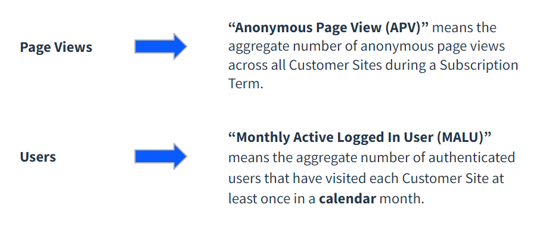
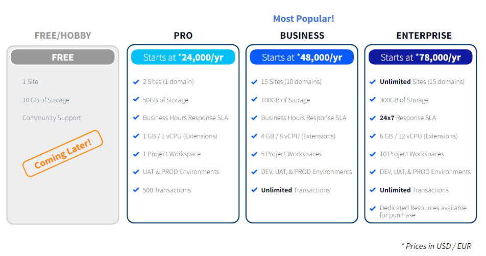

# Liferay SaaS Pricing - Introduction and Plans

**At a Glance**

* New pricing model for Liferay SaaS introduced in 2023
* Minor changes for 2024
* New pricing supports Endless Solutions on Liferay SaaS
* Three plans provide different levels of capabilities:
  * Pro
  * Business
  * Enterprise

```{note}
* View the [recording](https://learn.liferay.com/web/guest/d/sa1-2a-liferay-pricing-saas) from the live workshop of this module.
* Download the [PDF](https://learn.liferay.com/documents/d/guest/sa1-2a-liferay-pricing-saas-pdf) of the presentation used in the live workshop.
```

## Updated Pricing for 2024

The Liferay SaaS offering was launched in Q2 2022. A lot of feedback on this pricing was received, and a new pricing model was introduced in 2023.

This model is retained in 2024, with minor updates.

## Key principles for Liferay SaaS Pricing

With the new pricing we wanted to tackle four challenges:

* Lower entry point
* Pricing simplicity
* Project expansion
* Be solution agnostic

**Lower Entry Point**

Having a lower entry point helps to attract new customers and drive adoption. Liferay is striving to become a Product Led Growth company, a key principle of which is to have a bottoms-up-approach to increase adoption.

**Pricing Simplicity**

It shouldn’t require a 30-page manual to understand what to offer to prospects and customers, what elements to include, and how to price them. And to have to pass that on to the buyer so they know what they bought. 

The goal is for the pricing to be as easy as possible for Sellers and Buyers alike.

**Project Expansion**

The pricing needs to provide opportunities for growth within accounts after the initial purchase - another key characteristic of a Product Led Growth company.

Liferay’s legacy pricing model has been instance based. The drawback of this model is that, for example, if a customer buys 2 production and 2 non-production instances they can build a number of different solutions without needing to purchase more instances.

We wanted to make sure that Liferay and our Partners’ success grows when the customer becomes more successful - by having a price model that is usage based and therefore grows as the customer grows.

**Be Solution Agnostic**

The pricing model also needs to work with any type of solution that the customer could build. It would work regardless of how many accelerators we build.

## Pricing for Endless Solutions?

Initially the barrier to a flexible price model was explicitly tied to the flexibility of a platform intended to be used for endless solutions.

Liferay can be used as a public website, with a lot of page views. This aligns to a lot of SaaS companies who charge based on page views, because marketers understand the concept of page views.

But if the pricing is based purely on page views there’s a problem when the customer wants to build an internal site like a Customer Portal, instead of a public website, where page views are low, but usage is high. This model is not able to capitalize on a customer’s high usage of the system but with a low number of page views.

To flesh this out in a bit more detail, a customer portal for a utility company would have many users logging in and accessing their own information perhaps every month to check billing or statements, but the amount of page views would remain low. 

An alternative then is to price based on known users, which works well for customer portals and other sites requiring authentication.  However, this model falls down with public sites with heavy traffic but where only the content authors and site builders are known users - probably less than 50 users.

The solution to this challenge was to combine both models, to have metrics for both Page Views and Users, with each lever operating independently of the other.



### Anonymous Page Views

Thinking about the page views, ultimately these are from users who have not logged in to a site. This metric is used for companies that are using Liferay for public websites.

An Anonymous Page View (APV) therefore is a hit to a site built on Liferay where the user is not authenticated. For pricing purposes Customer’s should purchase enough APVs for their subscription term.

### Monthly Active Logged-in Users

Monthly Active Logged-in Users (MALUs) provides a way to ensure that known users are counted separately from anonymous users - and are not counted twice.

MALUs measure the number of individuals that authenticated themselves and were logged-in on during a given calendar month and per a site.  How this works in practice is covered later on in the module.

The combination of APVs and MALUs ensures that there is now a way to measure and track usage whether the solution is a public site, an internal site like a Customer Portal or Intranet, or a combination of both.

## Liferay SaaS Plans

The first part of every new SaaS deal’s pricing are the base plans, of which there are three:

* Pro
* Business
* Enterprise 

All plans have an annual fee, with the entry point for all of them, in particular the Pro plan being low - and therefore meeting one of the pricing objectives.

For most customers and potential customers the Business plan or the Enterprise plan are the preferred options. These two plans provide more value for the buyer and especially the kind of companies and organizations Liferay is particularly suitable for. 

The Business and Enterprise plans support more domains, allow more sites, including unlimited sites for the Enterprise plan, more storage, and so on. By design, the Pro plan includes some limitations, like allowing a maximum of two sites. 

The Enterprise plan provides Platinum level support with a 24/7 response-time SLA that is required for business critical solutions which are often the case with Liferay customers.

The key principle is that every customer needs to have one of these plans, either Pro, Business, or Enterprise.



As of January 2024, the starting point for each plan are as follows:
* Pro: EUR / USD 24,700 per year
* Business: EUR / USD 49,400 per year
* Enterprise: EUR / USD 80,300 per year

Localized pricing is available in other geographies - please contact your local Liferay sales team for details.

Continue learning about Liferay SaaS Pricing, with [MALUs, APVs and Moving Plans](./liferay-pricing-saas-malus-apvs.md).
