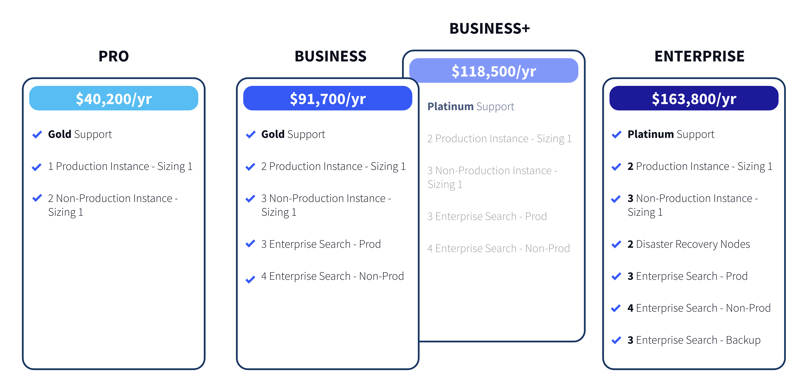

# Liferay Self-Hosted Pricing

**At a Glance**

* Liferay provides three deployment approaches, all including Liferay DXP:
  * Liferay SaaS
  * Liferay Paas
  * Liferay Self-Hosted
* A new pricing model for Liferay Self-Hosted was introduced in 2023
* The new model is Plan based, providing a bundle of Instances and Environments

```{note}
* View the [recording](https://learn.liferay.com/web/guest/d/sa1-2-liferay-pricing) from the live workshop of this module.
* Download the [PDF](https://learn.liferay.com/documents/d/guest/sa1-2-liferay-pricing-pdf) of the presentation used in the live workshop.
```

## Background

Sometimes Liferay's Cloud, in either SaaS or PaaS-mode is not an option for a Customer.

With Liferay Self-Hosted, Liferay provides just the DXP software itself, with the Customer responsible for everything else, either doing it themselves or paying for someone else to do it.

The Customer is responsible for the low-value, but often high cost activities, which include taking care of:

* Infrastructure
* Platform Software - the Database Server, Search Server, Storage, etc.
* Designing and implementing a high-availability architecture, if required
* Designing for higher capacity:
  * Adding a Cluster of Liferay instances
  * Replicating the Database
  * Adding a cluster of Search nodes
  * Adding a load balancer, often a cluster of Web Servers
  * etc.
* Performing day-to-day activities like:
  * Upgrades
  * Updates
  * Applying Patches, Security Hotfixes, etc.
  * Software Troubleshooting

In addition to these they are responsible for high-value activities like Application Delivery, also known as Solving Business Problems.

While there are a lot of additional responsibilities, there’s also flexibility because Customers can deploy Liferay Self-Hosted where they wish:

* Public Cloud
* Private Cloud
* In their own data-center.

## Liferay Self-Hosted Pricing Model - Summary

Liferay Self-Hosted pricing was updated May 2023. It is still instance based but starts with three base plans and a “plus” plan:

* Pro
* Business
* Business+
* Enterprise



The new model is being rolled out in phases, with the new plans being available for New Business and New Project Existing Business opportunities.

For existing customers renewals stay with the old a la carte pricing model for the time being. And, in some cases there are prior agreements or special pricing in place. For these situations please work with Liferay’s Go To Market leaders for exceptions when it comes to existing customers’ new projects.

Furthermore, there are some add-on product line items that have not yet been incorporated into the plans, which need to be handled manually for the time being.

With the co-selling model now in place, the Liferay sales team manages these manual pieces for Partners.

## Key principles for Liferay Self-Hosted Pricing

The key principles to the new Liferay Self-Hosted pricing model are as follows:

* Simpler than an a la carte model
* Include 3 base plans and 1 “plus” plan
* Needs based
* Increase average deal size
* Harmonize across offerings
* Add value

**Simplify**

* The previous model required adding many line items to any order form. The new model simplifies this substantially by using pre-configured plans which bundle together multiple line items.
* Being simpler means it is easier, and therefore faster for customers to do business with Liferay

**Plans**

* The starting point for the pricing is a Plan, and there are three plans, along with one “plus plan”. 
* Each of the plans consists of several product line items instead of needing to build a basic quote by manually selecting multiple line items.

**Needs Based**

* The plans are built with customer needs in mind, to cater for different sizes of customers with different budgets and differing needs. 

**Average Deal Size**

The new plans-based approach has been used in North America by Liferay’s Direct Sales team for a couple of years, with encouraging results:

* Buyers and their procurement teams are more receptive to simple quotes and order forms.
* Average Deal Size (ADR) has also increased since the packaged offering was introduced.

**Harmonization**

* With three deployment offerings, having a pricing model that is harmonized across the offerings makes it easier for any new sales people working at a partner or for Liferay to understand the model, and consequently to be able to explain it when needed to a buyer.

**Value**

* The new plans incorporate discounts over buying individual line items, so the buyer gets more value than buying a la carte.

**Rules**

* All new opportunities must start with the new plans.
* A la carte pricing is available for adding capacity and products to new opportunities.

## Liferay Self-Hosted Pro Plan

The smallest available plan provides a base-level configuration for simple projects. This configuration is considered the absolute minimum to have an effective Liferay installation.

This Plan includes the following instances:

* 1x Production Sizing 1
* 2x Non-production Sizing 1 (i.e. Development, Test, UAT)

Note that the Pro Plan does not include Liferay Enterprise Search (LES), but it is recommended to include LES in every deal, so it can be included as an add-on. Liferay Enterprise Search provides substantial value even to smaller customers because it provides support for the Search infrastructure used by Liferay, along with the commercial verison of Elasticsearch. Without this there is no support provided by Liferay for the Search infrastructure.

Note that due to the low cost for the Pro Plan there is minimal room for price negotiation. It is expected that the buying and contracting process should be straightforward.

## Liferay Self-Hosted Business and Business+ Plans

Next are the Business and Business+ Plans, which add High Availability with 2 instances for each of Production and UAT, along with an additional Non-Production instance. These plans also include a cluster of Enterprise Search nodes for production and sufficient Enterprise Search nodes for non-production.

The complete configuration is:

* 2x Production Sizing 1
* 3x Non-production Sizing 1 (2 nodes for UAT, 1 for Development)
* 3x Enterprise Search Production
* 4x Enterprise Search Non-Production (3 nodes for UAT, 1 for Development)

The Business Plan is expected to be the most popular option for new customers in most territories, and includes discounts over the a la carte model.

The Business Plan includes Gold Support, while the Business+ Plan includes Platinum Support.

For customers needing a 24/7 response SLA but not disaster recovery the Business+ plan is the most appropriate option.

Note that Platinum Support cannot be bought as an add on. Customers needing this level of support must either buy the Business+ or Enterprise Plans.

## Liferay Self-Hosted Enterprise Plan

The Enterprise Plan expands on the Business+ Plan by adding Disaster Recovery capabilities. The complete configuration is:

* 2x Production Sizing 1
* 3x Non-production Sizing 1 (2 nodes for UAT, 1 for Development)
* 2x Disaster Recovery Sizing 1
* 3x Enterprise Search Production
* 4x Enterprise Search Non-Production (3 nodes for UAT, 1 for Development)
* 3x Enterprise Search Backup

This plan will be most suitable to customers running larger, mission critical applications.

## Background to Plan Pricing

The plans are currently priced as follows:

* Pro: EUR / USD 40,200 per year
* Business: EUR / USD 91,700 per year
* Business+: EUR / USD 118,5000 per year
* Enterprise: EUR / USD 163,800 per year

As noted above, the new plan-based approach has been piloted in the North American region prior to being launched globally.  This provided an opportunity to gather feedback from sales, and to work with the regional sales leaders.

Additionally, data was gathered and analyzed from all new business and new project sales globally over the past 3 years.  The prices of the plans represent the “ideal and common and average” deals that are being won with the self hosted offering. 

In some situations the packages might not include enough, customers might need more nodes, or larger instance sizes, so of course it is possible to add this as needed.

## Summary

Three key points with respect to the pricing are:

* Focus on customer needs
* Business and Enterprise plans provide more flexibility
* Plans can be customized to add capacity and options

### Customer Needs

Of course this is a vital part of any sale, of any Liferay offering: always present what the customer needs rather than running through all of the options.  Start by understanding the buyer’s needs before recommending them a Plan or talking about prices.

The discussion should not focus on the number of instances or the sizing included in the different plans.

Particularly when proposing the Pro Plan be very conservative with respect to discounts and do not promise flexibility with legal negotiations.

### Flexibility

When customers require more flexibility propose the Business, Business+ or Enterprise plans. Remember that Liferay shines when there are complex enterprise needs, so do not be scared of large opportunities with large organizations.

With larger opportunities begin with a careful pre-sales analysis and define a custom proposal, even as the first quote, by starting with the Enterprise Plan and expanding it with added capacity and higher sizing.

And finally, remember that the Liferay and Partner co-selling approach helps to navigate the offerings, the pricing, and answer questions jointly.

To complete the module on pricing, finish with [Liferay Analytics Pricing](./liferay-pricing-analytics.md).
