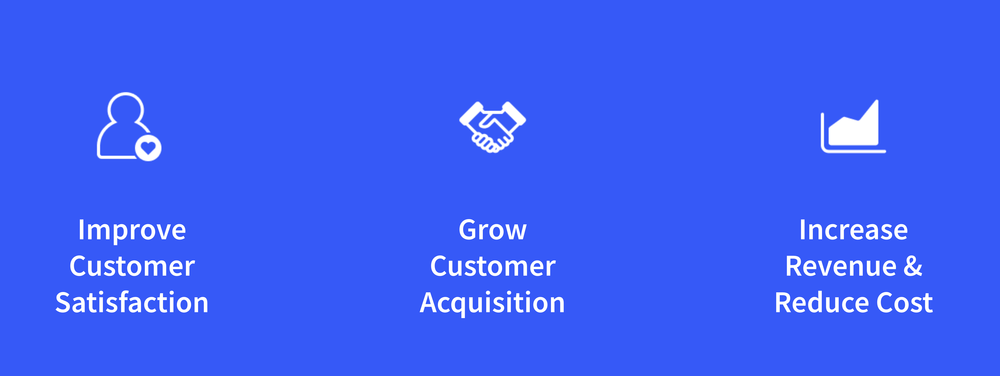

---
toc:
  - ./liferay-sales-presentations/sales-foundation-deck.md
  - ./liferay-sales-presentations/mastering-the-sales-foundation-deck.md
uuid: cda854ee-c766-4354-a093-fd498b936f69
visibility: 
- Employee
- Partner
---

# Liferay Sales Presentations and How to Master Them

**At a Glance**

* A Sales Foundation deck has been introduced with:
  * Consistent slides as a foundation and toolbox
  * Unified look and feel aligned to Liferay design guidelines
  * Flexibility for sales representatives to tailor as needed
  * Local autonomy with global alignment
  * Reduced time to prepare for pitches
  * Single deck for Liferay and Partner sales teams

## Background

This module covers the Liferay Sales Presentations, discussing how they can be used in an effective way with potential customers.

The information contained should be most useful for Account Executives and Customer Success Managers. It will allow you to prepare and deliver the right, most impactful, sales pitch.

```{note}
* View the [recording](https://learn.liferay.com/web/guest/d/sa1-4-liferay-sales-presentations-and-how-to-master-them) from the live workshop of this module.
* Download the [PDF](https://learn.liferay.com/documents/d/guest/sa1-4-liferay-sales-presentations-and-how-to-master-them-pdf) of the presentation used in the live workshop.
```

## Challenges of the old Industry Sales Decks

Liferay’s product has been constantly evolving since 2004. At the same time, Liferay’s Sales Approach has evolved with the product, and with the needs and demands of Customers.

Industry-specific Sales Decks were introduced several years ago, to enable Liferay and Partner sales teams to target specific industries. The decks provided valuable in-depth insights in specific industries and their most common challenges, but were ultimately not sufficient in meeting the diverse pitch requirements faced by Liferay and Partner sales teams during the various stages of an opportunity.

Based on feedback from internal sales teams and partners, a new Sales Foundation deck has been compiled.

## Directive for the new Sales Foundation Deck

To cater to the wide-range of requirements, the concept behind the new Sales Foundation Deck is to provide:

* A consistent set of slides that act as a toolbox and a foundation for all top-of-funnel pitches.
* A unified look and feel aligned with Liferay’s communication and design guidelines.
* The flexibility for each sales representative to tailor the deck to the individual needs of each opportunity.
* Local autonomy but with global alignment.
* A goal of reducing preparation time for each individual pitch.
* A presentation that can be used by Liferay and Partner sales teams.

## Positioning for Value

Before covering the new approach and new decks, it is important to understand how to effectively sell a complex enterprise solution, such as a digital experience platform, to a non-technical audience.  

When talking about a complex software solution, it’s easy to get lost in details about functionality and features.  Additionally, there are usually complex integration issues to consider and work through, and a need to accommodate the requirements of different client departments and people.

The primary thing that can influence your ability to win the sale more than anything else is aligning with the business objectives of the executive project sponsor and economic decision maker, and being able to position the Liferay solution for Value.

To be able to position for value, the first thing to understand is that each company is unique, with their own set of challenges. Because of this not every prospect, or even individual within a prospect, values the same things. When positioning for value it is important to:

* Qualify prospect priorities
* Align capabilities with business value
* Identify influencers and the project owner
* Quantify value

### Qualify Prospect Priorities

Some prospects’ priority is on reducing costs. For others it might be about taking technical complexity or growing their market share.

It is important therefore to qualify and quantify these priorities, whether they are reducing operational costs, increasing revenue or margins, or improving the overall customer experience.

### Aligning capabilities with business value

Liferay has so many capabilities that can be used to help solve so many different problems that talking about those capabilities without context doesn’t work. It is only possible to align Liferay’s capabilities with business values when those priorities and business outcomes are cataloged and prioritized.

For example, prospects are not evaluating Liferay because they need a message board, but some customers are suffering from problems related to effectively training and growing their workforce, or from an uneven distribution of knowledge, and Liferay’s message boards just might be part of the solution to those problems.

### Identifying influencers and the project owner

Within any organization, there will be many different perceptions of value and many different business outcomes desired. If all of the requirements and outcomes are treated equally, the risk is that they are only given surface-level attention.  

It’s much more effective to identify the key influencers on the project or the project owner, and to focus primarily on their needs, and ensure that those needs are being addressed.  

This is not to say that the other team members’ needs should be ignored, but there is always limited time and resources, and focusing on the key influencers and project owner makes the most of that limited time and resources to ensure the greatest chance of success.

### Quantifying value

To ensure that it is possible to quantify the value of the solution, it must be in line with the customers’ expectations and KPIs. The only way to discover expectations and KPIs is to ask during initial discovery and throughout all interactions with a prospect.

Ultimately it is critical to understand what the prospect considers a successful outcome to be and how they plan to measure that the outcome is successful. Once this is understood all messages and demonstrations should show how Liferay can achieve the value the prospect is looking for, and how, with Liferay’s help, that value can be measured.

## Aligning Capabilities to Business Value



As a deeper understanding of the business outcomes the client expects from the solution is gained, Liferay’s functionality can be aligned with those objectives. Three common objectives are:

* Improving customer satisfaction
* Growing customer acquisition
* Increasing revenue and reducing cost

### Improving Customer Satisfaction

Where the customer is focused on improving customer satisfaction, the following can be highlighted:  

* Liferay provides a variety of Self-Service options from Account Management to the ability to place and manage orders. Self-Service consistently ranks as one of the most desired features of any customer portal.
* Personalization of experiences also contributes to improved customer satisfaction. Once a user has logged in, what is known about them can be used to anticipate their needs and provide them with a personalized optimal experience.  
* Along with personalization, the ability to provide Contextual Search can be a differentiator. Contextual search uses Liferay’s Search Blueprints to provide different search results based on contextual information. Factors like who is searching, when they are searching, and where they are searching from can have an impact on the results that are returned.  
* While it is not possible to anticipate all the needs a customer has, it is possible to highlight how Liferay can improve customer satisfaction by providing help if end users get stuck during their journey. This can be in the form of Agent or AI-based Chat.

### Growing Customer Acquisition

Other prospects are more focused on growing their business through new customer acquisition.  In this case highlight features such as:

* Liferay’s powerful Content Management capabilities allow business users to create and maintain effective content to help attract and educate new prospects.  
* Personalization can be highlighted as a way to engage and nurture those prospects. By delivering the right content at the right time, those prospects can be moved down the sales funnel and through their customer journey towards conversion.
* Analytics is a very important part of ensuring content is working effectively, and determining which customer experiences are most effective. Analytics also plays a role when creating the right segments to provide personalized experiences.
* One of the best ways to objectively determine which experiences are the best is through A/B Testing by comparing those experiences with each other; promoting the experience that proves to be the most effective.

### Increasing Revenue

For other prospects, the main focus might be on cutting costs and increasing revenue. In that case features to spend more time discussing are:

* Liferay’s ability to use product relations such as Cross Sell / Up Sell  to grow the size of the basket or Average Order Volume.
* AI/ML based Recommendations are provided to make meaningful suggestions based on past orders or similar customers.  
* Carefully crafted Promotions can also lead to higher order volumes and higher order frequency, both leading to an increase in revenue.  Liferay provides an all-in-one platform that allows management of both promotional content and promotion and discounting rules through a single interface.  
* In a B2B context, the ability to natively handle Account Specific Pricing can help build stronger relationships with prospects to become their preferred vendor.

While all of Liferay’s features and functionality are a critical part of building solutions, it is important to focus first on the business challenges that each prospect is facing, and on the desired business outcomes.  Once those challenges and outcomes are known, then attention can be turned to how to solve those challenges and achieve those outcomes.

Next: Understand the new [Sales Foundation Deck](./liferay-sales-presentations/sales-foundation-deck.md).
