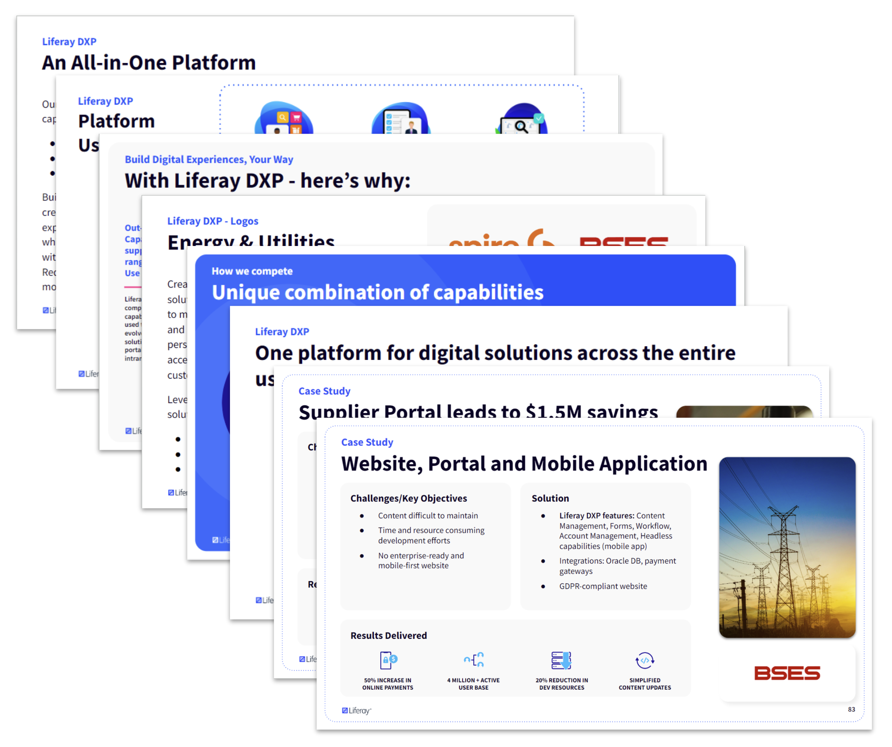
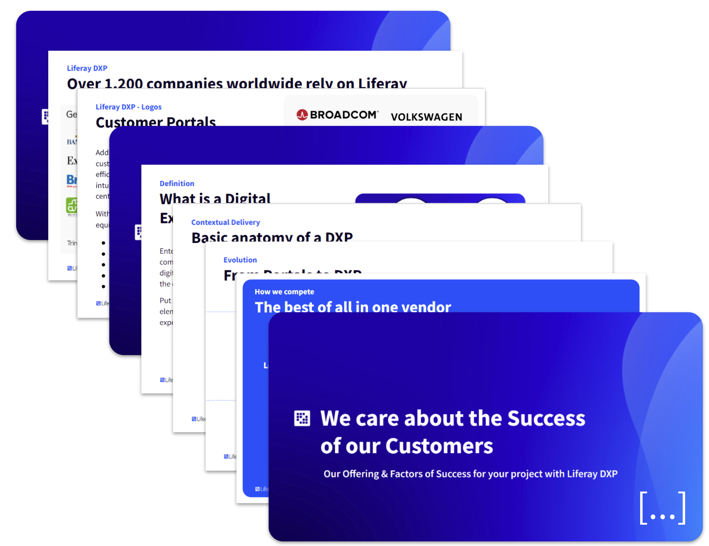
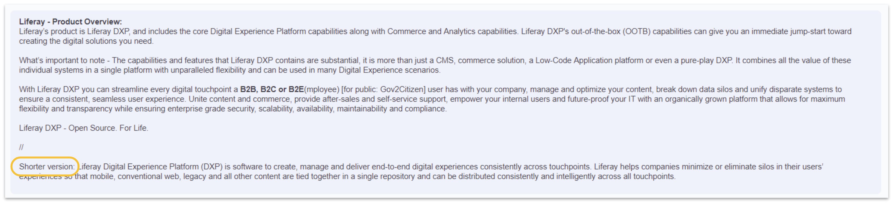
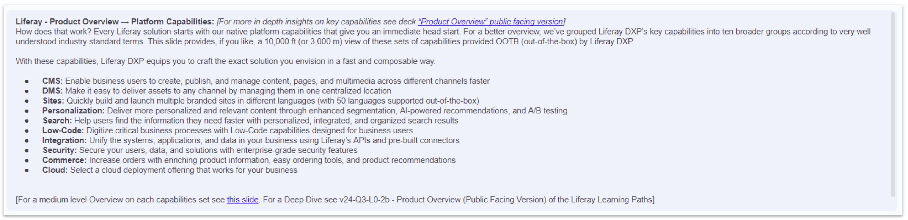
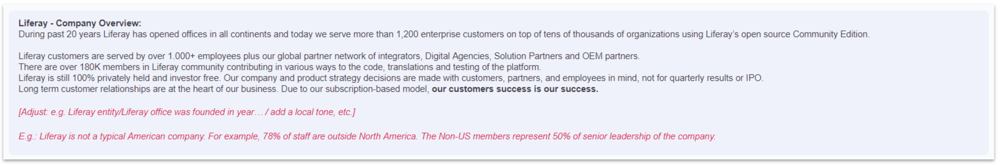
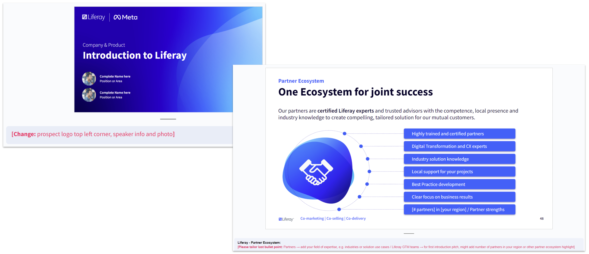
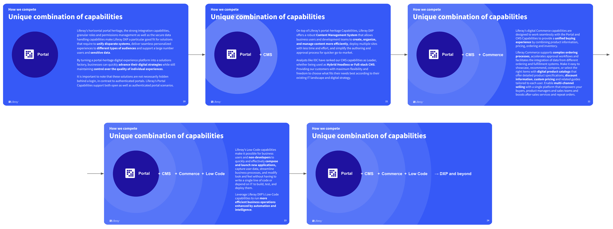

# How to master the Sales Foundation deck 

**At a Glance**

* The Sales Foundation deck is designed for any sales meeting
* All sections can be tailored for specific opportunities
* Example scenarios outline how the sections can be tailored
* Speaker Notes provide further guidance on tailoring and script options

## Background

When preparing a sales pitch for a prospective client, remember that the deck as a whole should not be presented. The Sales Foundation deck is intended to serve as a toolbox and a construction kit.

Each delivery will be different, depending on the requirements of the potential buyer and the time that is available. Select the slides that best support the sales strategy and that emphasize the value of Liferay DXP in order that the prospect can be confident that DXP can be used to achieve their desired business outcomes and solve their challenges

## Example Presentation Scenarios

This section provides more context on how the deck can be tailored for a specific opportunity, via two potential scenarios.

An important point is that in the Sales Foundation deck there are some slides that are similar, or two different versions of the same base slide. For any pitch deck opt for one of the options where this is the case.

### Scenario A - 15-minute meeting with the Head of Service of an Energy Supplier

In this first scenario an SDR was able to get a 15-minute meeting with the Head of Service of an Energy Supplier who took a brief look at Liferay.com but is not familiar with the concept of a DXP. 

The prospect has not yet explained what is driving their interest, and has indicated that there is not a concrete project in sight yet. But, they have shared that the idea of one platform for multiple solutions sounds attractive and that they would like to learn more about this. 

In this instance, most of the time should be spent discovering potential challenges that the prospect might have instead of starting with a presentation right away. But it is important to be prepared with a few slides to use as a backup to the discussion and to highlight some customer examples to further increase the interest, if there is sufficient time available.

In this scenario an example of the slides that could be used might be:

1. All-in-One Platform
2. Use Cases Overview
3. Why Liferay DXP
4. Energy & Utilities Logos
5. Across whole customer journey
6. Two Case Study slides

### Scenario B - 90-minute pitch after being shortlisted for an opportunity from a Public institution for a Portal application

In the second scenario you have been shortlisted after submitting a response to an RFI received from a Public Institution. Their required application is a Portal where clients can login, view and manage their data and can get help from one of the Institution’s advisors. 

The next step is to attend a 90-minute session to expand on the submitted response.

The main contacts up to this point have been the Head of IT and the responsible IT Project Manager. They really like the flexibility that Liferay DXP offers to them and indicate that the 90-min meeting will be with stakeholders from other departments who are not as familiar with current software products and standards and that it will be important to get the audience engaged and informed.

For this meeting it will be needed to prepare some additional slides to add to the core set provided by the Sales Foundation deck. To reduce the preparation time and effort, and to get everyone on the same page at the beginning of the meeting, the following slides from the foundation deck could be used:

1. The ‘About Liferay & Liferay DXP’ section
2. The general logo slide with some more Public Logos
3. The Customer Portal Logo Slide
4. The ‘Why choose a DXP?’ section (but not including the customer journey or ‘snail’ slides
5. Parts of the ‘We care about the Success of our Customers’ section to help them understand what their application would look like if they selected Liferay.

## Speaker Notes

Comprehensive speaker notes are provided throughout the Sales Foundation deck, to offer a baseline for what can be said for each slide. Experience Liferay Sales reps might have their own preferred wording, which is acceptable as it is always more authentic to use your own “voice”. Our recommendation is to use what works best, and that is consistent with Liferay’s messaging and guidelines.

In some cases options are provided, which fall into one of three categories:

* Shorter version
* References to other slides or topics
* Scripts that are intended to be personalized

### Alternative Shorter Script

When there is a “Shorter version” noted in the speaker notes this alternative can be used when there is less available time for the presentation.

### References to additional information

Where there is additional information available in another slide, or in other content, this will be marked by a link to that content.

### Personalized Speaker Notes

Pink text in the Speaker Notes provides guidance on Slides that are intended to be adapted and/or personalized. The pink text will refer to the part of the slide that can or should be adapted and individualized, explaining how it can be tailored.

As an example, the “We care about the Success of our Customers” section provides a lot of information about Liferay’s Partner ecosystem in general and contains a slide that is meant to be used in joint pitches or partner-only pitches and that is intended to be tailored to a given partner’s specific field of expertise. 

If it is decided to use this slide in joint meetings any changes should be done in accordance with the Liferay AE working on that opportunity.

## Animations and Transitions

Animations should not be used in an overflowing manner but in a purposeful way. For example the set of “Unique combination of capabilities slides” build over five slides to tell a purposeful story about the ways that Liferay DXP can be used to solve Customers’ business problems.

## Evolution and Feedback

The Sales Foundation deck is intended to evolve over time, and will naturally be subject to constant updates, enhancements and changes. There will also be other Slide Decks to contain complementary slides. 

These presentations are only really effective with feedback from their users - those who are closest to working with Liferay Customers and Prospects. Feedback is therefore vital to ensure that the content is aligned with the needs of Sellers.

Feedback can be provided via [this](https://forms.gle/aEzAZPNpqpZBc1DV6) form. 

Liferay Employees can also provide feedback by booking 1:1 meetings with the Sales Enablement team during open office hours on Tuesday evenings and Thursday mornings.

## Accessing the Sales Foundation Deck

For Liferay employees, the deck is available in [Alexandria](https://sales.liferay.com/web/library/w/v24-q3-sales-foundation-deck-liferay).

For Partners, the deck is available in the Partner Portal.

In the next module find out about the [Sales Funnel and Best Practices for Opportunity Progress](../sales-funnel-opportunity-progress.md).
