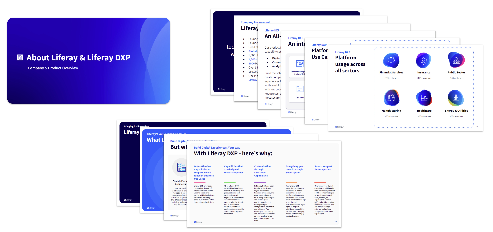

# Sales Foundation Deck 

**At a Glance**

* The Sales Foundation deck is designed for any sales meeting
* It contains six sections which can be used in any order
* Each section can be removed if not required
* All sections can be tailored for specific opportunities

## The New Approach

In the first part of this module we covered the previous generation of sales decks, and the importance of focussing early conversations on the business value that can be achieved with a Liferay solution.

In this section we will discuss how the new Sales Foundation deck:

* Is structured
* Is intended to be used
* Can be tailored to fit the needs of each opportunity
* Can be found
* Can be improved

## Sales Foundation Deck Structure

The new Sales Foundation deck is structured into six sections:

* About Liferay and Liferay DXP
* Customer References
* Why choose a DXP?
* We care about the Success of our Customers
* The Building Blocks to create Digital Experiences, Your Way
* How Liferay helped Enterprise Customers

The flow within the individual sections and across all sections is designed according to the most common best practice based on feedback received from Partners and Liferay’s sales team. The sections are not numbered so that they can be used in a flexible order, or omitted if not relevant to a specific meeting.

The comments in the speaker notes support the flow provided but can also be tailored to a storyline developed for a specific prospect’s requirements.

In addition, some of the slides are specifically intended to be personalized before use.

## About Liferay and Liferay DXP

This section provides a general overview of Liferay’s product and company and consists of 10 slides.

It is not necessarily a best practice to start a sales meeting speaking about “You” instead of focussing on your client’s needs. Therefore, the first part of preparing a tailored Sales Deck might be to move, remove or hide this section. 

This section is placed here because “Positioning for Value” was covered at the beginning of this module. The most fundamental question for any prospect in any sales process will most likely be “What can this product do for me?” - which is the essence and conclusion of this section.

### Section Slides

The section contains slides on:

* Liferay’s Mission Statement.
* Liferay Corporate Overview.
* Liferay DXP Product Overview.
* Liferay’s most common platform use cases and the focus sectors.
* Liferay’s Unique value proposition.
* A slide that answers the question on what Liferay can do for its customers.
* A classification of what “flexible” refers to in Liferay’s value proposition.
* A high level summary of our USP
* Why Customers should choose Liferay DXP in order to build ‘Digital Experiences, Your Way’.

## Customer References

The Customer References section offers a range of slides to choose from depending on the level of knowledge that has already been obtained about the prospect and their project.

### Section Slides

The section contains slides on:

* A very general logo slide.
* A hidden slide that provides additional logos that can be exchanged with some of the general slides if they better match the client’s interest.
* One logo slide per focus industry. This slide also summarizes the most common industry solutions built using Liferay DXP.
* In situations where the type of solution required is already known, there is also one logo slide per use case that highlights the benefits of Liferay DXP for that specific solution.

## Why choose a DXP?

This section is designed to help prospects understand the principle and benefits of a digital experience platform and consists of 14 slides.

### Section Slides

The section contains slides on:

* The storyline of the section starts with a general definition of a digital experience platform, its basic anatomy and evolution.
* The next 5 slides explore Liferay DXP's unique combination of capabilities to support Portal, CMS, Commerce, Low Code, _and_ DXP use-cases.
* Next are two versions of the Customer Journey, or “snail” slides. 
* Liferay's evolution over the years.
* Liferay’s USPs, which are a subset of Liferay’s differentiators.
* Liferay’s positioning in the market.

## We care about the Success of our Customers

Prospects often want to understand what it would be like to realize their project with Liferay DXP. The next section provides a couple of slides that help to answer this question, containing an overview of the Liferay ecosystem and important factors of success for clients' projects.

Next are slides that explain the concept of Liferay Subscription Services and Open Source background. These are important because in some situations prospects who are not familiar with these constructs can find these topics confusing.

The remaining slides in this section cover a high level overview of Liferay’s Deployment Offerings, highlighting the flexibility that Liferay offers in this regard. These are followed by slides that summarize other customer care and success factors such as:

* Customer Portal.
* Liferay Learn.
* Trust Center.
* Liferay Marketplace.

## The Building Blocks to create Digital Experiences, Your Way

The next section focuses, at a high-level, on Liferay’s key capabilities.

It is important to remember to not to focus in too much detail on features and functions when presenting this Foundation Deck, particularly when talking to non-technical prospects.

Nevertheless, there might be situations where it is helpful or required to talk about Liferay’s out-of-the-box functionality and the capability sets that Liferay DXP provides from a business perspective. 

One slide is provided for each of Liferay DXPs 10 key capability sets. These explain from a business perspective how the capability set enables clients to use the raw functionality to create the compelling digital experiences and solutions that Liferay’s customers require.

## How Liferay helped Enterprise Customers

The final section covers Liferay’s Customer Case Studies in a slide format.

Seven Case Study slides are provided with this section, but the expectation is that there may well be Case Studies on the Liferay website which will be a better fit for a specific client’s requirements. 

A Template Slide is provided at the very end of this section to enable the construction of any alternative Customer Case Study slides as required.

Next: learn about the intended usage of the deck and options for tailoring it - [how to master the Sales Foundation deck.](./mastering-the-sales-foundation-deck.md)

(Link to “mastering-the sales-foundation-deck”)

Was linked to:

(Link to “sales-presentations-base-deck”)
