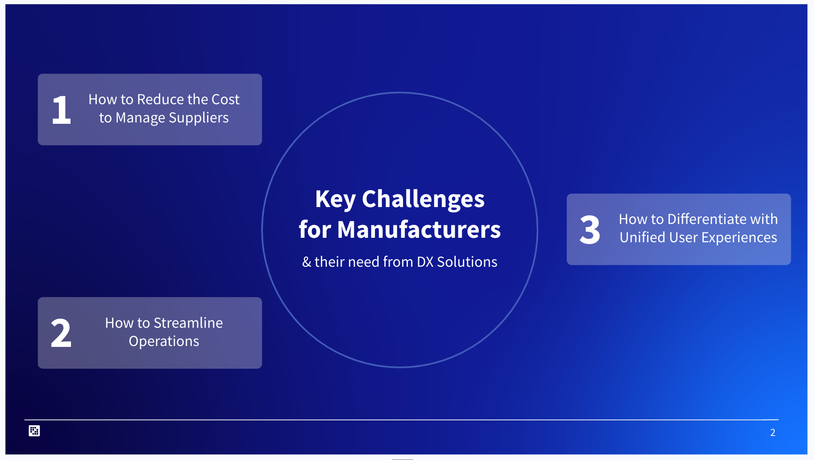
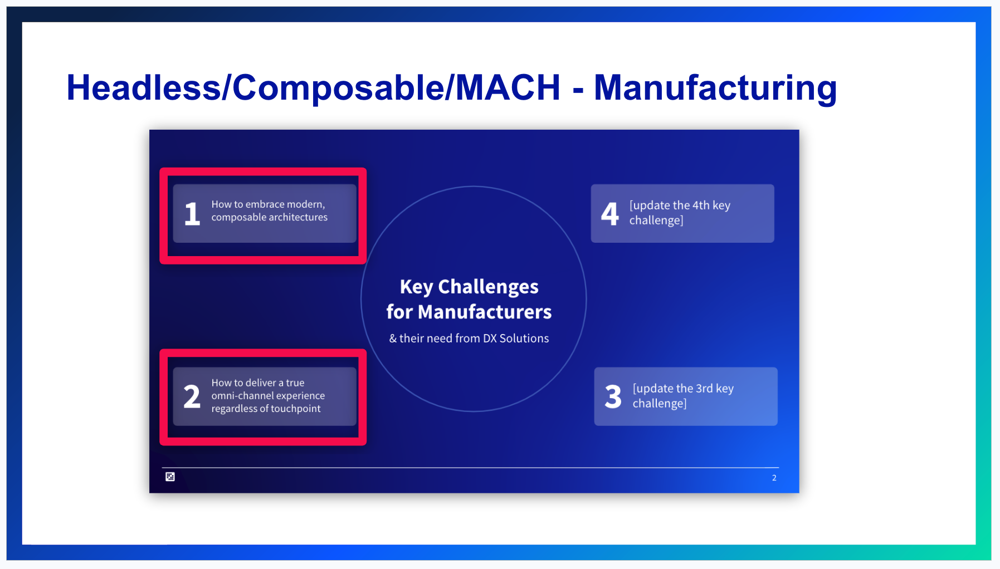

# Mastering the Expansion Decks

**At a Glance**

* All Base Sales Decks use the same basic structure
* This section explains the use of Manufacturing Expansion deck for an example scenario
* Additional Industry and Horizontal Solutions decks are coming soon

```{note}
* View the [recording](https://learn.liferay.com/web/guest/d/sa1-4-liferay-sales-presentations-and-how-to-master-them) from the live workshop of this module.
* Download the [PDF](https://learn.liferay.com/documents/d/guest/sa1-4-liferay-sales-presentations-and-how-to-master-them-pdf) of the presentation used in the live workshop.
```

## Scenario 2: Widget Manufacturer

> “We’ve been contacted by Amy at TestCo Ltd., a manufacturer of high quality widgets and widget accessories. TestCo Ltd. is based in the United Kingdom but has suppliers around the globe. We don’t have complete information about Amy’s needs, but based on the data we have, we know that she has been looking at content related to Supplier Portal solutions. Amy recently filled out a Contact Us form and indicated her company has been struggling with managing their vendors and coordinating a global supply chain. We have arranged for an introductory phone call to provide her some information about Liferay and to gather some more information about her needs.”

In this example scenario the prospect had already filled the Contact Us form and mentioned the need for a supplier portal. TestCo Ltd. is also from the manufacturing industry and looking for the supplier portal horizontal solution. Once the prospect qualification is done for TestCo Ltd. using Liferay’s ideal customer profile criteria, the Account Executive can use the Supplier Portal expansion deck for the first round of discussions.

## Expansion Deck Structure



The Supplier Portal expansion pack contains just a subset of slides. The idea is to use the base deck as a starting point and then modify the broad challenge, sub-challenge, solutions, and case studies based on the content provided in the expansion deck.

In the case of the Manufacturer Supplier Portal Expansion Slides, there are new challenges that would generally replace the original four challenges from the base deck. The rest of the deck can be used as-is. But remember, at the end of the deck when talking about the types of solutions Liferay provides, focus on the Supplier Portal since that’s what this customer is looking for.

## Additional Manufacturing Expansion Decks

### Growing Revenue


Another expansion deck for Manufacturing customers who are interested in growing their revenue. In this case, just one challenge is provided in the expansion deck, so this challenge should be used to replace one of the challenges in the base deck.

### Growth through Acquisition


For companies that have grown through acquisitions, another expansion deck provides specific challenges that will be more relevant than the challenges in the base deck - so these can replace two of those generic challenges.

### Headless, Composable Architectures, MACH Alliance



A third expansion deck for Manufacturing covers Headless, Composable Architectures and the principles promoted by the MACH alliance.

## Other Industry Sales Decks

In addition to these decks for the Manufacturing industry there are already decks for the Financial Services sector, and soon will be publishing decks for the Government or Public Sector.

## Horizontal Solution Sales Decks

In addition to these industry decks, additional decks are being developed that are focused on horizontal solutions and other types of sales assets.

Help us to help you by providing feedback to let us know what is working and what is not, and to let us know what other types of sales presentations you need.

## Currently Available Sales Decks

At the time of writing, the following decks are available:

* Manufacturing
  * Base Deck
  * Supplier Portal
  * Growing Revenue
  * Headless / Composable / MACH Alliance
* Financial Services
  * Base Deck

For Liferay employees, all decks are available in the Sales Decks section in [Alexandria](https://sales.liferay.com).

For Partners, all the slide packs are available in the [Partner Portal](https://partner.liferay.com).

In the next module find out about the [Sales Funnel and Best Practices for Opportunity Progress](../sales-funnel-opportunity-progress.md).
