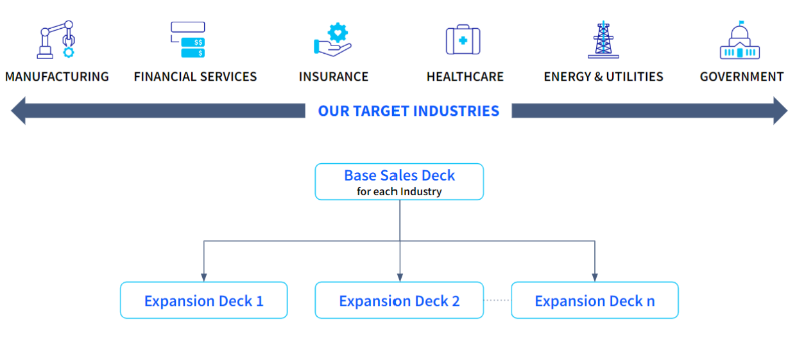
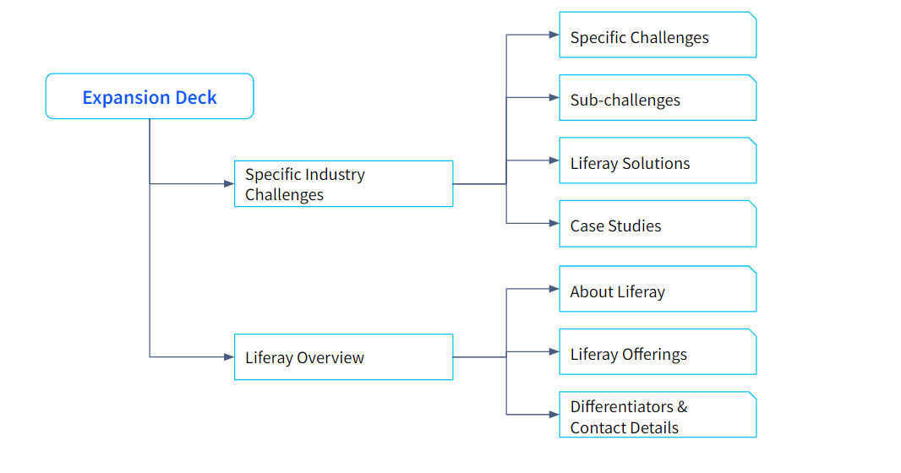

# The New Approach to Liferay Sales Presentations

**At a Glance**

* New Sales decks are aligned with brand messaging
* Base Decks cover key industry challenges and Liferay overview
* Expansion decks cover specific industry challenges and/or target solutions
* The key benefits of the new approach are:
* Aligned to our overall vision & strategy
* Specific slide packs for targeted use cases
* Easier to master
* Quicker turnaround time

## The New Approach

In the first part of this module we covered the previous generation of sales decks, and the importance of focussing early conversations on the business value that can be achieved with a Liferay solution.

In this section we will discuss:

* How the new sales decks are structured
* How they are aligned to Liferay’s current marketing strategy and messaging
* How they are also aligned to Liferay’s focus industries such as Manufacturing, Financial Services, Public Sector, Insurance, Energy & Utility and Healthcare
* What the benefits of the new sales decks are

### About the New Sales Deck

Based on feedback received, and to address the challenges covered in the first part of the module, an entirely new approach has been taken for the sales decks.

Liferay has historically been strong in verticals like Manufacturing, Financial Service, Insurance, Healthcare, Energy & Utilities, and Government/ Public Sector. 

As discussed during our previous sessions, these are also the current target verticals.

Liferay has worked extensively in these industries to deliver tailored digital experience solutions, and in doing so have gained much experience and expertise. This means that the common challenges these industries face, and how they can be solved with Liferay, are already well understood.

The new sales decks make use of this knowledge and understanding. For each targeted industry, there is a base sales deck, coupled with expansion decks to dive deeper into specific needs.

## The Base Sales Decks

The base sales deck covers the broad challenges faced by the industry. Each broad challenge is further broken down into multiple sub-challenges.

The base sales deck also has the solution Liferay offers to solve these challenges, and include details of case studies and successes.

This deck is used when the exact use case for the prospect is not yet known, which is not an ideal scenario. It is much better to do discovery before presenting anything, but the base deck provides for this situation by covering the industry-specific challenges. 

The base deck also contains information about Liferay, the product offerings, use cases or horizontal solutions Liferay solves for that particular industry, along with key differentiators and contact details.

## The Expansion Decks

The expansion deck details the specific client needs or challenges for each industry. For example for a manufacturing customer an expansion deck can be created for some of the specific customer challenges such as:

* How to grow revenue
* How to manage suppliers and partners

This deck is useful when the problems and/or key business priorities of the prospect are known. The expansion deck focuses on a topic or related topics, and goes deeper into these business challenges. It also covers Liferay’s offerings, case studies or success stories, followed by a Liferay overview and credentials.

## Benefits of the new Approach

The key benefits of the new approach are:

* Aligned to our overall vision & strategy
* Specific slide packs for targeted use cases
* Easier to master
* Quicker turnaround time

**Vision & Strategy Alignment**

The new sales deck approach is aligned with Liferay’s overall vision & strategy, covering Liferay being the Complete Platform for Tailored Solutions. Liferay can be used by our clients to create custom digital experiences without sacrificing speed, flexibility, or cost. 

The new sales decks are also aligned to the marketing strategy and overall messaging available on liferay.com. When using the new sales decks, Account Executives can re-emphasised the key USPs and Value Propositions. 

**Targeted and focused Decks**

Breaking down the large legacy sales deck into smaller and focused use case specific decks provides much needed modularity to the new sales decks. It is easier to pick and choose the use cases required for a sales call, and allows AEs to have more focused discussions with the prospects in a time bound manner.

**Easier to Master**   

The third benefit is that the new decks are easier to master for AEs. The base sales deck and expansion decks clearly mention the challenges, sub-challenges Liferay’s solutions, so AEs can easily use the decks in a more effective way.

**Quicker Turnaround Time**

Due to the modular nature of the decks, it is quick to pick-and-choose the right challenges / use cases to create a sales presentation in a faster manner.

## Mastering the Sales Decks

In this section two scenarios are used to discuss how AEs can select the right content from the base sales and expansion decks to create an effective sales presentation.  

### Scenario 1: Automotive Supplier

> “We have been researching automotive suppliers in South America and have found a potential customer, CarCo, SA. based in Chile that fits our target customer profile. Their current public website appears to be old and outdated and it does not appear to offer a ‘logged in’ customer experience. Through some hard work, LinkedIn research, and polite persistence, we have made contact with José, the Digital Product Owner for CarCo and he’s agreed to a 30 minute call to hear about Liferay has helped other manufacturing customers to improve their business.”

A number of key points worth focussing on are:

1. CarCo, SA fits the target customer profile, as discussed in the [Ideal Customer Profile](../../level-0/the-ideal-customer-profile.md).  
2. CarCo, SA had an outdated public website without a logged in customer experience. Public Websites and Customer Portals are target use cases for Liferay, and the prospect is in the Manufacturing industry, also discussed in the Ideal Customer Profile.
3. Because this is a first level call with José, the business priorities and use cases of CarCo, SA are not known yet.

Based on the information available, the correct approach in this scenario is to make use of the Manufacturing Base Sales Deck. Partners can find this on [Partner Portal](https://partner.liferay.com), while employees can find it on [Alexandria](https://sales.liferay.com).

Next: using this scenario learn about the [Base Sales Deck Structure](./sales-presentations-base-deck.md)
