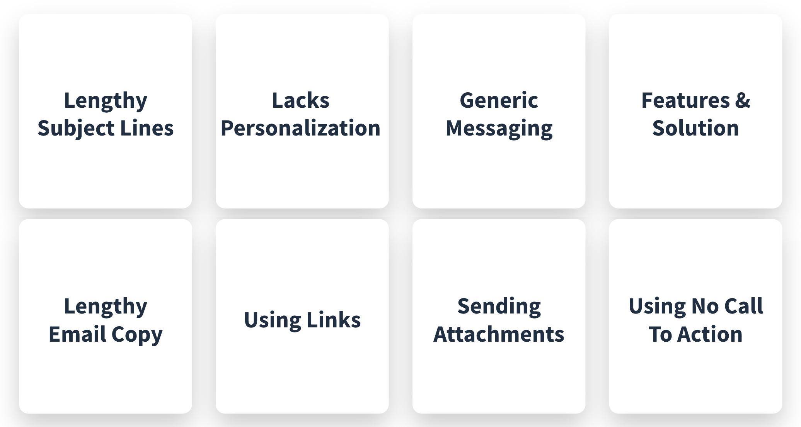

# Prospecting Tools - Email

The first tool that every seller must learn to master is email.

The challenge here is that according to consulting firm [McKinsey & Company](https://www.google.com/url?q=https://hbr.org/2019/01/how-to-spend-way-less-time-on-email-every-day%23:~:text%3DThe%2520average%2520professional%2520spends%252028,120%2520messages%2520received%2520per%2520day&sa=D&source=docs&ust=1687919492251304&usg=AOvVaw0uat-Hvtk6TpeCueTEK1G_), the average working professional receives roughly 120 emails per day.

Additionally, according to the data science team at the sales engagement platform company [Outreach](https://www.google.com/url?q=https://www.outreach.io/assets/resources/Outreach_PersonalizingProspectEmails_Final.pdf?utm_medium%3DWeb%26utm_source%3DWeb%2520Direct&sa=D&source=docs&ust=1687919492261815&usg=AOvVaw0ZLsBsDfg1bfPBfYGSNfYB), the average cold email response rate is less than 1 percent.

What this means for Liferay’s prospects is that they’re being bombarded with emails, which means that as sellers we compete with hundreds of others for the attention of our prospects. As such it is vital that the way you communicate with email stands out from the others.

## Common Mistakes

There is a right and wrong way to email your prospect. Here you'll learn what not to do---what will not help you stand out from the crowd.

### Links and Attachments

Emails with links and attachments trigger spam filters. Prospects never see an email if it's filtered away before reaching their inbox. Filtering happens on various levels:

* The Internet Service Provider (ISP) filters out some unwanted / suspicious looking emails
* The company has further filtering to keep its employees from receiving hundreds of unsolicited emails
* The people you are trying to reach may have their own filters

Even if the message is perfectly composed and it fits the prospect’s need perfectly, if the recipient never sees it, the process is a waste of time.

### Subject Lines and Personalization

Emails that do reach inboxes with lengthy subject lines and no personalization are not opened. The subject line is a critical component; it provides a reason for the person to open and read it or to delete it. 

Another important point is that people browse email and clean their inbox on their phone with the device in a vertical position. Because of this, a common mistake is to try to put everything into the subject line.

About 40 characters is the most that can be displayed in a subject line when a device is held vertically. That 40 characters get a second or two before the email is deleted. Be careful about catchy words or emojis in the subject line as both of these can trigger spam filters and may annoy the recipient.

Remember that both the sender’s name and the first few words of the message also appear, so think carefully about these opening words. If an email never gets opened, there can be no response.

### Generic Messaging, Features and Solutions, Lengthy Emails 

If the email is opened there are still pitfalls to avoid. Emails containing generic messaging, that are focused on features and solutions do not engage the prospect. If the contents of the email are not in line with the subject, the prospect may feel tricked, and if the email is too long it is unlikely to be read.

In all of these cases the message is probably deleted or worse, marked as spam. And once your email address has been marked as spam, all future messages are marked as spam automatically. Even worse, if enough messages are marked as spam, the ISP may mark your email address as spam for all other recipients too.

### Missing Call to Action

If the message reaches the recipient’s inbox, is opened and read, it must have a relevant and pleasant call to action. 

### Don’t be the 99%

If you don't address the above topics, you'll likely only get a response less than 1% of the time.

## Examples of Effective Email Messaging 

The following examples provide some examples of effective email messaging:

* **Let us help you reduce your cost to serve** \
Customers expect more, but how can we deliver with limited budgets?
* **Mitigating pain of disparate systems** \
Growth through acquisition presents many challenges
* **Learn how to empower your sales teams** \
A Customer Portal isn’t a replacement for your sales team, it should be a catalyst to drive their success

### Solving Business Challenges

To ensure emails are noticed and opened, lead with a subject that explains how Liferay can solve a business challenge or problem that the prospect might be experiencing. Because Liferay provides so many features and capabilities, there is no shortage of solutions that can be built or problems that Liferay can help to solve.

For customers that have grown through acquisition, there are bound to be growing pains as disparate systems now must work together. A Liferay-based solution can help to present a unified frontend to customers, partners, dealers and distributors.

### Getting more from Sales Teams

Another example might appeal to a prospect’s desire to get more from their sales teams. Liferay can help with this in a variety of ways, starting with a public-facing website to better attract and educate prospects as well as a customer portal to retain and grow those customers and adding B2B commerce capabilities to drive replenishment orders as self-service.

### Reducing the Cost to Serve Customers

A third option might be to show how Liferay can reduce the cost to serve customers. Reducing cost is always a challenge and a goal, but is even more so in the current economic climate.

These are just a few examples of the challenges you can base your email messaging on. To learn more about the challenges Liferay is well-suited to solve, refer to the Industry and Horizontal First Call Decks as well as the previous learning modules on Ideal Customer Profile, USPs and Challenges we help to solve.

Next: [phoning prospects](./phone.md).
