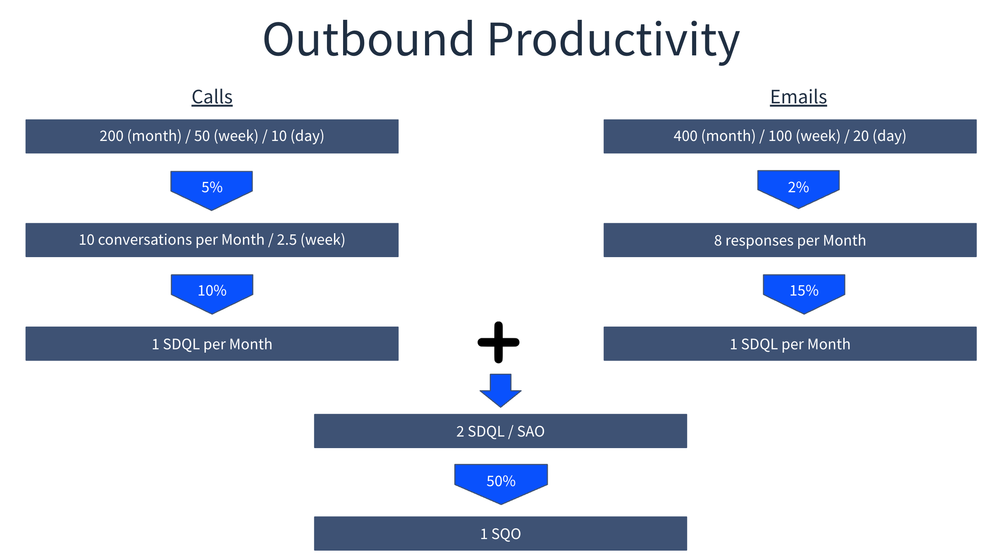
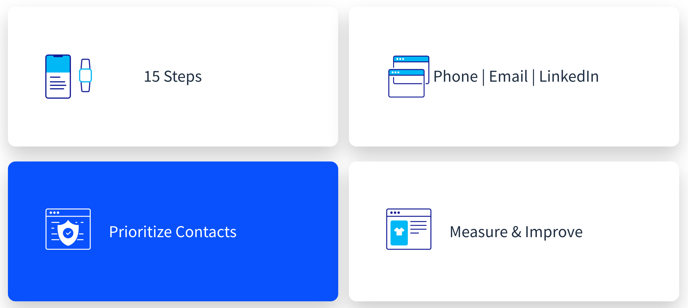

# Persistence and Measurement

## Persistence

The one tool that ties all of the others together is persistence, and this is perhaps the most disagreed upon tool of all. 

Despite popular opinion, being _pleasantly_ persistent is proven to be an effective way of engaging with prospects.

> “Of the contacts that convert, 50% happen after the fifth touch.”

According to [Salesloft](https://pages.salesloft.com/rs/432-WAJ-793/images/33%20Tips%20for%20Optimizing%20B2B%20Sales%20Emails%20eBook.pdf?mkt_tok=NDMyLVdBSi03OTMAAAF9m1SHnRS1iDQqLvHu0D3bFwd2pc2WCy-UKAdmmWQOGz-6DViCCgC4OQKpG9r6aChNmAJ2IqiLavPIjflUUTytHTF-WqfNZgIe71uWadA&ref=blog.lavender.ai), “The optimal number of attempts to engage with a contact is 15.”  And according to [ZoomInfo](https://pipeline.zoominfo.com/sales/sales-follow-up-statistics), “Of the contacts that convert, 50% happen after the fifth touch.”

In other words, as a seller, if the research on the account, the prospect, and on the use case has been done, then there is no reason to be afraid or uncomfortable with being persistent. If you have something of value to share, you never need to apologize.

The key here is to do your research. Once you have this in place you can be confident that pleasant persistence will generate positive returns.

## Measure

The sixth and final tool is the ability to measure. As the well known saying goes, “you can't improve what you don't measure.”

Coupled with this is that in almost any sales role multiple tasks must be balanced:

* SDRs at Liferay are challenged with balancing inbound tasks along with outbound tasks.
* AEs at Liferay are challenged with balancing closing deals along with finding new ones.
* CSMs at Liferay are challenged with balancing retaining clients with growing those relationships.
* Sales People at Liferay partners might be doing all of the above or a combination of these, but are also most likely challenged by balancing various tasks.

Everyone is challenged to a degree with balancing competing tasks. In the case of outbound prospecting, it is important to understand how much time can be dedicated to outbound prospecting.

One way to determine this is to start with a goal and then work backwards. In the scenario above the fictional goal is to produce 1 SQO, from outbound, per month, using fairly conservative and realistic conversions to understand how many calls and emails must be made on a monthly, weekly, and daily basis. 

As a result, as a seller, SDR, AE, or CSM juggling multiple priorities, you can now determine how much outbound prospecting must be done on a daily basis to achieve a specific target. 

At the end of each month, by analyzing the performance achieved against these conversions you can uncover areas of improvement. As a result of this outbound productivity tool, you can not only understand how much time must be set aside for prospecting, but also measure how effective your prospecting is, which in turn allows for improvement.

A dynamic version of the tool is available for download [here](https://learn.liferay.com/documents/d/guest/sdr-productivity-tool).

## The End Result

When email, phone, social, data, and persistence are used and measured properly, individually, and in synchronization, the end result is an effective outbound cadence.

To be effective in prospecting, use a cadence that has no less than 15 touches.

This cadence must include phone touches, email touches, and LinkedIn touches.

Not all prospects have equal priority. Use a data enrichment tool to help determine which contacts deserve spending time on. Spend that time where there is the highest return on investment.

And lastly, measure the results of the prospecting cadence---because if it isn’t measured it can’t be improved.

Congratulations, that’s the end of the Outbound Prospecting module.

Next: find out about [Liferay Pricing](../liferay-pricing.md) for the different deployment approaches.
