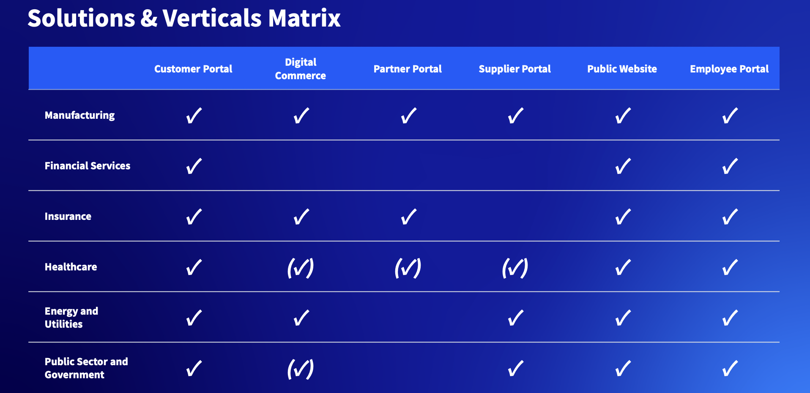

---
toc:
  - ./sales-funnel-opportunity-progress/buyer-process-sales-process.md
  - ./sales-funnel-opportunity-progress/buying-phases.md
  - ./sales-funnel-opportunity-progress/before-buying-starts.md
  - ./sales-funnel-opportunity-progress/mapping-buyer-sales-process.md
uuid: 81455421-067d-40fb-b666-2144de21ed3a
visibility: 
- Employee
- Partner
---

# Sales Funnel and Best Practices for Opportunity Progress

**At a Glance**

* It is impossible to win every opportunity - focus on strengths
* Liferay’s flexible platform serves needs of multiple verticals and various horizontal solutions use cases especially when there is:
  * Complexity in needs
  * High security and access control requirements
  * Enterprise scalability, extensibility and integration expectations
* Typical Enterprise Sales Processes focus on what is important to the seller
* There are three customer buying phases - Solution Development, Evaluation, and Commitment
* The buying process can be Seller or Buyer initiated

## Background

This module provides an overview of

1. How an opportunity for Liferay progresses through the funnel 
2. What the typical concerns are for a buyer
3. What the typical steps in the buying journey are
4. How those steps map to a typical sales process 
5. What sales ready assets and messages can be used in during this process

```{note}
* View the [recording](https://learn.liferay.com/web/guest/d/sa1-5-sales-funnel-and-best-practices-for-opportunity-progress) from the live workshop of this module.
* Download the [PDF](https://learn.liferay.com/documents/d/guest/sa1-5-sales-funnel-and-best-practices-for-opportunity-progress-pdf) of the presentation used in the live workshop.
```

## Pursuing Major Contracts is Expensive

There are direct and indirect costs involved in progressing sales opportunities. The direct costs of a major enterprise opportunity with a value of annual subscription of EUR/USD 150,000 could be tens of thousands of Euros or Dollars.

While this might seem exaggerated, consider the amount of time spent by multiple individuals (Account Executives, Technical Sales Engineers, Architects, Legal Advisors, Leadership Sponsors etc.) This typically amounts to several days across several months to prepare meetings, presentations, demonstrations, etc. to win an opportunity.  Calculating this based on the various hourly salaries and adding travel costs, mileage, per diems, accommodation, meals, and so on, a cost of tens of thousands is likely realistic.

Because of this it is important for sellers to understand the strengths and weaknesses of both the sales team and the product. It is not possible to win every opportunity so sellers need to be able to prioritize opportunities and prospects and sometimes realize that if it is not going to be possible to win, it is better to walk away from an opportunity. 

Realism and optimism are not opposites of each other: The chances of winning do not need to be 100%, it is possible to win even if the starting point is at 20 percent probability. 

> “Bad news early is good news.”

Facing reality during the various phases of the sales process helps to adjust the strategy to ensure a successful outcome. Alternatively deciding to walk away early allows the time and money to be reallocated to other opportunities that _can_ be won.

To meet the buying criteria of the potential customer, or to change those criteria, those needs must be understood well. It is also important to understand how well the offering can meet those needs.

Finishing second in a race for a major deal costs almost as much as winning it, but without the reward at the end. In every deal there are two winners: those who are awarded a deal and those who walked away first. Everyone else lost.

## Where is Liferay a Good Fit



This solution matrix summarizes some, but not all, of the ideal solutions industries where Liferay is particularly strong and where there are several references available. Solutions and industries not listed, and having a check mark in brackets, or no check mark at all, does not mean that Liferay DXP could not be a fit. But when building a target list for outbound prospecting it is advisable to concentrate and dedicate resources where there are more potential customers and higher probabilities to win, and where there are more tools and assets pre-built.  

Where Liferay has successful horizontal offerings most mainstream market buyers like to feel that the selling organization understands and has done business in their industry.

For each industry and each industry-solution combination, having a list of Job Titles and/or Functions will help to find and craft the right messages and approaches.

These titles and example messages are described in the [Level 0 Sales Learning Path](../level-0.md) modules.

In addition to the industry solution matrix, the following provides a summary of prospects' needs scenarios where Liferay is a particularly good fit, and where Liferay’s offering is particularly strong:

* Complexity
* Security
* Enterprise

### Complexity

Liferay is in a strong position with a prospect whose needs and requirements are complex. 

Examples of complexity include:

* Lots of different types of user profiles. For example, partner portals, vendor portals, or B2B self-service portals with digital commerce involve many types of users, with the need for approval processes etc.
* Multiple usage scenarios and multiple processes and complex workflows
* Many integrations
* B2B usage scenarios

### Security

Liferay is a strong option when the prospect has a need for high security and stringent access controls.

Example industries and scenarios include:

* Financial services portals
* Government sites and other public portals
* Healthcare portals
* Any industries or companies with extremely high security expectations, governance expectations and compliance requirements
* High expectations in the form of account services, for example customer profile management, registration, login and password management capabilities in an authenticated, logged-in experience

### Enterprise

Liferay is strong in the enterprise landscape. Enterprise customers need scalability.

Examples of the scenarios and needs of enterprise prospects include:

* Lots of markets
* Lots of users
* Lots of customers
* Lots of solution and application needs
* Need for flexibility

Enterprise grade digital experience needs cannot be met with non-customizable turnkey solutions - there’s a need for a platform on top of which the enterprise customer can have their solution built and tailored to their needs in a flexible manner.

These examples are an exhaustive list, but these are some of Liferay's strongest areas. If there is a prospect with expectations in all three of these then that is even better.

Next: [Buyer Process vs Sales Process](./sales-funnel-opportunity-progress/buyer-process-sales-process.md).
