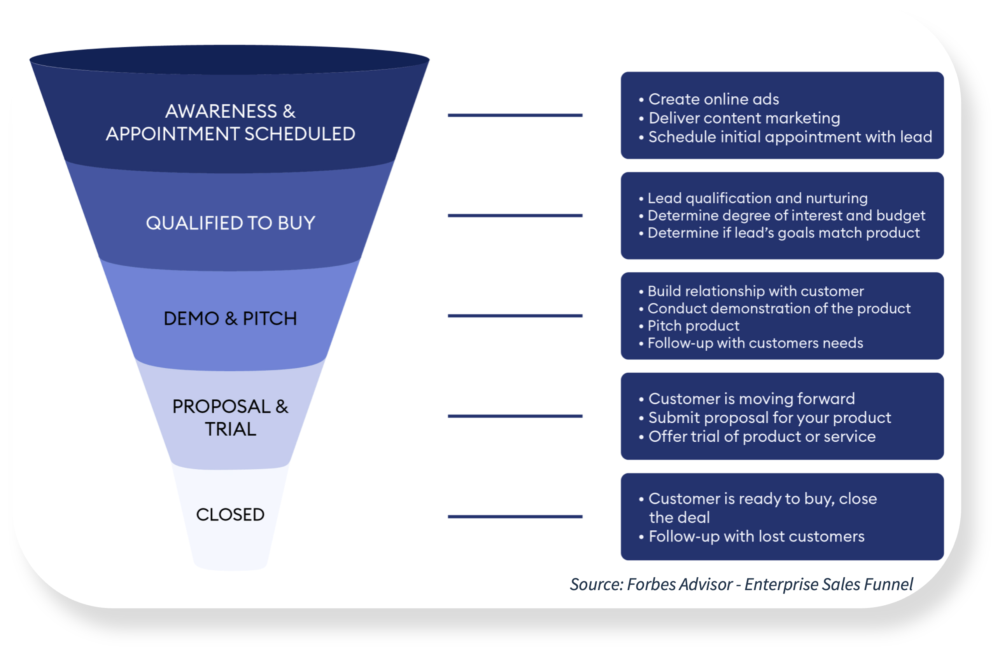
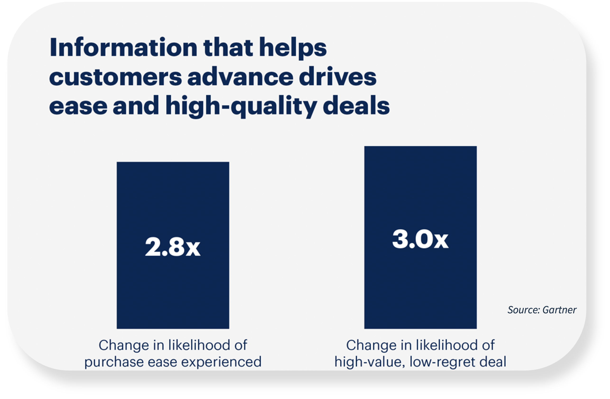

# Buyer Process vs. Sales Process

**At a Glance**

* Typical Enterprise Sales Processes focus entirely on what is important to the seller
* It is important to look into the buying behavior and buyer process and how to meet buyer expectations
* Providing the right information at the right time during the buying process will help the buyer in their purchase and it will also lessen the regrets.

## Enterprise Sales Process

Here is an example of an enterprise sales process with funnel and pipeline steps by [Forbes for an enterprise sales funnel.](https://www.forbes.com/advisor/business/sales-funnel-template/) On the left side is the funnel and on the right are so-called pipeline steps or pipeline milestones. In vendor companies selling enterprise software there are many sales processes (or at least there should be):

* Add-ons / expansions with an existing client
* New Projects with existing client
* Sale of professional services
* Renewals
* New project to a prospect

Also the types of accounts vary and that should reflect the sales process and pipeline steps. There could be:

* Major accounts
* Small Accounts
* Global accounts
* National accounts

Because of these factors, no one sales process is really enough to cover all possible scenarios. This focus for this module is mostly on new logos and new business opportunities but some pieces also apply to sales of new projects for existing customers and for selling services or even renewing an existing subscription.

## Buyer Process vs Sales Process

Instead of the traditional “sales process approach” it is important to look into the buying behavior and buyer process and how to meet buyer expectations.

## Help the Buyer to Buy

Buyers are busy people who are bombarded with messages. In the [Prospecting 101](../outbound-prospecting.md) module it was stated that an average enterprise professional gets over 100 emails per day. Most of these professionals are hired and paid to do totally other things than buying enterprise software.

The exception to this is if the buyer is from the procurement department, which is certainly not the best place to start the sales efforts as those people are professional negotiators. They will make the vendor lower the prices because that is one of their primary goals.

According to a study by [Gartner](https://www.gartner.com/en/sales/insights/b2b-buying-journey?_its=JTdCJTIydmlkJTIyJTNBJTIyNzcxZjMwODctNDg5YS00MGJkLWE3YzEtMjE5MDQzYTViMDkzJTIyJTJDJTIyc3RhdGUlMjIlM0ElMjJybHR%2BMTY4NjY2NjQ4Nn5sYW5kfjJfMTY0NjVfc2VvXzlhY2IwMjk3ZDJmODkwNTZhOGEyMTc3ODg3MmZkOGM0JTIyJTJDJTIyc2l0ZUlkJTIyJTNBNDAxMzElN0Q%3D) in 2019 with around 800 respondents, information drives purchase ease and high-quality sales.

Lowering prices is not the business goal of a prospective customer company. Because business buyers are busy, and are being bombarded with messages, and were not hired to buy software, they value suppliers that make it easier for them to navigate the purchase process.

Note, it is the **purchase process** that should be made easier to navigate, not the sales process. It is about them, the customer, and their needs and their buying. In fact, this Gartner research found that customers, who perceived the information they received from vendors to be helpful in advancing across their buying jobs, were 2.8 times more likely to experience a high degree of purchase ease, and three times more likely to buy a bigger deal with less regret.

The vendor should want the buyer to feel helped to buy and not to regret they bought from the vendor. If the customer regrets the purchase, they are less likely to renew and if they do not renew, they do not buy more and grow and they certainly will not recommend.

Next: [Buying Phases](./buying-phases.md).
