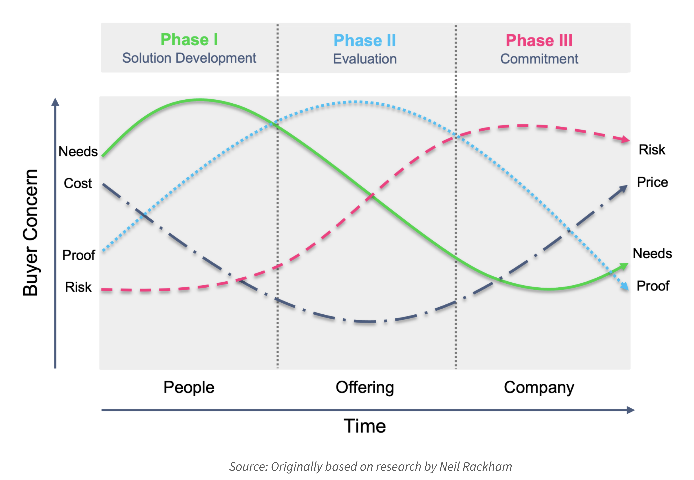

# Buying Phases

**At a Glance**

* There are three customer buying phases - Solution Development, Evaluation, and Commitment
* Buyers have four main types of concern: Needs, Cost, Proof, and Risk
* Each concern increases and/or reduces depending on the buying phase

## Shifting Buyer Concerns

The diagram above describes various buying phases and the various concerns the buyer has during the three buying phases. Several variations of the same diagram can be found by searching for “shifting buyer concerns”.

There are various possible originators for this diagram, but the most likely original source is Neil Rackham. While the name might not be familiar, many sales people recognize the concept of “Spin Selling”. Neil Rackham is the author of the book “Spin Selling" and the concept itself.

Originally an experimental psychologist, Neil later became known for his books about Spin Selling amongst others, and also as a sales methodology guru. Neil did extensive research on human buying behaviors and successful selling and what successful B2B sellers do to become successful. Even though the first version of the image dates back decades, human buying behavior is essentially unchanged.

There are some substantial differences between the previous sales process funnel and milestones diagram compared with the buyer process and buying phases.

In the diagram:

* The **X axis** represents the time it takes to move an opportunity from start to finish. 
* The **Y axis** shows the level of concern the buyer has. This is the relative importance of a factor at a given moment. The higher the line the greater the importance.
* The top of the diagram shows **3 phases** representing the stages the buyer goes through from solution development to evaluation to commitment before they are ready to buy. 

The essence of the diagram is the **buyer's concerns** which are represented by the coloured curvy lines which reflect:

* Needs
* Cost / Price
* Proof
* Risk

**Needs**

The top left shows buyer needs. These are what matters most for the buyer at the start of the buying process. What is the problem they work to solve, the goal they aim to achieve or the need they want to satisfy? 

Over time and moving forward in the process the need becomes less relevant because, if work is done properly in the first phase, this need or goal is shared with the vendor and understood by both. And, the vendor and the buyer key stakeholders are working effectively together to build a solution for satisfying the buyer’s need. Note that in this context the word solution does not mean Intranet, or partner portal, it means purely a solution to the buyers’ problem.

**Cost**

Next there is cost. When the buying process starts, the buyer has some sort of a budgetary figure that they can afford and want to invest. If the buying is initiated by the vendor, this amount may be uncertain or not even exist yet. Even though the pricing should not be discussed on a detailed level at this early stage, it is good, once the requirements to fill the needs are gathered,  to make sure that there is a ballpark number. 

There’s no point continuing the process if the buyer expects and only has money for getting their “tailored self-service solution” built with just USD/EUR 20K for the project work and USD/EUR 20K for the annual subscription fee. 

It is like thinking it is possible to buy a Ferrari for the price of a Fiat. 

Even if the original budgetary number is low, in many cases, especially if the vendor is talking at a high enough level in the buyer organization, there is a possibility to get further funds when the value of the offering is recognized by the buyer.

Moving to the right, in the middle of the buying process the cost becomes less of a concern for a time. 

Then during the final phase cost once again becomes important. If everything is done well in the earlier stages at the final phase it is not considered a **_cost_** anymore. Instead this evolves to be the **_price_** for getting the problem solved. This is the right time to discuss pricing details. At any earlier stage there is probably not enough information gathered and sufficient value has not been established yet. 

It is worth noting the changing importance of each of the items as the stages progress. At the final stage the risk is higher than price. Because of this the risks should be tackled before starting negotiating the final price. 

**Proof**

The next concern, staring from the left, is the blue curve which is proof. The proof is the most important thing in the evaluation phase because that is when it needs to be proved to the buyer that the product / offering / solution / package the vendor is putting together for them can fulfill their needs. 

**Risk**

The final buyer concern is the risk. The concern about risk increases towards the end of the buying process. The buyer might hesitate and challenge the vendor and their offer. There might be tricky questions on terms, security, SLAs or timing. 

The buying team is thinking whether the big investment they are about to make is the right choice and whether the vendor is the right partner for them. At that point the seller should not start panicking and propose discounting the price because it is important to mitigate the risks and relieve the pain of making decisions. Once that is done, then the price negotiation can start, if needed.

Next: [what happens before the buying starts](./before-buying-starts.md).
