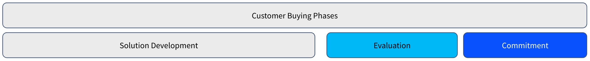
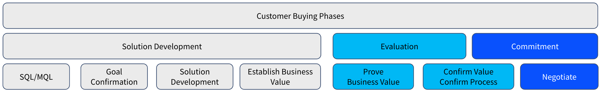
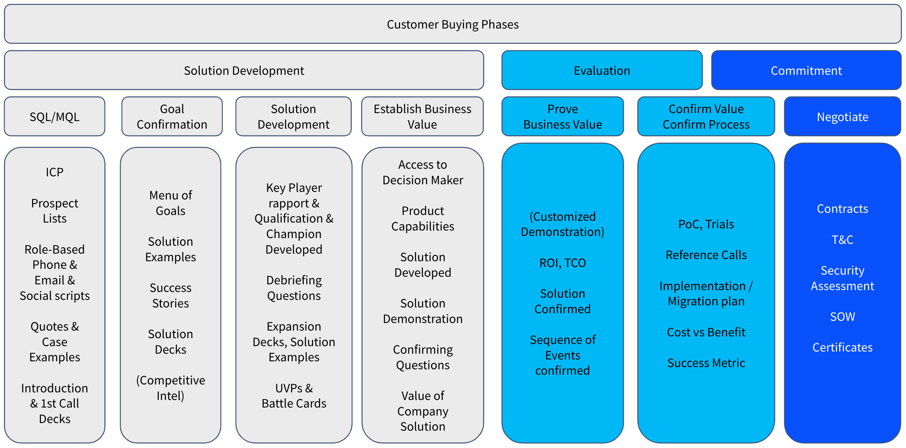

# Mapping Buying Phases and Sales Processes

**At a Glance**

* Mapping the sales process and its different steps and buyer process helps to define what the sales ready assets and messages are for each step
* There are three customer buying phases - Solution Development, Evaluation, and Commitment
* Each buying phase maps to one or more of the sales process stages
* There are multiple tools and steps at each sales process stage

```{note}
* View the [recording](https://learn.liferay.com/documents/d/guest/sa1-5-sales-funnel-and-best-practices-for-opportunity-progress) from the live workshop of this module.
* Download the [PDF](https://learn.liferay.com/documents/d/guest/sa1-5-sales-funnel-and-best-practices-for-opportunity-progress-pdf) of the presentation used in the live workshop.
```

## Mapping Buying Phases & Sales Process

This section looks at mapping the customer buying phases to the sales process

### Customer Buying Phases

The three customer buying phases are:

1. Solution Development
2. Evaluation
3. Commitment



The Solution Development phase is typically much longer than the other two phases, often more than both of the other two phases combined.

This is simply because usually the days, weeks, or months it takes to get through this phase is much longer than the other two phases when looking at new business sales.

If the length of a sales initiated opportunity is assumed to be 10 months from the initial relevant contact to closed-won, the solution development phase could easily take 6 months when the other two phases could be 2 months each.

There are exceptions. In some cases a buyer might actually have been through the solution development phase with other options and vendors, and yet failed to get to a satisfactory result. When starting working with the buyers it might be possible to very quickly match their needs to the vendors capabilities, and so reduce the length of phase one.

But, there might be extremely complex legal processes and hurdles involved, which could push the final phase out to a much longer period of time over all.

But, generally, expect that the solution development phase will be the longest of the three.

### Pipeline Stages and Milestones



Next are some common pipeline stages and milestones.

They are not representing any particular sales process but they will most likely resonate with your current new business process steps and milestones as they are pretty universal.

**Solution Development**

The Solution Development phase can be divided into:

* Sales or Marketing Qualified Leads
* Goal Confirmation
* Solution Development
* Establishing Business Value

Sales Qualified Lead or Sales Qualifying a Lead, or in case of an inbound lead, Marketing Qualified Leads into qualified opportunities. Here however, the term Goal Confirmation is used instead of qualified opportunity.

This is because it is vital that the buyer has shared their goal, need, or problem. If they have not then this cannot be classified as an opportunity. More importantly, if it hasn’t been confirmed that the problem or goal can be solved with product and offerings, it also cannot be classified as an opportunity. 

The Solution Development phase means diving deeper into the needs and requirements gathering, and establishing rapport with the relevant key people. 

The next step is to establish business value. This is important because without establishing business value it will be very difficult to justify the price at the end. 

**Evaluation**

The evaluation phase consists of:

* Proving business value
* Confirming value and the process

When moving to the evaluation phase, it is required to prove the business value and the solution for the buyer and to get confirmation from them that they understand the value and agree to it. At this point it is also important that both sides understand the processes involved.

**Commitment**

There is also the need for the buyer to commit. In most cases the negotiation starts with one vendor only, even though the other vendors are not yet informed that they are not preferred. 

If at this stage your prospect gets quiet, it is a certain sign that they are busy in negotiation with another vendor.

### Tools and Steps



Finally in this module, some more details about the various tools and steps used in each phase and stage.

**Solution Development**

To support generation of SQLs and MQLs the following can be used:

* The content of the [ideal customer profile](../../level-0/the-ideal-customer-profile.md) module can be used to build prospect lists.
* Use the personas per industry and solution types, along with information from [Prospecting 101](../outbound-prospecting.md) to build scripts.  
* Customer success stories can also be used to build further messages and email scripts. These must be easy for prospects to understand, by finding content that resonates with them.
* The [first call decks](../liferay-sales-presentations.md) are important tools for preparing for first meetings. 

For goal confirmation various tools and approaches can be used:

* If the prospect is hesitant to share their goals or it is not clear what they are yet, preparing and suggesting a menu of goals can be effective. This means putting together some business challenges of similar companies from similar industries where Liferay has been successful and suggesting those.
* Success stories and solution examples and of course horizontal solution decks are also useful. 
* Being familiar with competitive intelligence provides opportunities to drive conversation to areas where Liferay has known advantages is appreciated by buyers.

As solution development continues, the following are important:

* Building relationships with different players at the buyer.
* Further expanding the solutions through the expansion decks and solution examples.
* Liferay USP and battle cards are more tools to help the deal progress at this stage.

To establish business value use the following tactics and tools: 

* It is vital to gain access to the decision maker.
* Start diving deeper into the product and its capabilities.
* Start planning and building a demo. 

The Solution Development phase ends when the buyer and buying team have clear requirements and also have an understanding of the high level cost of fulfilling those. 

**Evaluation**

To help to prove business value, use the following:

* Demonstrating capabilities, often via a customized demo, is a critical part of the evaluation phase.
* Depending on the buyer, ROI and TCO calculations might also be required.
* It is important the buyer confirms that the offering and solution being put together for them is what they want. 
* You will also need to put together a _sequence of events_. That could mean listing on high level all the things that need to happen before the minimum viable product (MVP) goes live. This will help you to count backwards to help the buyer understand also when there’s the time to have the contracts signed. 

To confirm the value and the process:

* There may be some sort of Proof of Concept (PoC) or Trial
* One or more reference calls with other customers must be carried out.
* Initial or Draft Implementation or Migration plans are often needed.
* If input into a cost benefit analysis can be provided, which buyers’ need in many cases the chances of winning are much better.

The evaluation phase ends when the buyer and the other people involved have decided what it is they believe is the best alternative. 

Negotiating with two vendors is time consuming for the buyer, and that is why it is _usually_ a single vendor moving to the final phase. In some markets, and in some circumstances, there could be two vendors in the negotiation phase. 

Be warned though, that if this appears to be the case, often it means that the commitment phase has not actually started.

**Commitment**

The final phase of the sale is about lowering or removing real and perceived risks by:

* Doing security assessments
* Checking certificates
* Going through the terms and conditions
* Negotiating the details of the pricing

The commitment phase concludes with contracts, which is the final module in this learning path.  

Next, take a look at the [Battlecards](../battlecards.md) that Liferay provides to support Competitive Analysis and how they are structured.
