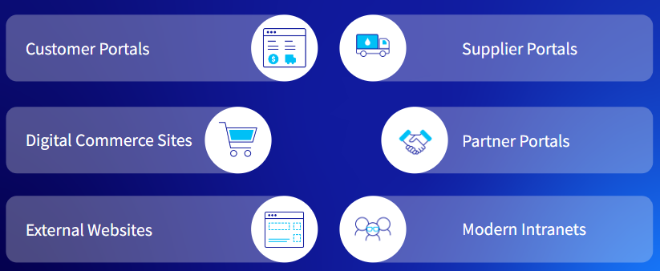

---
toc:
  - ./tailored-solution-highlights/customer-portals.md
  - ./tailored-solution-highlights/digital-commerce-sites.md
  - ./tailored-solution-highlights/external-websites.md
  - ./tailored-solution-highlights/supplier-portals.md
  - ./tailored-solution-highlights/partner-portals.md
  - ./tailored-solution-highlights/modern-intranets.md
uuid: 04c0d21c-dbf1-443e-b097-f053a387e2dd
visibility: 
- Employee
- Partner
---

# Liferay Tailored Solution Highlights

**At a Glance**

* Liferay solves the following business problems:
  * Customer Portals
  * Digital Commerce Sites
  * External Websites
  * Supplier Portals
  * Partner Portals
  * Modern Intranets
* Different business problems use different sets of Liferay out-of-the-box capabilities
* Success stories are available for each horizontal solution 

## Background

Here you'll learn about the most common horizontal solutions for Liferay, along with the OOTB capabilities utilized by these solutions. 

With each horizontal solution appears a key success story to show how different solutions use Liferay's capabilities. 

When finished, you'll have discovered several examples of Liferay platform-delivered solutions to inspire endless possibilities with a prospect. You can help paint a picture for the buyer not only of what they need now, but also for the future.

```{note}
* View the [recording](https://learn.liferay.com/web/guest/d/sa1-1-liferay-tailored-solution-highlights) from the live workshop of this module.
* Download the [PDF](https://learn.liferay.com/documents/d/guest/sa1-1-liferay-tailored-solution-highlights-pdf) of the presentation used in the live workshop.
```

## Horizontal Solutions

Liferay's horizontal portal legacy solves many business use cases across multiple industries. Some of the common horizontal solutions are

* Customer Portals
* Digital Commerce Sites
* External Websites
* Supplier Portals
* Partner Portals
* Intranets



## Liferay DXP Capabilities

Liferay's industry leading Digital Experience Platform (DXP) includes many out-of-the-box capabilities. The latest release Liferay DXP 7.4 includes core DXP, Digital Commerce, and Analytics features. Its high-level key capabilities are

* [Design Systems & Experience Management](https://learn.liferay.com/w/dxp/building-applications/tooling/liferay-workspace)
* [Content & Asset Management ](https://learn.liferay.com/w/dxp/content-authoring-and-management)
* [Low-Code / No-Code Application Building](https://learn.liferay.com/w/dxp/building-applications/objects)
* [Data Modeling & Process Automation](https://learn.liferay.com/w/dxp/process-automation)
* [Commerce](https://learn.liferay.com/w/commerce/index)
* [Analytics ](https://learn.liferay.com/web/guest/w/analytics-cloud/index) & [Optimization](https://learn.liferay.com/w/dxp/content-authoring-and-management/content-dashboard
* [Segmentation & Personalization](https://learn.liferay.com/w/dxp/site-building/personalizing-site-experience)
* [Search](https://learn.liferay.com/w/dxp/using-search) & [Navigation](https://learn.liferay.com/w/dxp/site-building/site-navigation
* [Headless APIs & Multichannel](https://learn.liferay.com/w/dxp/headless-delivery)
* [Collaboration & Knowledge Sharing](https://learn.liferay.com/w/dxp/collaboration-and-social)
* [Identity Management & Access Control](https://learn.liferay.com/w/dxp/installation-and-upgrades/securing-liferay)
* Integration & Interoperability
* [Developer Tooling](https://learn.liferay.com/w/dxp/building-applications/tooling/liferay-workspace)
* Platform Services
* [Cloud & Infrastructure ](https://learn.liferay.com/w/dxp/building-applications/tooling/liferay-workspace)

All the horizontal solutions mentioned earlier leverage these features. These OOTB capabilities make Liferay a strong player in the DXP space. 

For more information, please see the [Liferay DXP Product Capabilities](../level-0/liferay-product-overview.md) module.

Click on each of the tiles to read more about the six most common horizontal solutions for Liferay. In each case is provided

* A solution definition
* The key Liferay capabilities utilized
* Details and examples of how those capabilities are incorporated into the solution
* A Liferay success story

One-by-one, you'll learn each feature and how it is leveraged.

Don't know where to start? [Start with Customer Portals](./tailored-solution-highlights/customer-portals.md).

::::{grid} 2
:gutter: 3 3 3 3

:::{grid-item-card} Customer Portals
:link: ./tailored-solution-highlights/customer-portals.md

:::
:::{grid-item-card} Digital Commerce Sites
:link: ./tailored-solution-highlights/digital-commerce-sites.md

:::

:::{grid-item-card} External Websites
:link: ./tailored-solution-highlights/external-websites.md

:::

:::{grid-item-card} Supplier Portals
:link: ./tailored-solution-highlights/supplier-portals.md

:::

:::{grid-item-card} Partner Portals
:link: ./tailored-solution-highlights/partner-portals.md

:::

:::{grid-item-card} Modern Intranets
:link: ./tailored-solution-highlights/modern-intranets.md

:::
::::
