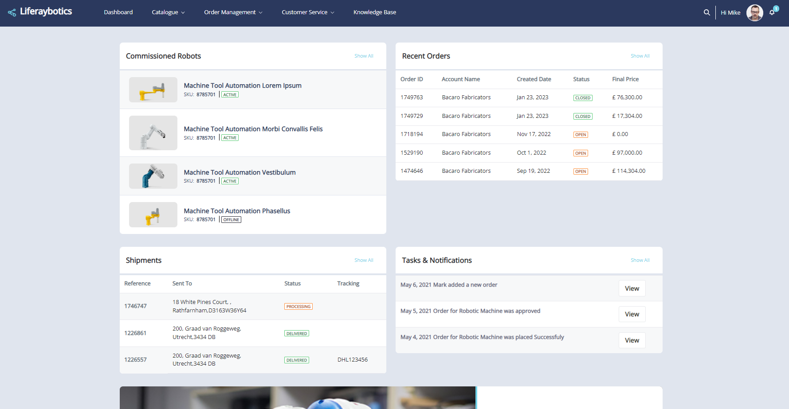
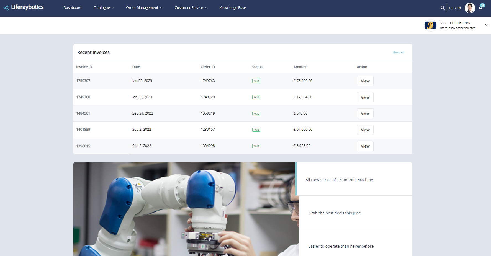
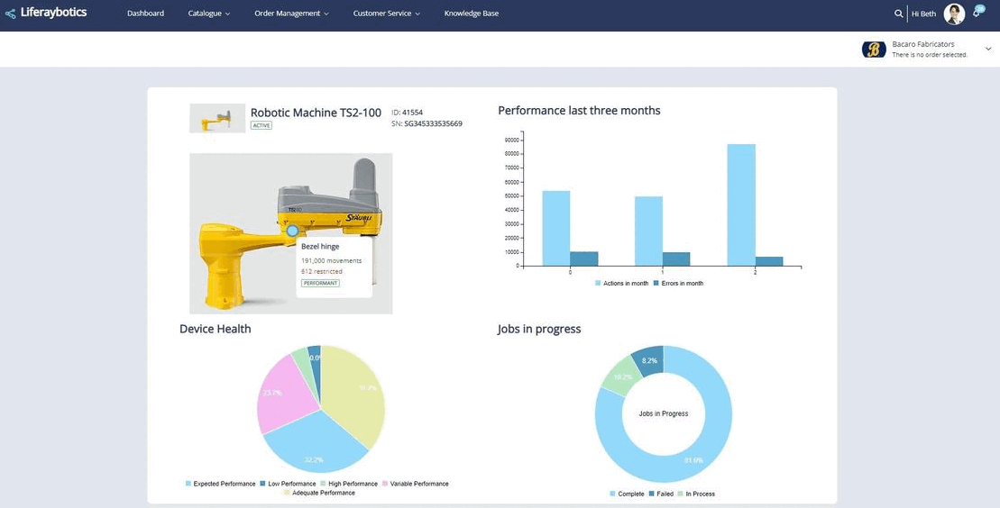
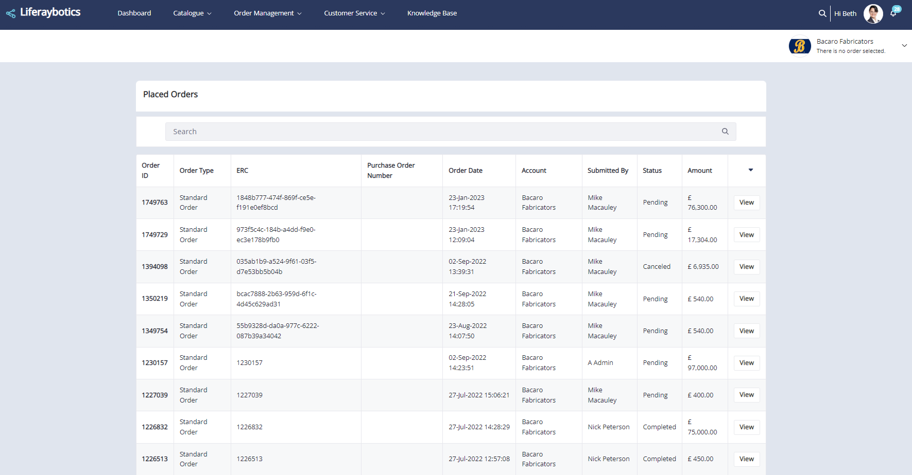
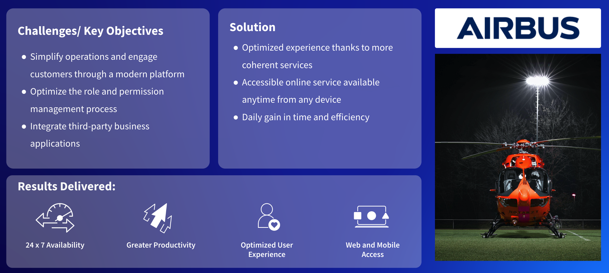

# Customer Portals

A Customer Portal provides customers with a single point of access to all relevant information about the products and services they are purchasing from a vendor.

Key to this is the customer or the end user of the products/services provided by the organization are the primary users of the solution.

## Key Liferay DXP Capabilities for Customer Portals

Several of Liferay’s high-level capabilities are likely to be incorporated into most customer portal solutions:

* [Segmentation and Personalization](https://learn.liferay.com/w/dxp/site-building/personalizing-site-experience)
* [Identity Management and Access Control](https://learn.liferay.com/w/dxp/installation-and-upgrades/securing-liferay)
* [Low-Code / No-Code Application Building](https://learn.liferay.com/w/dxp/building-applications/objects)
* [Data Modeling and Process Automation](https://learn.liferay.com/w/dxp/process-automation)
* [Commerce](https://learn.liferay.com/w/commerce/index)
* [Design Systems and Experience Management](https://learn.liferay.com/w/dxp/site-building)
* Integration and Interoperability
* [Search](https://learn.liferay.com/w/dxp/using-search) and [Navigation](https://learn.liferay.com/w/dxp/site-building/site-navigation)
* [Headless APIs and Multichannel](https://learn.liferay.com/w/dxp/headless-delivery)
* [Collaboration and Knowledge Sharing](https://learn.liferay.com/w/dxp/collaboration-and-social)

Two are particularly relevant for customer portals:

* Segmentation and Personalization
* Integration and Interoperability

## Segmentation and Personalization

One key goal of a customer portal is to provide tailored experiences to customers. Liferay provides OOTB Segmentation and Personalization capabilities that ensure the right content is delivered to the right audience, with meaningful recommendations, tailored search results, and much more.

As different types of buyers log into the site they see information tailored to their requirements. 

**Technical Buyer Dashboard**

Technical buyers see a dashboard that helps them quickly check on the status of equipment, re-order consumables, and learn about new products and services.

**Business Buyer Dashboard**

When business buyers visit the same page, they see a personalized dashboard that provides immediate access to order and shipment statuses, as well as invoices and the ability to make a payment.

Liferay provides key features that help achieve this desired business outcome, including a segment builder for creating segments based on demographic data (e.g., country, gender, language) or behavioral patterns (e.g., page visited, device, last login date). Users can create as many different experiences as they need for any given page, each linked to a different user segment. Each of these different experiences can show different widgets, fragments, and data based on users' needs.

**Integration and Interoperability**

One the key value of a customer portal is to bring together and unify the many disparate systems in use across the enterprise, so it is critical that a customer portal is built on technology that excels at integration.

**Integration with IoT devices**

Integration can take many different forms. For example, customers may want integration with IoT devices in the field or in a manufacturing plant. This integration can quickly surface critical information and help facilitate the reordering of consumables or spare parts or schedule proactive service to prolong the life of equipment (and in doing so maximize the value of the investment in that equipment).

**Integration with Systems of Record**

Customer portal integration could also involve surfacing key order and invoice data from a back office system of record. In many cases, these back office systems don’t provide self-service directly, or the self-service experience leaves much to be desired. When using Liferay as a frontend to these back office systems, customers get the right level of access with a consistent user experience and branding. 

With this in place, the customer portal is a single pane of glass that provides users an unmatched view into their business relationships and reduces friction that might impede future purchases. 

## Case Study - Airbus

Airbus Helicopters is a great example of a customer portal that makes effective use of both segmentation and personalization as well as integration and interoperability. Airbus Helicopters provides civil and military helicopter solutions to its customers. In 2016, this division of the Airbus Group turned to Liferay to redesign its customer portal and put forward a more modern platform adapted to the customer journey of its helicopter operators, who constitute 24,000 users.

Airbus's key challenge to solve was to better engage customers and simplify their operations. Users have different needs, and Airbus wanted a modern customer portal solution that could provide users with a more personalized experience. By personalizing the experience, the process of onboarding and educating users became a lot easier and customers have realized real productivity gains.

Another challenge was many different third-party business applications had to be accessed by the helicopter operators. Their users bounced around between different applications with multiple logins and different user experiences. Airbus needed a platform that could integrate those applications and present them as part of a single customer journey. 

By leveraging Liferay’s ability to segment users by their role and additional demographic and behavioral attributes, Airbus provided a tailored customer journey that surfaced the right information at the right time. They also used Liferay’s superior integration capabilities to ensure that those third party applications appeared in the context of the customer portal, giving their end users a more cohesive experience.

For more detailed information see [Airbus Helicopters](https://www.liferay.com/resources/case-studies/m-1) on liferay.com.

Next: [Digital Commerce Sites](./digital-commerce-sites.md). 
