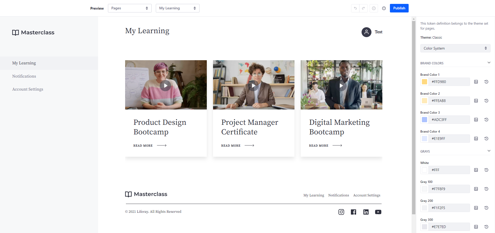
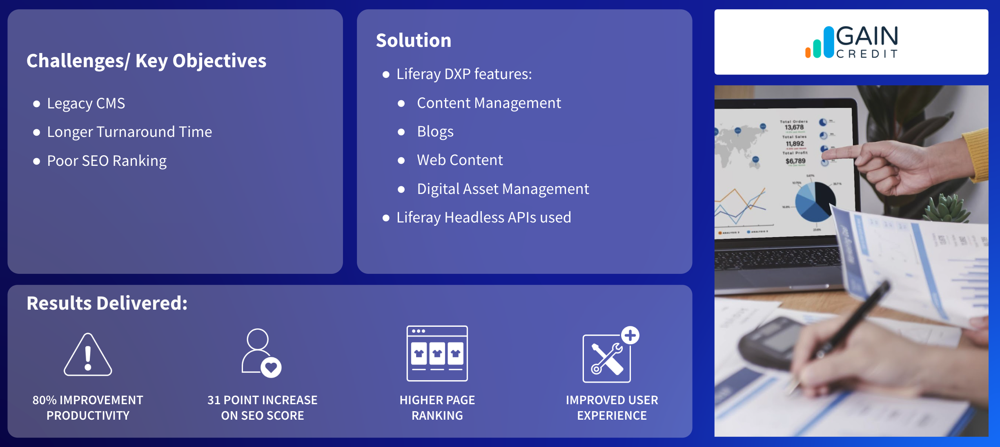

# External Websites

An external website (or public website) helps drive new opportunities by providing prospects with information about what an organization has to offer. Liferay DXP is well suited for building these types of deeply personalized, omni-channel experiences.

## Key Liferay DXP Capabilities for External Websites

For powering an external website, some of the most important capabilities to highlight are

* [Design Systems and Experience Management](https://learn.liferay.com/w/dxp/site-building)
* [Content and Asset Management](https://learn.liferay.com/w/dxp/content-authoring-and-management)
* [Low-Code / No-Code Application Building](https://learn.liferay.com/w/dxp/building-applications/objects)
* [Segmentation and Personalization](https://learn.liferay.com/w/dxp/site-building/personalizing-site-experience)
* [Analytics](https://learn.liferay.com/w/analytics-cloud/index) and [Optimization](https://learn.liferay.com/w/dxp/site-building/optimizing-sites)
* [Data Modeling and Process Automation](https://learn.liferay.com/w/dxp/process-automation)
* [Search](https://learn.liferay.com/w/dxp/using-search) and [Navigation](https://learn.liferay.com/w/dxp/site-building/site-navigation)
* [Headless APIs and Multichannel](https://learn.liferay.com/w/dxp/headless-delivery)

Of these, two key capability sets are

* Design Systems and Experience Management
* Content and Asset Management

## Design Systems and Experience Management

An external website is one of the major digital assets of an organization that showcases the brand.  Liferay provides state-of-the-art features for creating immersive digital experiences through external websites.

### Style Books and Master Pages

A style book is a set of visual rules that apply to a site to provide a consistent experience across its pages. Style books determine various visual settings on the site, including spacing between elements, colors, and fonts. Each of these settings applies equally to every page using the style book. 

Master page templates provide a way to define elements common to every page (e.g. headers and footers) using fragments, so it is easy to maintain and manage them in the platform. 

## Content and Asset Management

Liferay provides applications you can use to create and manage content. These applications include Web Content, Documents and Media, Collections, and more. These applications can be used directly in each site, or asset libraries can be created to make assets available across any number of sites. Tags and categories make it easier to organize, find, and display content.

Web Content is one of the most practical and essential methods for creating site content. The Blogs application contains a powerful set of tools for customizing how blogs appear. The Documents and Media application stores and manages files in a Liferay instance, which includes files uploaded directly to Documents and Media, as well as those uploaded in applications that support file attachments.

Liferay empowers users to build and customize digital experiences using low code capabilities such as fragments. With fragments, users can easily and quickly build new pages with designed, reusable components. Fragments use in-line editing to change text and images, map to content fields and templates, and can be tailored for, or even hidden from, specific display viewports.

## Case Study - GAIN Credit

This is a good example of Liferay being used by a client as a headless CMS. GAIN Credit is a market-leading Fintech company providing customers with first-class credit solutions. GAIN Credit wanted a new, better platform for Lending Stream, one that could run headless for easy customizations.

GAIN Credit faced these issues with their old solution:

* Long turnaround time for content changes: making updates to content required coding and development experience, so marketing teams couldn’t make necessary changes themselves.
* No way to track the content publication process: the current platform didn’t have the functionality needed to let the team know what stage content was in at a glance.
* Low ranking on Google’s search result pages: with scores on the Lighthouse report as low as 65 and poor SEO ranking, the site wasn’t reaching all potential users.

Using both out-of-the-box functionality and customization, the Liferay solution allows marketers and content creators to log in and make changes quickly. Hosted on a different server, the website fetches the content changes through Liferay’s headless APIs. Headless APIs allow developers to customize easily without disturbing Liferay’s architecture. Marketers and content creators can make changes to content with Liferay’s user-friendly editing interface.

For more detailed information see [GAIN Credit](https://www.liferay.com/web/guest/resources/case-studies/gain-credit) on liferay.com.

Next: [Supplier Portals](./supplier-portals.md).
