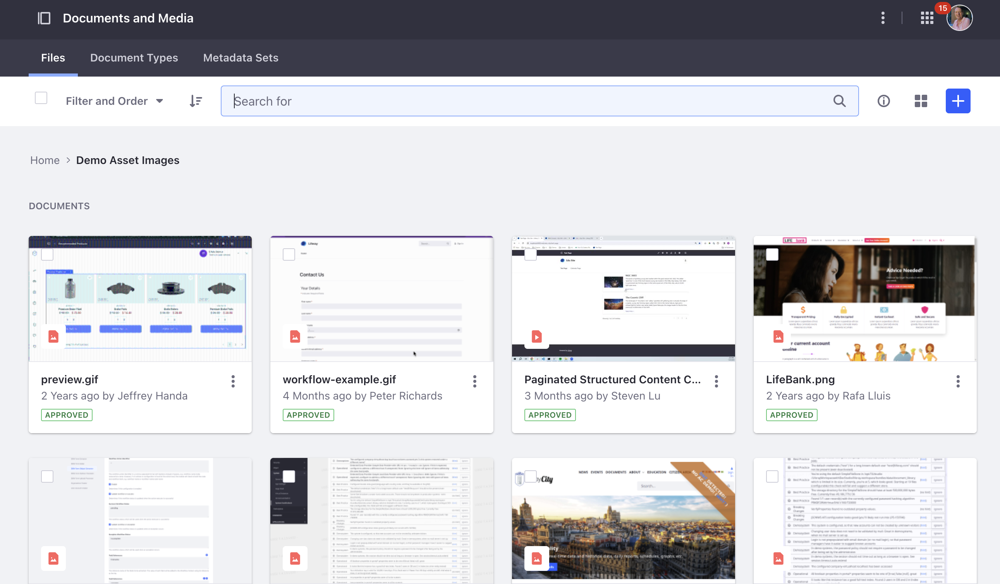
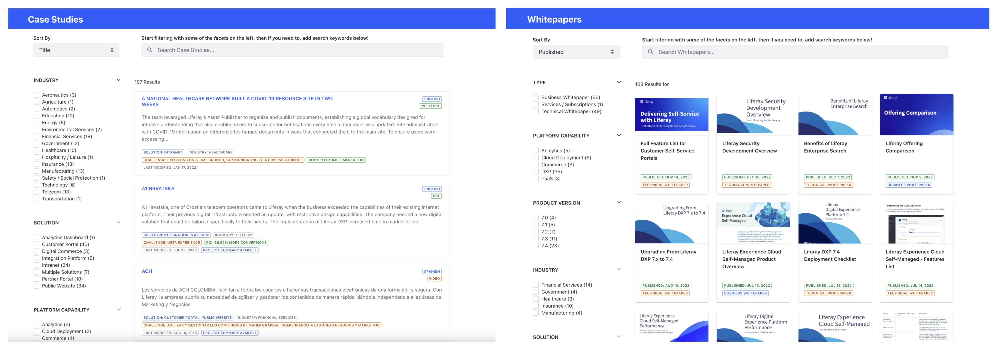

# Intranets

An intranet helps employees share, collaborate, and communicate on one consistent platform. Liferay DXP’s ability to integrate with and aggregate content and functionality from a wide variety of systems saves employees time by providing personalized experiences.

## Key Liferay DXP Capabilities for Intranets

When discussing Liferay’s key capabilities for modern intranets, highlight Liferay’s portal heritage and ability to provide secure access to an integrated set of resources.  Key capabilities for intranets are

* [Sites](https://learn.liferay.com/w/dxp/site-building)
* [Content Management System (CMS)](https://learn.liferay.com/w/dxp/content-authoring-and-management)
* [Digital Asset Management (DAM)](https://learn.liferay.com/w/dxp/content-authoring-and-management/documents-and-media)
* [Security](https://learn.liferay.com/w/dxp/installation-and-upgrades/securing-liferay)
* [Low-Code](https://learn.liferay.com/w/dxp/liferay-development/objects)
* [Personalization](https://learn.liferay.com/w/dxp/site-building/personalizing-site-experience)
* Integration
* [Search](https://learn.liferay.com/w/dxp/using-search)

Particularly, focus on

* Digital Asset Management
* Search

## Digital Asset Management

Document Management is typically a critical requirement for Intranet solutions because users need to access documents that support their day-to-day activities. An Intranet could also be described as an Employee Self-Service Portal. Liferay can also be connected to Google Drive and Office 365 to support online creation and editing of documents.

Collaboration is not strictly part of Digital Asset Management, but it is also an important part of intranet applications. Liferay’s Message Boards feature for example, provides forum capabilities which allows users to ask questions and get other answers in a collaborative fashion.

## Search

A recent study found that the average employee spends 3.6 hours daily searching for information, an increase of one hour from the previous year’s report. IT employees spend half their day (4.2 hours) looking for relevant information. Sixty percent of employees have to search within four or more data sources every day, while 18% stumble between seven or more. 

All of this suggests that all emphasis should be on implementing capable search---however, another recent study observed that 70% of a technical audience actually used on-page navigation rather than search to find what they were looking for.

In addition to Site Search, which is enabled by default, Site Builders can create any number of customised search pages to surface different information, with different filtering and sorting options, and even entirely different presentation.

Liferay offers more advanced features such as search blueprints which can

* Make minor tweaks to Liferay’s default search page behavior
* Override the search page behavior completely
* Configure context-aware personalized search results based on attributes of the search user

## Case Study - Klabin

Klabin is the biggest producer and exporter of packaging paper in Brazil. With more than 23,000 direct employees, Klabin knew they needed a modern intranet solution able to harness the collective knowledge and experience of their diverse workforce. Additionally, with 24 plants spread throughout Brazil and Argentina, Klabin needed a way to sustain the company’s culture digitally and to promote agile and organized communication for employees.

Klabin selected Liferay PaaS as the centerpiece of their modern intranet project not only for the lower TCO that a cloud-based solution provides, but also for the Liferay's underlying DXP features. 

Some key features were Liferay's out-of-the-box collaboration tools. By enabling users to share knowledge and access relevant content, they were able to launch a solution that not only led to greater productivity and strengthened organization culture, but also earned more than a 95% user satisfaction rating.

Because the user base for this solution had roles across the organization, with jobs ranging from skilled technical labor to business functions, it was critical that the solution be as user-friendly as possible to reduce the need for detailed training. The solution must cater to the needs and preferences of a variety of users and devices, offer powerful search, and intuitive navigation capabilities. Search and navigation doesn't replace training and onboarding, but they can help to increase user adoption, and the Klabin solution has already been adopted by over 90% of the employees.

For more detailed information see [Klabin](https://www.liferay.com/web/guest/resources/case-studies/klabin) on liferay.com.

Congratulations, you've reached the end of the Tailored Solutions module!

Next: Learn how to run an effective [outbound prospecting](../outbound-prospecting.md) cadence.
