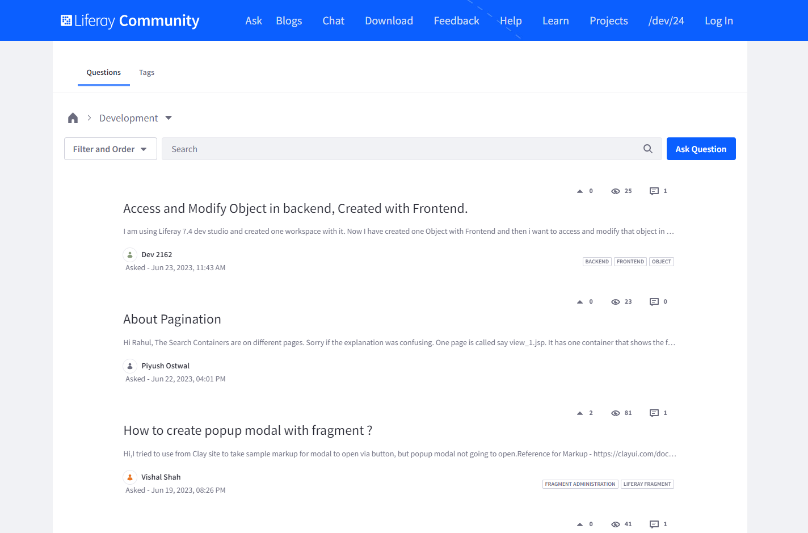
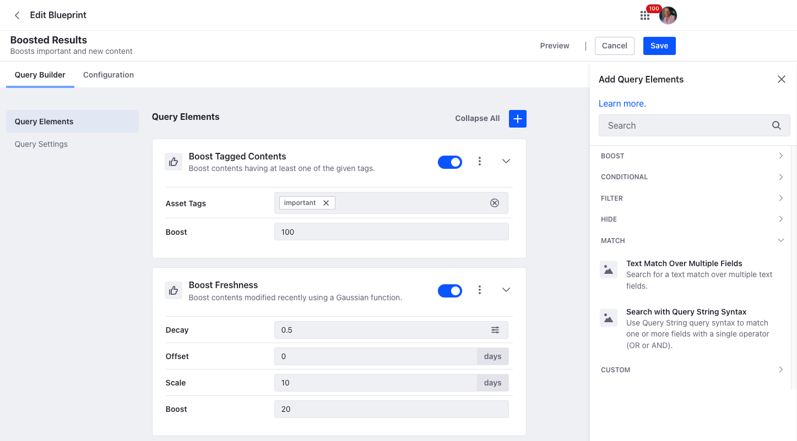
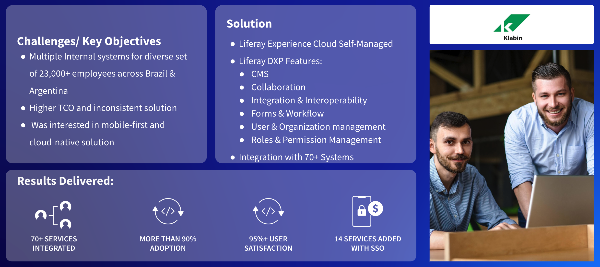

# Modern Intranets

A modern intranet helps employees share, collaborate, and communicate on one consistent platform. Liferay DXP’s ability to integrate with and aggregate content and functionality from a wide variety of systems saves employees time by providing personalized experiences.

## Key Liferay DXP Capabilities for Modern Intranets

When discussing Liferay’s key capabilities for modern intranets, highlight Liferay’s portal heritage and ability to provide secure access to an integrated set of resources.  However, to stress the _modern_ nature of Liferay intranet solutions, highlight additional capabilities such as

* [Design Systems and Experience Management](https://learn.liferay.com/w/dxp/site-building) 
* [Content and Asset Management](https://learn.liferay.com/w/dxp/content-authoring-and-management)
* [Low-Code / No-Code Application Building](https://learn.liferay.com/w/dxp/building-applications/objects)
* [Collaboration and Knowledge Sharing](https://learn.liferay.com/w/dxp/collaboration-and-social)
* [Data Modeling and Process Automation](https://learn.liferay.com/w/dxp/process-automation)
* [Segmentation and Personalization](https://learn.liferay.com/w/dxp/site-building/personalizing-site-experience)
* [Search](https://learn.liferay.com/w/dxp/using-search) and [Navigation](https://learn.liferay.com/w/dxp/site-building/site-navigation)

Particularly, focus on

* Collaboration and Knowledge Sharing
* Search and Navigation

## Collaboration and Knowledge Sharing

Collaboration in Liferay DXP is supported with applications for blogs, forums, message boards, and other capabilities. Social networking features are also available to further support collaboration activities.

## Search and Navigation

A recent study found that the average employee spends 3.6 hours daily searching for information, an increase of one hour from the previous year’s report. IT employees spend half their day (4.2 hours) looking for relevant information. Sixty percent of employees have to search within four or more data sources every day, while 18% stumble between seven or more. 

All of this suggests that all emphasis should be on implementing capable search---however, another recent study observed that 70% of a technical audience actually used on-page navigation rather than search to find what they were looking for.

Liferay provides both powerful search capabilities as well as intuitive navigation building capabilities. Key search features are synonym sets and manual page ranking.

Liferay offers more advanced features such as search blueprints which can

* Make minor tweaks to Liferay’s default search page behavior
* Override the search page behavior completely
* Configure context-aware search results based on attributes of the search user

On the navigation front, Liferay provides powerful tools for creating and organizing pages. Everything from a simple, flat site navigation to a complex hierarchical tree of sub-pages nested down many levels can be built easily. 

By default, there is a defined page hierarchy to organize pages. Additionally, separate navigation menus can be created to support one-off landing pages. Multiple navigation menus can also be used: a main menu, secondary menus, footer menus, and custom menus.

Menus can differ by page: landing pages can show a simple list of frequently visited pages, and the rest can appear in secondary navigation.

## Case Study - Klabin

Klabin is the biggest producer and exporter of packaging paper in Brazil. With more than 23,000 direct employees, Klabin knew they needed a modern intranet solution able to harness the collective knowledge and experience of their diverse workforce. Additionally, with 24 plants spread throughout Brazil and Argentina, Klabin needed a way to sustain the company’s culture digitally and to promote agile and organized communication for employees.

Klabin selected Liferay PaaS as the centerpiece of their modern intranet project not only for the lower TCO that a cloud-based solution provides, but also for the Liferay's underlying DXP features. 

Some key features were Liferay's out-of-the-box collaboration tools. By enabling users to share knowledge and access relevant content, they were able to launch a solution that not only led to greater productivity and strengthened organization culture, but also earned more than a 95% user satisfaction rating.

Because the user base for this solution had roles across the organization, with jobs ranging from skilled technical labor to business functions, it was critical that the solution be as user-friendly as possible to reduce the need for detailed training. The solution must cater to the needs and preferences of a variety of users and devices, offer powerful search, and intuitive navigation capabilities. Search and navigation doesn't replace training and onboarding, but they can help to increase user adoption, and the Klabin solution has already been adopted by over 90% of the employees.

For more detailed information see [Klabin](https://www.liferay.com/web/guest/resources/case-studies/klabin) on liferay.com.

Congratulations, you've reached the end of the Tailored Solutions module!

Next: Learn how to run an effective [outbound prospecting](../outbound-prospecting.md) cadence.
