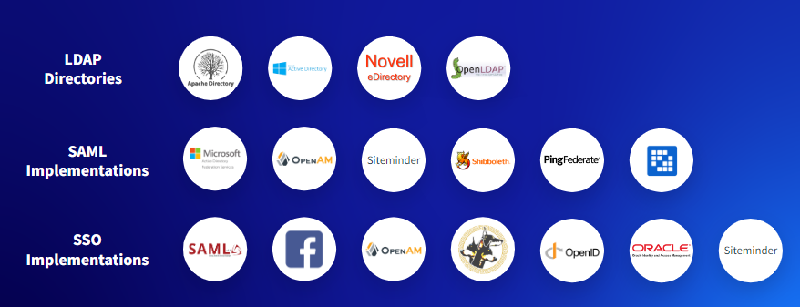

# Partner Portals

A Partner Portal provides partners with access to deal registration, marketing resources, pricing and sales information for products and services, as well as technical details and support.

## Key Liferay DXP Capabilities for Partner Portals

The key capabilities for Partner Portals are very similar to the capabilities utilized in Supplier Portals:  

* [Segmentation & Personalization](https://learn.liferay.com/w/dxp/site-building/personalizing-site-experience)
* [Identity Management & Access Control](https://learn.liferay.com/w/dxp/installation-and-upgrades/securing-liferay)
* [Low-Code / No-Code Application Building](https://learn.liferay.com/w/dxp/building-applications/objects)
* [Data Modeling & Process Automation](https://learn.liferay.com/w/dxp/process-automation)
* [Commerce](https://learn.liferay.com/w/commerce/index)
* [Design Systems & Experience Management](https://learn.liferay.com/w/dxp/site-building) 
* Integration & Interoperability
* [Search](https://learn.liferay.com/w/dxp/using-search) & [Navigation](https://learn.liferay.com/w/dxp/site-building/site-navigation)
* [Headless APIs & Multichannel](https://learn.liferay.com/w/dxp/headless-delivery)
* [Collaboration & Knowledge Sharing](https://learn.liferay.com/w/dxp/collaboration-and-social)

The key capabilities we want to highlight for Partner Portals are:  

* Identity Management and Access Control
* Analytics & Optimization

## Identity Management and Access Control

Liferay DXP identity management and user authentication is very flexible, containing sophisticated native user management features. Most prospective customers will already have some type of identity management and single sign on solution in place, and Liferay can also easily work with those solutions. 

For identity management, Liferay can easily be configured to integrate with popular LDAP directories such as Microsoft Active Directory or OpenLDAP. For authentication, Liferay works with a range of popular SSO providers such as Okta, PingFederate, Siteminder as well as any other provider that supports standards-based approaches such as SAML or OpenID Connect. These capabilities are key for any type of authenticated solution, not just for Partner Portals.

## Analytics & Optimization

Liferay Analytics Cloud offers a fully integrated analytics solution for Liferay DXP to help companies understand how people use their site and how they can improve.

Liferay Analytics helps to meet customer demands for meaningful and seamless experiences across touchpoints with robust segmentation and personalization tools. In DXP, this allows marketers to mix DXP and Analytics Cloud segments to create new and more powerful criteria. Once segments are defined, practitioners can create any number of Experiences for each page, with each Experience mapped to a user segment. Each page Experience can offer an entirely different set of content, fragments, widgets etc., to meet the specific needs of the target audience.

To identify the most successful variant of content or pages, A/B Tests can be created. Users are randomly directed to one of the variants, with their behavior - which could be clicking on a clickable element or tracking the bounce rate - being monitored in Analytics Cloud. Once the test is complete, the winning variant can be set as the default page presentation.

## Case Study - Panasonic

Anchor (by Panasonic) is a good case study detailing Partner Portal, B2B Ordering, and Dealer/Distributor Management. Anchor is a leading manufacturer of electrical products such as switches, wires, wiring devices, lighting products etc. in India. Since 1918, Panasonic has offered long-lasting products with better safety and comfort to customers worldwide. Panasonic streamline and automate its primary sales (OEM to dealer/distributor) by creating the dealer self-service portal.

With over 4000 business partners using the system, it’s crucial that identity management and access control work seamlessly. Each dealer needed to be able to securely authenticate to the system using their preferred credentials. Once authenticated, it is critical that each dealer can only access the data they are allowed to see.

The data is scoped to a specific Dealer, or Account in Liferay terminology. If users belong to more than one Dealer, Liferay provides a user-friendly UI component that allows a user to switch between Dealerships to easily manage multiple Dealerships with a single login. Within a Dealership different roles are used to further control access to data and functionality.   

Prior to the introduction of the Liferay based Partner Portal, the primary B2B sales process was manual. One of the advantages of automating a manual sales process is that there are many opportunities to improve and optimize the processes.  

When automating previously manual processes it is important to observe and analyze how users are adapting to the new approach, to ensure that they do not become lost or confused with a new process. Liferay Analytics provides capabilities to make those types of observations and analysis, to ensure the solution evolves to best support the needs of the users.  

Next: [Modern Intranets](./modern-intranets.md).
