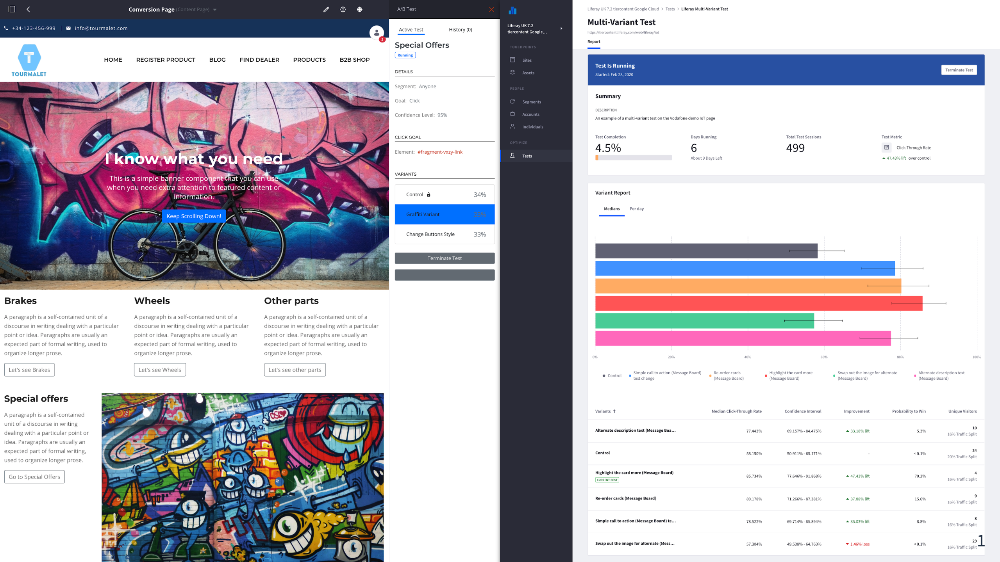
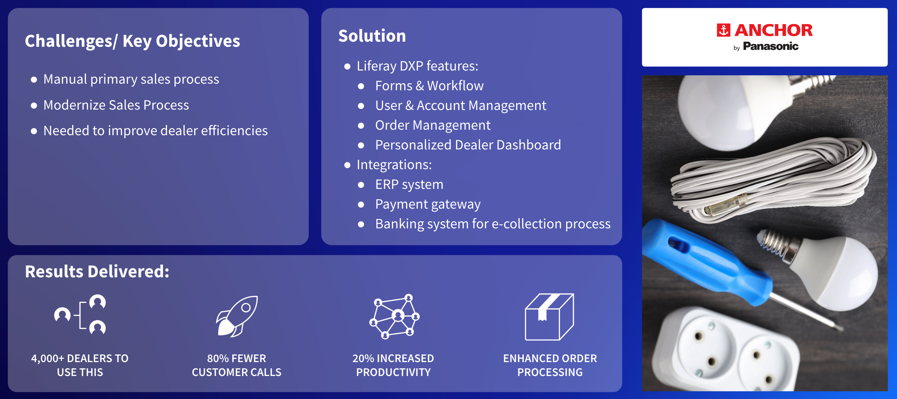

# Partner Portals

A partner portal gives partners access to deal registration, marketing resources, pricing and sales information for products and services, as well as technical details and support.

## Key Liferay DXP Capabilities for Partner Portals

The key capabilities for partner portals are similar to those used for Supplier Portals:

* [Personalization](https://learn.liferay.com/w/dxp/site-building/personalizing-site-experience)
* [Security](https://learn.liferay.com/w/dxp/installation-and-upgrades/securing-liferay)
* [Low-Code](https://learn.liferay.com/w/dxp/liferay-development/objects)
* [Commerce](https://learn.liferay.com/w/commerce/index)
* [Content Management System (CMS)](https://learn.liferay.com/w/dxp/content-authoring-and-management)
* [Sites](https://learn.liferay.com/w/dxp/site-building)
* Integration
* [Search](https://learn.liferay.com/w/dxp/using-search)
* [Digital Asset Management (DAM)](https://learn.liferay.com/w/dxp/content-authoring-and-management/documents-and-media)

Liferay's key capabilities for Partner Portals are

* Security
* Sites
* Analytics
* Optimization
* Personalization

## Security

Liferay DXP's identity management and user authentication features are sophisticated. Most prospective customers already have some type of identity management and single sign on solution in place, and Liferay can work easily with those solutions. 

Liferay can easily integrate with external IdMs through built-in support for standards like SAML, OpenID Connect, and so on. These integrations also allow Single Sign-On (SSO) to be used across Liferay and non-Liferay applications and systems. Once users are authenticated, Liferay’s granular roles and permissions model ensure that users interact only with information they are authorized to interact with. Multi-Factor Authentication provides an extra layer of security, while GDPR-compliant features are also included.

These capabilities are key for any type of authenticated solution, not just for Partner Portals.  

## Sites and Personalization

Liferay Analytics Cloud offers a fully integrated analytics solution for Liferay DXP to help companies understand how people use their site and how they can improve.

Liferay Analytics helps meet customer demands for meaningful and seamless experiences across touchpoints with robust segmentation and personalization tools. Marketers can mix DXP and Analytics Cloud segments to create new and more powerful criteria. Once segments are defined, practitioners can create any number of experiences for each page, with each experience mapped to a user segment. Each page experience can offer an entirely different set of content, fragments, widgets etc., to meet the specific needs of the target audience.

To identify the most successful variant of content or pages, A/B Tests can be created. Users are randomly directed to one of the variants, with their behavior---which could be clicks on an element or tracking the bounce rate---monitored in Analytics Cloud. Once the test is complete, the winning variant can be set as the default page presentation.

## Case Study - Panasonic

The Anchor (by Panasonic) case study details Partner Portal, B2B Ordering, and Dealer/Distributor Management. Anchor is a leading manufacturer of electrical products such as switches, wires, wiring devices, lighting products etc. in India. Since 1918, Panasonic has offered long-lasting products with better safety and comfort to customers worldwide. Panasonic streamlines and automates its primary sales (OEM to dealer/distributor) by creating a dealer self-service portal.

With over 4000 business partners using the system, it’s crucial that identity management and access control work seamlessly. Each dealer had to authenticate securely to the system using their preferred credentials. Once authenticated, dealers must have access only to the data they are allowed to see.

The data is scoped to a specific dealer, or *account* in Liferay terminology. If users belong to more than one dealer, Liferay provides a user-friendly UI component for switching between dealerships to manage multiple dealerships with a single login easily. Within a dealership, different roles further control access to data and functionality.

Prior to introducing the Liferay-based partner portal, the primary B2B sales process was manual. One advantage of automating a manual sales process is the opportunity to improve and optimize the processes.

When automating previously manual processes, it's important to observe and analyze how users adapt to the new approach, to ensure they do not become lost or confused with a new process. Liferay Analytics helps make those types of observations and analysis, to ensure the solution evolves to best support the needs of the users.

Next: [Intranets](./intranets.md).
