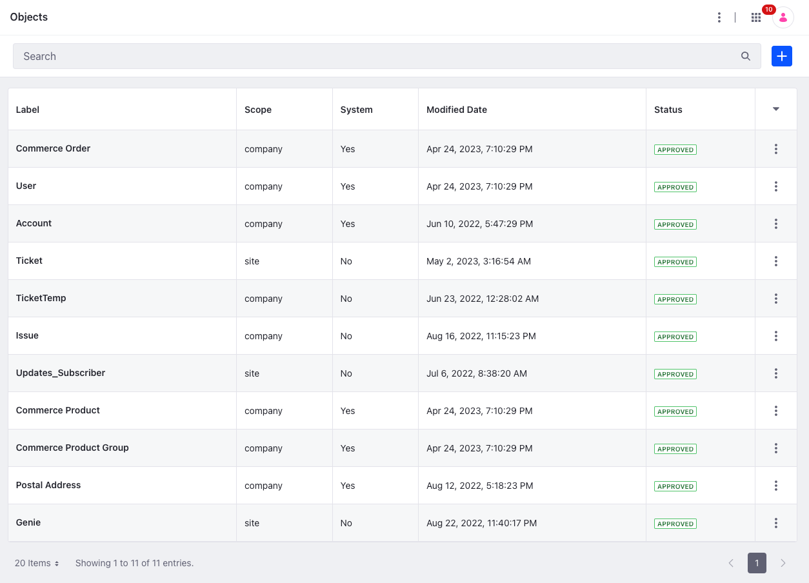
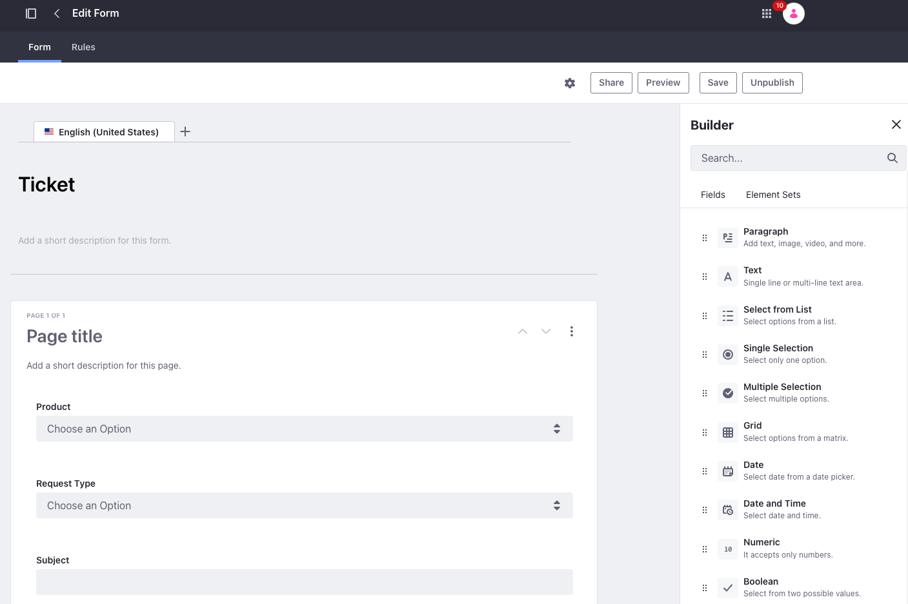
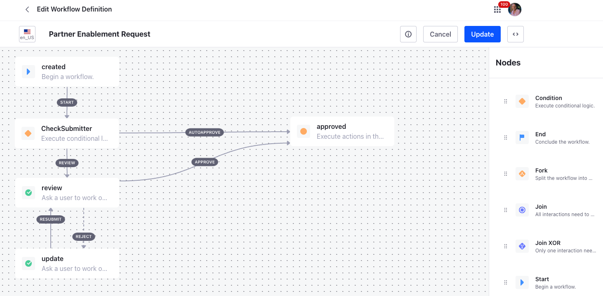
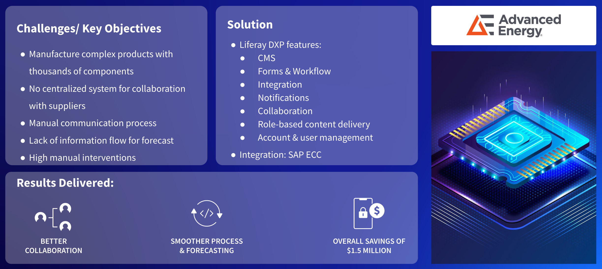

# Supplier Portals

A supplier portal empowers collaboration between a company and its suppliers of goods and services. Supplier Portals are commonly used by manufacturers with complex supply chains. Companies in all industries rely on suppliers to some degree, and as they grow, their relationships with suppliers often become more difficult to manage. This is when they look for a supplier portal.

## Key Liferay DXP Capabilities for Supplier Portals

Many challenges can be solved by implementing a supplier portal, but each opportunity's set of challenges may be unique.  The following capabilities showcase how Liferay DXP can be used as a supplier portal:

* [Personalization](https://learn.liferay.com/w/dxp/site-building/personalizing-site-experience)
* [Security](https://learn.liferay.com/w/dxp/installation-and-upgrades/securing-liferay)
* [Low-Code](https://learn.liferay.com/w/dxp/liferay-development/objects)
* [Commerce](https://learn.liferay.com/w/commerce/index)
* [Sites](https://learn.liferay.com/w/dxp/site-building)
* Integration
* [Search](https://learn.liferay.com/w/dxp/using-search)
* [Digital Asset Management (DAM)](https://learn.liferay.com/w/dxp/content-authoring-and-management/documents-and-media)

When evaluating Liferay DXP for a supplier portal, highlight these capabilities: 

* Low-Code/No-Code App Building 
* Data Modeling and Process Management

## Low-Code/No-Code App Building

Liferay’s low and no-code capabilities empower business users to compose digital experiences. New low-code capabilities in Liferay DXP 7.4 make it easy to create powerful business applications, pages, and experiences that traditionally require costly development.

With Liferay Objects, users can build and deliver business applications without having to write code or deploy modules. Each application built with Objects is integrated with Liferay’s core framework, so flexible solutions that adapt Liferay DXP to business needs can be implemented easily while maintaining a seamless user experience.

Customers can design forms for everything from business process automation to replacing complex paper applications. Conditional rules can make these forms personalized, which allows the form to adapt dynamically based on user input.

## Data Modeling and Process Management

Liferay provides the [Objects Model Builder](https://learn.liferay.com/w/dxp/liferay-development/objects/creating-and-managing-objects/using-the-objects-model-builder) to define and manage relationships between Custom and System objects. Liferay provides a graphical workflow designer for defining many simple to complex business processes or workflows. Workflows can be used organization-wide and tailored for specific individual requirements.

Workflow metrics provide insight into how long certain workflow events take to complete, with options to filter by workflow version. Additionally SLAs can set deadlines on specific workflow events and activities.

## Case Study - Advanced Energy

Advanced Energy's supplier portal makes effective use of data modeling and process management as well as low-code/no-code app building. Founded in 1981, Advanced Energy is a global leader in reliable power conversion solutions used in thin-film plasma manufacturing processes and solar energy generation. Advanced Energy used Liferay to automate the supplier side of its processes with a self-service supplier portal for a very large and diverse set of suppliers.

As a global manufacturer of highly complex products that include thousands of components, Advanced Energy had no centralized system in place to collaborate with its suppliers. They relied on a siloed approach to communicate, where each method was independent of the other. Fax, email, and phone communications were each used separately as workflow steps as forecast and purchase order commitments were relayed back and forth.

Advanced Energy used Liferay’s low and no-code functionality to streamline the on-boarding process of the diverse set of suppliers, and they used Liferay’s workflow management tools to automate various internal complex processes.

For more detailed information see [Advanced Energy](https://www.liferay.com/resources/case-studies/advanced-energy) on liferay.com.

Next: [Partner Portals](./partner-portals.md).
