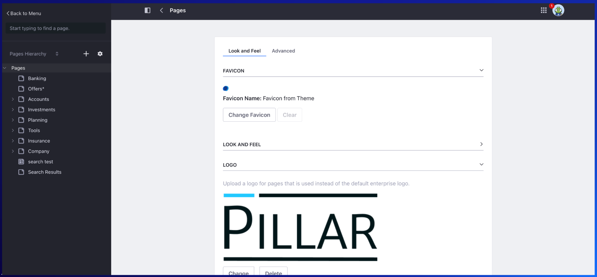
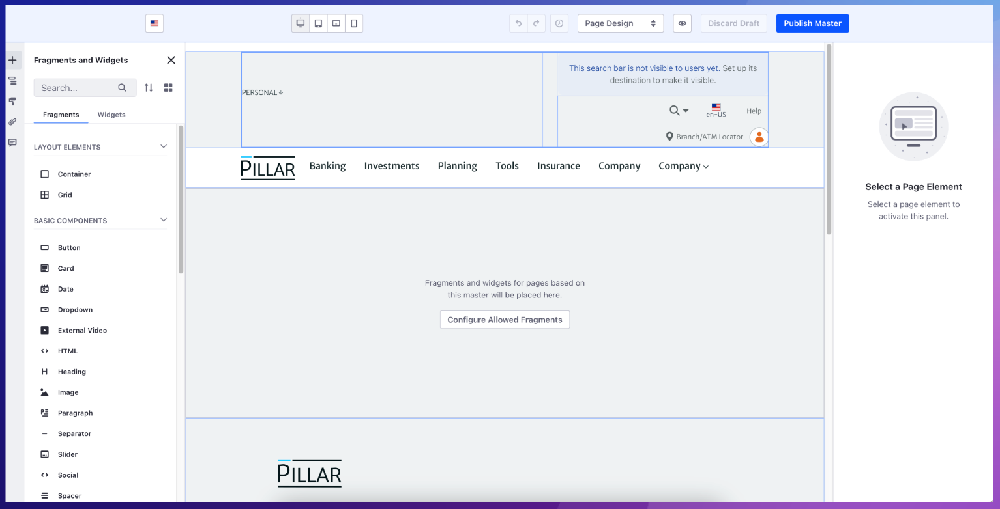

# Basics of Styling

**At a Glance**

* The key to a successful demo is engaging with the audience.
* Updating the look and feel of an existing demo is an effective way to create engagement.
* Replacing the Site Logo and Favicon with graphics that are known to the prospect aids this process significantly. 
* A Master Page is a page template that allows users to define common elements to every page, such as headers, footers and navigation menus.

```{note}
* View the [recording](https://learn.liferay.com/documents/d/guest/se1-5-basics-of-styling-in-liferay) from the live workshop of this module.
* Download the [PDF](https://learn.liferay.com/documents/d/guest/se1-5-basics-of-styling-in-liferay-pdf) of the presentation used in the live workshop.
```

## Site Logos and Favicons



In addition to changing colors, fonts, spacing, etc. using Style Books, changing the Site Logo and the Favicon are two changes that can be made quickly and easily.

To make these changes access the Pages Configuration and choose Look and Feel. Changes can be made by uploading new images, or by using existing images that have previously been uploaded to the site.

As with Style Books, these changes impact all pages in a site and can be seen in real time.

```{note}
While most websites require a specific file format for Favicons - i.e. an ICO file, Liferay accepts most image file formats - such as PNG, etc., making it even easier to apply the desired image.
```

## Master Pages



A Master Page is a page template that allows users to define common elements to every page, such as headers, footers and navigation menus.

Each Master page will have one or more drop zones. Drop zones are elements which act as containers for each page to have its own content.

The key benefits of Master Pages are:

* They provide a consistent look and feel to each page built from the same Master.
* They save time and effort developing each page because common elements are applied automatically.

## Why does changing the look and feel of a demo matter?

At first glance the simple changes proposed in this module may seem trivial, but it is important to understand that they all change the impact of a demo by making it more relevant and personal to the prospect.

The key points that are addressed by these sorts of changes are:

* The goal of any demo is to engage the audience.
* For most audiences this will be the first time they’ve seen a DXP in action. 
* Seeing something that they can relate to helps massively with engagement.
* If the prospect can see their own logo, along with their corporate colors, it is much easier for them to imagine building their application with Liferay.

**Audience engagement**

The goal of any demo is to engage with that prospective customer - to build confidence that they can solve their business problem with Liferay.

**Seeing a DXP for the first time**

It is highly likely that this demo will be the first time that any of the audience has seen a Digital Experience Platform in action - and because of this it is important that they are clear about what they are seeing.

**Relating to the demo**

The most important thing to show a prospect in a demo is something that they can relate to. If an existing demo is available that is solving the same problem that they have, then that is the perfect situation. If an identical fit is not available, look for a demo that has a use case that anyone could relate to - something that they could have used in their lives.

**Building confidence**

Either way, a great way to massively improve engagement, and help a prospect to relate to the demo, is to show them a demo that looks like something they use in their world. Borrowing the logo and colors of (for example) their company website can really help them to imagine what an application built in Liferay, for them, could look like.

## Advanced styling options

It is important to note that what has been discussed in this module is the basics of styling. Liferay provides many other capabilities for making more sophisticated changes to the look and feel of a Liferay application. 

This module focuses on simple but effective changes that can be made to an existing demo to make the demo more engaging to the audience.

Later modules, Training courses, and Liferay product documentation can be used to learn more about the things that can be done to impact styling of a Liferay application.

Congratulations - that’s the end of this module, next investigate how to [build a business application](../constructing-a-business-application.md) in Liferay.
