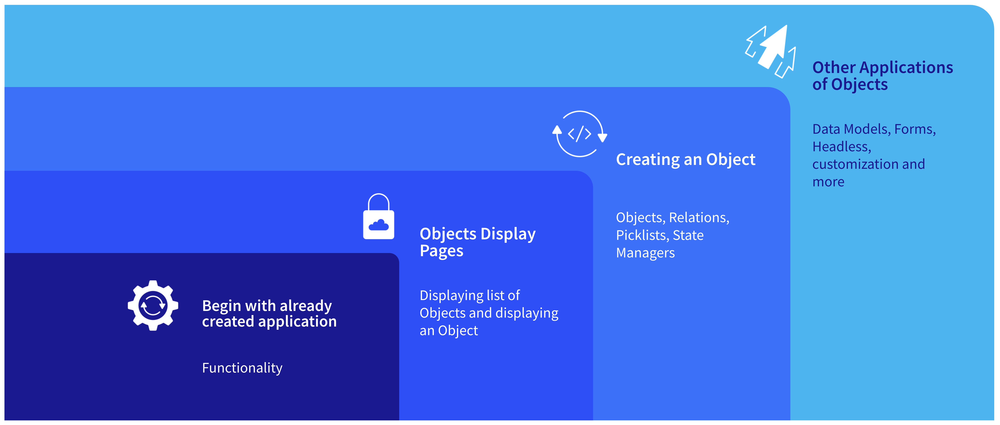

---
toc:
  - ./constructing-a-business-application/example-object-demo.md
  - ./constructing-a-business-application/creating-objects.md
uuid: e47d248a-5a03-4c22-99f8-1273f7d11a34
visibility: 
- Employee
- Partner
---

# Constructing a Business Application in Liferay

**At a Glance**

* Low-Code / No-Code is an increasing area of interest for customers
* Liferay provides many Low-Code / No-Code capabilities, including Liferay Objects
* Liferay Objects allows non-developers to quickly create fully functional business applications in Liferay
* Including a demonstration of Objects in Liferay demos is an effective way to build interest and engagement

## Background

Liferay provides a powerful platform for building and managing digital experiences, including business applications that are tailored to the specific needs of each organization.

With the word “constructing” in the title of this module, it might be reasonable to assume that coding might be required in this context, and in many cases with Liferay coding will form a part of building additional capabilities. Indeed, many more advanced demos will also include custom-coded extensions, however a smart goal to always have in mind is to only develop custom code in a demo, or even in a full implementation of Liferay, when it is absolutely the only possible way. 

This module teaches how to demonstrate Liferay [Objects](https://learn.liferay.com/web/guest/w/dxp/building-applications/objects), a capability that allows custom business applications to be created through the LIferay UI. Up to this point in the demo all features demonstrated have been out-of-the-box capabilities, which might leave the audience wondering what they can do if there is a dynamic need. Liferay Objects provides the capabilities to support these dynamic requirements.

This is the ideal point in a demo to introduce these features, before discussing Client Extensions and other ways to extend Liferay which are covered in the next module. 

The topics covered are:

* Introduction to Low-Code / No-Code in Liferay.
* How to demonstrate Liferay Objects.
* Creating a Liferay Object.
* Using the auto-generated page Widget.
* Exploring the auto-generated headless APIs.
* Discussion of advanced features.

```{note}
* View the [recording](https://learn.liferay.com/documents/d/guest/se1-6-constructing-a-business-application) from the live workshop of this module.
* Download the [PDF](https://learn.liferay.com/documents/d/guest/se1-6-constructing-a-business-application-pdf) of the presentation used in the live workshop.
```

## The Low-Code / No-Code Approach

Low-Code / No-Code is becoming an increasingly common requirement from Enterprise software buyers. During a Liferay demo there may well be an expectation that the prospect will see Low-Code / No-Code capabilities where the Sales Engineer creates something amazing just through drag-and-drop features.

There are various definitions for Low-Code and No-Code, but simplistically Low-Code can be defined as:

> Low-code is a way of designing and developing applications using graphical tools and/or drag-and-drop tools that reduce code–writing requirements. Some code is still required, but low-code development offers a simplified and enhanced approach to help accelerate application development. 

While No-Code can be defined as:

> No-code is an approach that uses a similar user experience to low-code, but goes further by allowing non-technical and business users to build applications without having to write any code at all.

Both capabilities are therefore aiming at the same results - the reduction of the amount of code that needs to be developed to create the required application.

At this point in the demo the prospect has already seen the use of some of the Low-Code / No-Code features offered by Liferay - building pages, creating content, defining experiences and so on are all done without writing code. Liferay is known for its flexibility and has a long history of offering a complete, customizable, and extensible platform. While Liferay continues to offer various ways to extend the platform by writing code in any language customers prefer, Liferay has progressed rapidly in offering enhanced Low-Code / No-Code capabilities to extend the platform. 

A typical question that a prospect might have is “How do I bridge the gap between Liferay’s out-of-the-box capabilities and the actual application that I need to deliver?” A good way of beginning to answer this is to talk about Low-Code and No-Code features that Liferay provides, to give them the confidence that Liferay as a platform has the capabilities to build the applications that they need, and a big part of Liferay’s Low-Code / No-Code capabilities, specifically when it comes to building business applications are the features provided by Liferay Objects.

## Demonstrating Liferay Objects



Before starting a demonstration of Liferay Objects, remember that there are a lot of different capabilities provided, so depending on the time available for the demo, it is a good idea to list the specific topics to be covered. 

A typical way of demonstrating software is to create an application by starting from the beginning. If this approach was taken with Liferay Objects, using a Ticketing Application as an example, the first step would be to create an object called _Ticket_ and then add fields to it, data to it, and so on. So, the application is created step by step and at the very end of it the complete application is showcased.

However, there are challenges with this approach. First, although the steps are not difficult, there are quite a few of them, and some can appear repetitive - once a prospect has seen one field being added, they are likely to become bored if you add ten more, or as many fields as a real application might need.

What works really effectively is to essentially reverse the order completely. Instead of building step by step, showcase the complete application first, and then show some of the elements needed to construct it.

This kind of “reverse engineering” approach, at a high level, covers the following four topics:

* Begin with a previously completed application
* Showing Objects display pages
* Creating a simple object
* Discussing other applications of Objects

The key objective of any demo is to build confidence that the platform can solve the prospect’s business needs. Liferay Objects provides an opportunity to not only build confidence, but also to generate real excitement, or magic. Like a magic trick, the magician does not want to give away the secrets of the trick before showing the magic. That is basically what this “reverse engineering” approach is trying to do!

**Previously Completed Application**

For any demo, it is important to have a realistic business application in mind - and ideally added to the demo before the session with the prospect begins. In Liferay Object terms that means building the objects, building the look and feel for it, building the display pages for it, and potentially also using State Managers with notifications and assignments to different personas and so on. 

Other topics to discuss are cover forms and form containers. Form Containers are relatively new features that help to create the data-capture UIs for Object entries. Check out the documentation on Form Containers [here](https://learn.liferay.com/web/guest/w/dxp/building-applications/objects/using-fragments-to-build-forms).

**Object Display Pages**

Objects are integrated out-of-the-box into Liferay’s Info framework, and as such Display Page Templates can be created easily to display the Object entries. The completed application using Objects should include the ability to display a list of entries and then individual entries via a Display Page.

Documentation on displaying object entries is available [here](https://learn.liferay.com/web/guest/w/dxp/building-applications/objects/displaying-object-entries).

**Object Creation**

Creating an object involves defining the data model for the object by adding fields, defining any relationships that object might have with Liferay system objects or other custom objects, creating picklists for fields, and using State Manager. State Manage provides the ability to add a business process management type of feel to the application by starting a process or submitting an object for approval and so on.

Documentation on defining State Fields and using State Manager is available [here](https://learn.liferay.com/web/guest/w/dxp/building-applications/objects/creating-and-managing-objects/fields/adding-and-managing-custom-states).

**Other Applications of Objects**

Once the fundamentals are covered, the final step is to discuss and potentially show some of the other capabilities provided with objects. For example, explain that once a custom Object is created Liferay automatically generates new headless APIs for that object which allow for external applications to interact with the object, or for developers to create entirely custom UIs for them via Client Extensions.

Documentation on the way that Objects is integrated into other Liferay frameworks is available [here](https://learn.liferay.com/web/guest/w/dxp/building-applications/objects/understanding-object-integrations).

Next, a simple, easily understood [example object demo](./constructing-a-business-application/example-object-demo.md).
