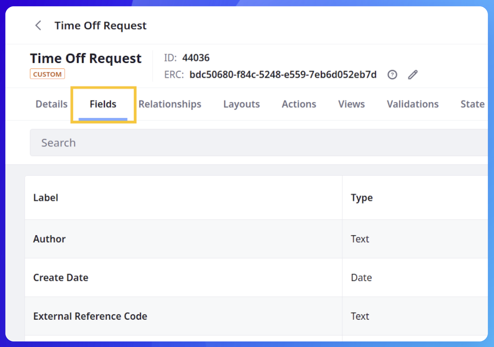
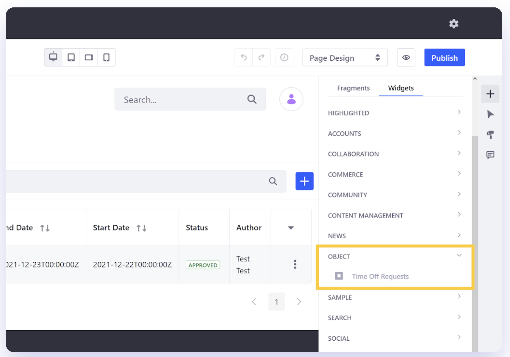
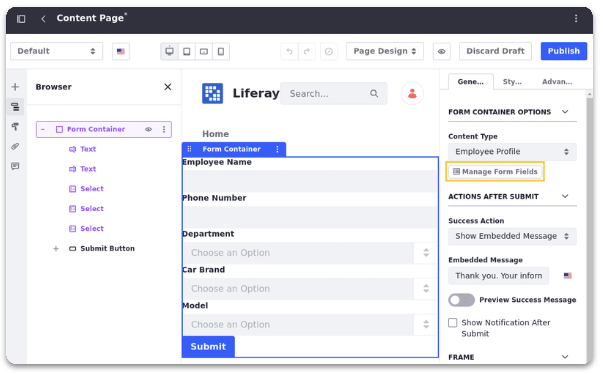
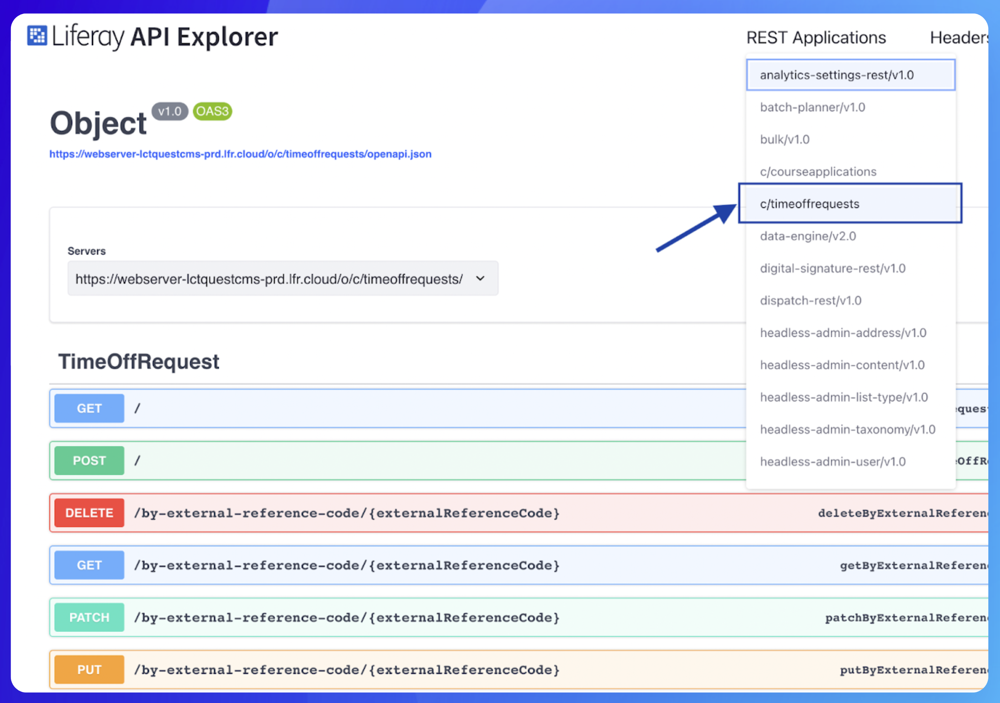

# Creating Liferay Objects

**At a Glance**

* A high-level Liferay demo should include a demo of a pre-built Object, showcasing the basic features
* This section includes details on how to create an Object from scratch, which serves two purposes
  * Provides more detailed learning opportunities about Objects
  * Provides a framework for a more detailed technical demo with a Prospect

## Learning about Liferay Objects

Liferay Objects can be thought of as containers for data. They can be used to store and retrieve data from a variety of sources. Objects are highly configurable, users can define custom fields, relationships, and methods to meet the specific needs of their application. 

## Creating an Object


The first step to creating an object is a draft object. Object drafts are application templates that store the necessary data for creating an object application. Follow these steps to create an object draft:

1. Open the Global Menu, go to the **Control Panel** tab, and click **Objects**.
2. Click the **Add** button.
3. Provide these details for the Object draft.
    1. **Label**: Identifies the object in the Objects admin and supported application contexts (e.g., Workflow, Display Page Templates, Forms).
    2. **Plural Label**: Determines the display name for the object application in the UI.
    3. **Object Name**: Determines the object’s definition.name and cannot be changed once the object is published.
4. Click **Save**.

Once saved, a blank object draft is created without any configuration or data elements. The object draft can be viewed in the Objects admin UI alongside system objects. To finish the creation process, the object draft must be [edited](https://learn.liferay.com/w/dxp/building-applications/objects/creating-and-managing-objects/creating-objects?p_l_back_url=%2Fsearch%3Fq%3DObjects&highlight=Objects#editing-object-drafts) and then [published](https://learn.liferay.com/w/dxp/building-applications/objects/creating-and-managing-objects/creating-objects?p_l_back_url=%2Fsearch%3Fq%3DObjects&highlight=Objects#publishing-object-drafts) to the Liferay instance.

## Editing and Publishing an Object



Before an Object can be published elements must be added and its settings must be configured. This includes adding fields, defining validations, setting a scope for its data, and more.

Follow these steps to edit the object draft:

1. From the Objects admin page, click the newly created object draft to begin editing it. Object features and configuration options are organized into the following tabs: Details, Fields, Relationships, Layouts, Actions, Views, Validations, and State Manager.
1. Click the **Fields** tab to add custom fields. Each field represents a database column for storing specific types of values. See [Adding Fields to Objects](https://learn.liferay.com/w/dxp/building-applications/objects/creating-and-managing-objects/fields/adding-fields-to-objects). By default, all objects include these system fields: Author, Create Date, External Reference Code, ID, Modified Date, and Status.
1. Select the object scope of 'Company’. The object determines how the object’s data is stored.
    * **Company** (default): When scoped by Company, the object’s data is stored per Liferay instance.
    * **Site**: When scoped by Site, the object’s data is stored per Site.
1. Show the object’s page widget. While enabled, you can add the object’s widget to site pages. See [Deploying Object Widgets in Sites](https://learn.liferay.com/w/dxp/building-applications/objects/deploying-object-widgets-to-sites).
1. Click Save.

Once the configuration and editing is finished the object can be [published](https://learn.liferay.com/w/dxp/building-applications/objects/creating-and-managing-objects/creating-objects).

This step is really where a lot of the magic takes place because Liferay is creating a substantial amount of elements for the Object which can be used immediately through the Liferay UI and by developers. The publishing process includes the following operations:

* A database table is created for the object with the draft’s data definitions.
* A new Headless API is automatically created for CRUD operations.
* A collection provider is created for displaying the object’s entries.
* A page widget is created for the object.
* The object is integrated with Info framework, so you can select the object as a content type for a display page template
* The object is integrated with the Permissions framework, so you can manage permissions for the new application and its resources.
* The object is integrated with the Workflow framework, so you can configure a custom workflow for the object.
* The object is integrated with Forms, so you can select the object as a data storage option.

This is really important because without the Objects feature all of these steps would have to be carried out by writing code. The elements created allow users to display the object, add entries to it, list those entries in a Collection Display, display an individual object entry in a display page, and so on.

## Creating a UI for Objects



Once the data model for the business application has been defined, the next step is to create a user interface using Liferay's widget framework. This involves defining the widgets that will be used to display and manage the data in the application, as well as any custom user interface components that are needed for the implementation.

**Adding the Widget to Pages**

* When Show Widget is enabled for a Published Object, its widgets appear under Objects in the widget menu.
* The widget can be added to Site Pages like any other Page widget.
* Click the widget’s Options button to access additional functions and configuration options.

Liferay objects are integrated with the Forms application, so forms can be designed for receiving user input and creating object entries. To do this, first add a new form and configure it to use the object's storage type. Then select the desired object, design the form, and map its fields to the selected object’s fields. \

Please see [Using Forms with Objects](https://learn.liferay.com/w/dxp/building-applications/objects/using-forms-with-objects#using-forms-with-objects) for more information.

## Headless Objects



```{note}
Discussions about Headless APIs are best included in a demo only if the audience is suitably, and primarily, technical in nature. The primary benefit of Objects is the ability to build business applications without the need for development. Discussing Headless APIs with a mainly business audience can cause confusion and dilute this message.
```

For technical audiences additional topics to discuss include:

* Headless APIs are created automatically for custom Objects.
* The new APIs can be explored using the /o/api URL on the Liferay instance.
* A common use case for the Headless APIs is to develop a custom JavaScript Client Extension UI for the object.
* Headless APIs can also be used to enable external system integration with the object.

For more information on Liferay’s headless APIs in general see [Consuming REST Services](https://learn.liferay.com/w/dxp/headless-delivery/consuming-apis/consuming-rest-services#consuming-rest-services).

## Advanced Features



Even with the additional learning and potential deeper-dive demo steps outlined above, only the surface of what can be achieved with Objects has been scratched. Enough information has been included to provide an opportunity to create an Object for a demo. 

Any time a pre-built demo can be supplemented with something that the prospect can relate to, the demo will be more engaging and create a better chance of success!

But, Objects contains many more features that enable it to be used for sophisticated business applications:

* One-to-many and many-to-many relationships with other Custom Objects, with System Objects (like, User, Account etc.) and even with the object itself can be added. For example a relationship could be created to show “related” object entries in the same table.
* Layouts can be easily defined layouts to control how Object Entries are displayed.
* Actions allow objects to be assigned to users, and to send notifications about the object.
* Validations can be defined to ensure that the correct information is captured.
* State Manager can be used to build a workflow to control how an object progresses through a full business process.

And even that is not all - great user interfaces to allow users to create object entries can be built with things like Form-integration, Form Containers and Form Fragments.

And, as noted before, the auto-generated headless APIs can be used to build entirely custom UIs as Client Extensions.

## Summary

To maximize the effectiveness of any Liferay demonstration, and to provide the opportunity to showcase the Low-Code / No-Code capabilities provided in the platform, always include a demo of Liferay Objects.

Liferay Objects provide:

* Quick, easy, no-code approach for creating custom applications.
* Comprehensive capabilities including:
  * Define Data Models
  * Create User Interfaces
  * Auto-generated APIs
  * Consume through Client Extensions
  * Integrate with External Systems
* Standard, modular approach to data management - build better applications faster.

Even though this learning path works towards using a pre-built demo, Objects provides a quick and easy (no code!) way of adding additional capabilities to that demo. Aim to create something that aligns with the requirements that your prospect has - not as a complete application, but to show them how quickly they can extend the platform to fit their specific needs. 

Use the content here along with the Objects documentation references to learn how to start building business applications with Object.

Congratulations - that’s the end of this module. The next module covers at a high level the opportunities that exist to [extend Liferay](../extending-liferay.md).
